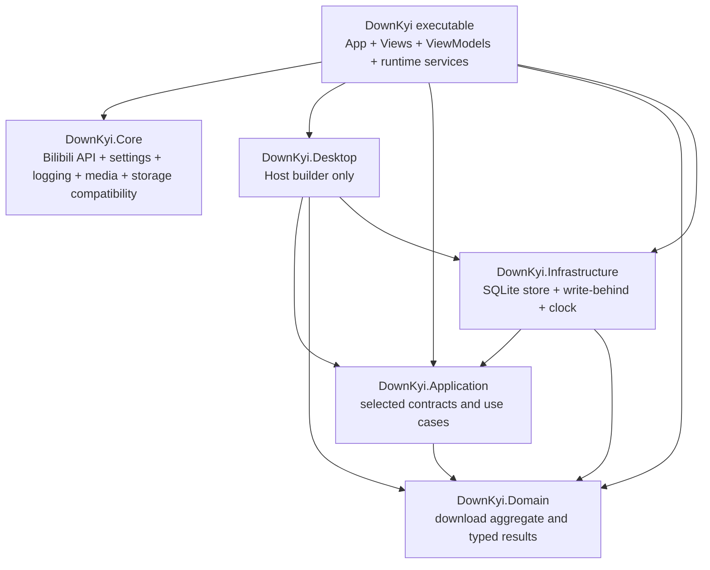
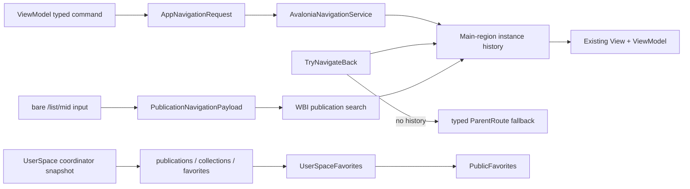
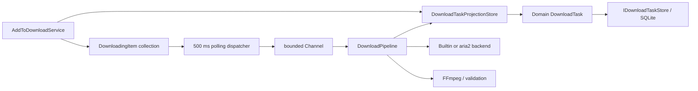
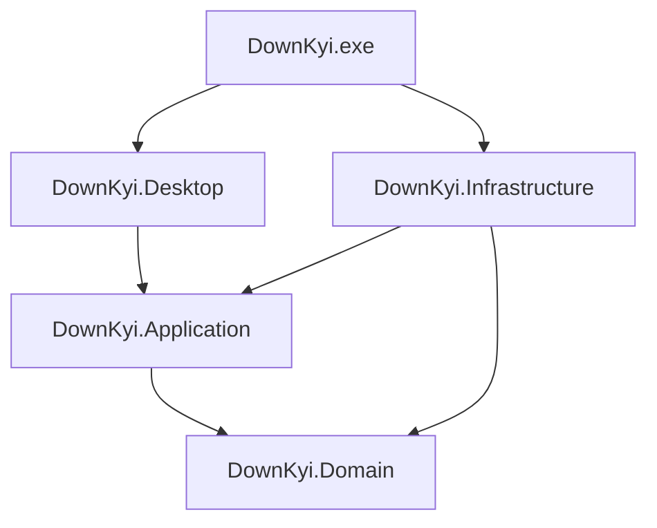

# DownKyi Architecture

本文件描述目前可執行的架構、已知邊界缺口與目標依賴方向。它不是理想化簡圖。若本文件、知識圖譜和程式碼不一致，以程式碼及可重現檢查結果為準，並在同一個 PR 修正文檔。

## 閱讀入口

- 模組、呼叫關係與穩定契約：`docs/ai-knowledge-graph.md`
- 目前尚未完成的工作：`docs/refactoring-live-plan.md`
- 模組邊界審查：`docs/design-docs/module-boundary-naming-audit.md`
- 建置、測試、發布與外部 binary：`docs/maintenance.md`
- 驗證及回滾：`docs/operations/verification-and-rollback.md`

## 目前拓樸

目前分支已建立 Domain、Application、Infrastructure 與 Desktop 專案，但主要產品程式仍集中在既有 `DownKyi` 與 `DownKyi.Core` 組件。



目前的正確事實：

- `DownKyi.exe` 同時是啟動入口、Avalonia Desktop 層與多數 runtime implementation owner。
- `DownKyi.Desktop` 只含 Host builder，尚未形成完整 Desktop assembly boundary。
- `DownKyi.Core` 仍直接依賴 Avalonia QR bitmap 與 XAML resources，尚未是 headless core。
- `DownKyi.Domain.DownloadTask` 目前主要出現在 store/projection 邊界，下載 worker 仍操作 `DownloadingItem`。
- `DownKyi.Application` 和 `DownKyi.Infrastructure` 已建立正確的依賴方向，但只承接部分實際產品責任。
- Prism、DryIoc、EventAggregator、RegionManager 和 ContainerLocator 已從 production source 移除，不得重新引入。

## 目前啟動鏈

```text
Program
  -> Avalonia App
  -> DownKyiHost.Create()
  -> DesktopComposition.AddDownKyiDesktop()
  -> Microsoft.Extensions.DependencyInjection
  -> MainWindow and MainWindowViewModel
  -> AvaloniaApplicationLifecycle.StartHostAsync()
```

`DownKyiHost` 與 `DesktopComposition` 目前共同形成 composition root。這是受測試保護的相容狀態，但目標是讓 executable 只保留最小啟動與最外層組合。

## 目前導航與 UserSpace 資料流



Main region 的返回操作必須先縮減 `AvaloniaNavigationService` 的既有歷史，並恢復原本的 View/ViewModel instance；只有沒有歷史時才建立 typed parent route。UserSpace 的公開收藏夾由注入的 coordinator 一次映射到 snapshot，返回同一個 MID 時保留原頁面與清單狀態。失效收藏項目保留在 UI 供辨識，但不能選取、開啟或加入下載。

投稿路由只接受 `PublicationNavigationPayload`。裸 `bilibili.com/list/<MID>` 代表該使用者全部投稿；`x/series/archives` 契約已完成審查，但帶 `sid` 的 URL 在建立獨立 typed series payload 與產品測試前仍不得被猜成全部投稿。投稿搜尋採 WBI 回應的精確 `page.count`；收藏搜尋的 `media_count` 是未篩選總數，因此分頁只能依 `has_more` 逐頁擴展。兩頁返回時保留 query、頁碼與既有 media instances；被取消的未完成頁才會補載。

導航箭頭 path 必須由 factory 建立獨立 geometry；不得讓不同 ViewModel 共用可變的 `PathIconData`，否則單頁主題更新會改壞其他頁面。

## 目前下載資料流



這條流程可運作且保留既有資料相容性，但它不是目標架構。主要缺口是 UI projection 仍是 runtime source of truth，Domain aggregate 只在持久化前後參與轉換。

## 目標拓樸

```text
DownKyi.exe
└─ minimal startup and composition root

DownKyi.Desktop
├─ Avalonia Views
├─ ViewModels
├─ UI projections
├─ UI dispatcher
├─ Desktop adapters
└─ application lifecycle

DownKyi.Application
├─ download commands and queries
├─ coordinators
├─ ports
└─ application events

DownKyi.Domain
├─ DownloadTask
├─ state transitions
└─ value objects

DownKyi.Infrastructure
├─ SQLite stores
├─ Bilibili HTTP clients
├─ aria2 backend
├─ FFmpeg
├─ file system
└─ logging sink configuration
```

目標依賴方向：



## 目標下載資料流

```text
command
  -> load Domain DownloadTask by DownloadTaskId
  -> invoke legal state transition
  -> persist Domain task
  -> enqueue DownloadTaskId
  -> execute stages
  -> publish task-changed event
  -> Desktop projector
  -> ObservableCollection owner
  -> ReadOnlyObservableCollection exposed to View
```

下載管線目標 stages：

```text
ResolvePlaybackStage
DownloadMediaStage
DownloadArtifactsStage
MuxStage
ValidateStage
FinalizeStage
```

每個 stage 接受 `DownloadExecutionContext` 與 `CancellationToken`，回傳 typed result。UI 文字由 Desktop presenter 依 domain/application phase 投影，不可由 pipeline 直接讀取資源字典。

## 邊界規則

### Domain

- 不依賴 UI、HTTP、SQLite、FFmpeg、aria2、設定或 logging implementation。
- 所有狀態轉換由 aggregate method 驗證。
- 不能從 mutable UI model 反向推導合法狀態作為主要 runtime 流程。

### Application

- 不依賴 Avalonia 或 `DownKyi.ViewModels`。
- command/query/coordinator contract 使用 Domain 或 Application DTO。
- cancellation、錯誤分類及 retry decision 必須可測。

### Infrastructure

- 實作 Application ports。
- 擁有 SQLite、HTTP、aria2、FFmpeg、file system 與 logging sink 的生命週期。
- 不依賴 Desktop types 或 UI collections。

### Desktop

- 擁有 Views、ViewModels、typed navigation、dialogs、UI dispatcher 與 projections。
- View 只能取得 read-only projection。
- 背景 runtime 不得掃描或修改 UI collection 來取得工作。

### Entry Point

- 只建立 App、Host 和 composition root。
- 不保存業務狀態，不實作下載、HTTP、資料庫或 ViewModel workflow。

## 相容性不變量

- 既有 JSON property 名稱與 migration 必須保持可讀。
- SQLite 下載紀錄、未完成任務、partial files、aria2 GID 與續傳資料不可遺失。
- 外部 Bilibili envelope、WBI、DURL 與 protobuf contract 必須由 fixture 測試保護。
- 固定 Bilibili 端點必須登錄於 `docs/operations/bilibili-api-audit.md`；匿名 live probe 只提供時點證據，不可取代 deterministic contract tests。
- XAML resource URI、compiled binding 和 typed route 改名必須有 UI smoke coverage。
- 任何跨層搬移都先建立 adapter 或 migration，再移除舊 owner。

## 可執行防線

- `tests/DownKyi.Architecture.Tests/ProjectDependencyTests.cs`
- `tests/DownKyi.Architecture.Tests/ModuleBoundaryBaselineTests.cs`
- `tests/DownKyi.Architecture.Tests/AgentEnvironmentArchitectureTests.cs`
- `tests/DownKyi.Architecture.Tests/BilibiliApiInventoryArchitectureTests.cs`
- `script/audit-module-boundaries.ps1`
- `script/audit-bilibili-api.ps1`
- `tests/DownKyi.Desktop.Tests/UiSmokeTests.cs`

基線測試採 ratchet 模式：現有違規可以減少或移除，新增違規或擴大巨檔會失敗。基線不是豁免，也不能成為長期目標。
