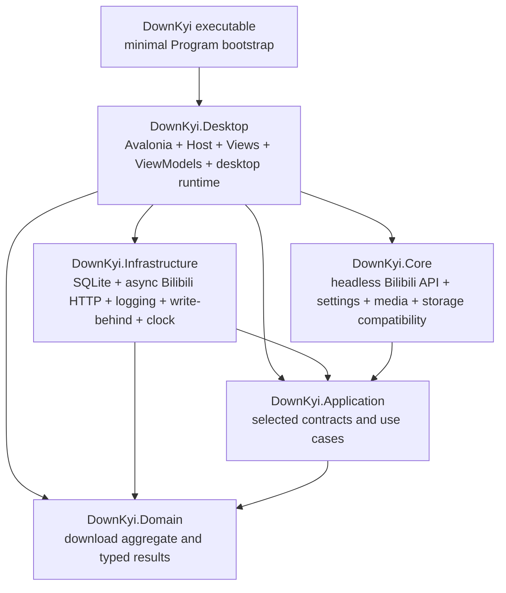
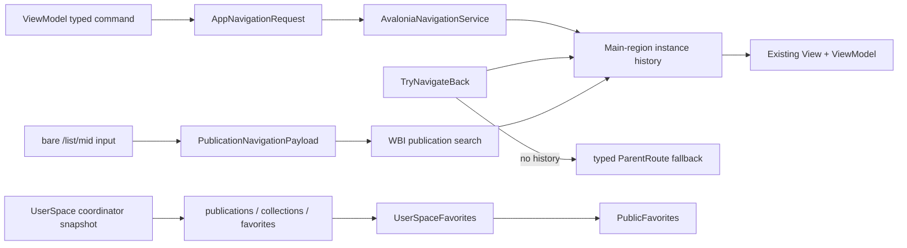
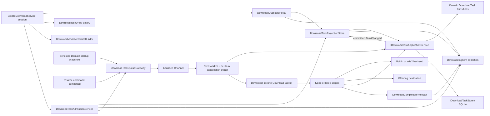
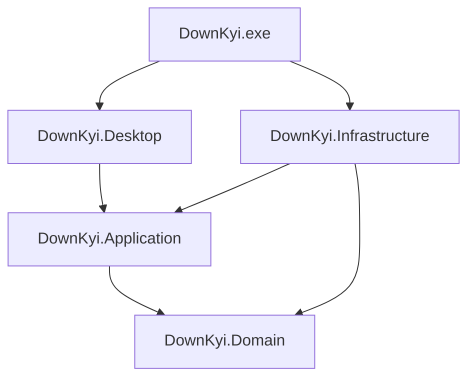
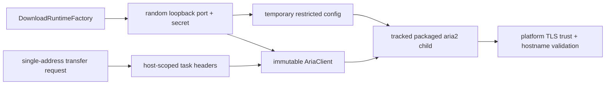

# DownKyi Architecture

本文件描述目前可執行的架構、已知邊界缺口與目標依賴方向。它不是理想化簡圖。若本文件、知識圖譜和程式碼不一致，以程式碼及可重現檢查結果為準，並在同一個 PR 修正文檔。

## 閱讀入口

- 模組、呼叫關係與穩定契約：`docs/ai-knowledge-graph.md`
- 目前尚未完成的工作：`docs/refactoring-live-plan.md`
- 模組邊界審查：`docs/design-docs/module-boundary-naming-audit.md`
- 建置、測試、發布與外部 binary：`docs/maintenance.md`
- 驗證及回滾：`docs/operations/verification-and-rollback.md`

## 目前拓樸

目前分支已建立 Domain、Application、Infrastructure 與 Desktop 專案。Avalonia 產品程式已由 `DownKyi.Desktop` 實際擁有；`DownKyi` executable 只保留最小啟動入口。


```mermaid
flowchart TD
    Entry["DownKyi executable\nminimal Program bootstrap"]
    Core["DownKyi.Core\nheadless Bilibili API + settings + media + storage compatibility"]
    Desktop["DownKyi.Desktop\nAvalonia + Host + Views + ViewModels + desktop runtime"]
    Application["DownKyi.Application\nselected contracts and use cases"]
    Domain["DownKyi.Domain\ndownload aggregate and typed results"]
    Infrastructure["DownKyi.Infrastructure\nSQLite + async Bilibili HTTP + logging + write-behind + clock"]

    Entry --> Desktop
    Desktop --> Core
    Desktop --> Application
    Desktop --> Domain
    Desktop --> Infrastructure
    Infrastructure --> Application
    Infrastructure --> Domain
    Core --> Application
    Application --> Domain
```

目前的正確事實：

- `DownKyi.exe` 只含 `Program.cs`，只引用 `DownKyi.Desktop`，不持有 UI、套件、資源或生命週期實作。
- `DownKyi.Desktop` 是 Avalonia App、Views、ViewModels、`Presentation` projections、desktop adapters、Host composition 與 desktop runtime owner。Service contracts 不再引用 `DownKyi.ViewModels`。
- `DownKyi.Core` 不含 `.axaml`、Avalonia 或 QRCoder；登入 API 留在 Core，QR bitmap renderer 與 Bilibili image dictionaries 位於 Desktop。
- `DownKyi.Domain.DownloadTask` 已是持久化狀態轉換的權威；worker 與 pipeline 入口使用 `DownloadTaskId`，但 orchestrator channel 與部分 media stage 仍暫時持有 UI projection。
- `DownKyi.Application` 已擁有 Bilibili HTTP/buvid/cookie ports 與 logging contracts；`DownKyi.Infrastructure` 已擁有 async `IHttpClientFactory` transport、single-flight buvid provider、SQLite、write-behind，以及私有 NLog logging sink、retention 與 diagnostic exporter。aria2、FFmpeg 與 file system 的最終 ownership 尚待後續切片。
- Prism、DryIoc、EventAggregator、RegionManager 和 ContainerLocator 已從 production source 移除，不得重新引入。

## 目前啟動鏈

```text
Program
  -> DesktopApplication.RunAsync()
  -> Avalonia App
  -> DownKyiHost.Create()
  -> DesktopComposition.AddDownKyiDesktop()
  -> Microsoft.Extensions.DependencyInjection
  -> MainWindow and MainWindowViewModel
  -> AvaloniaApplicationLifecycle.StartHostAsync()
```

`DesktopApplication`、`DownKyiHost` 與 `DesktopComposition` 共同形成 Desktop composition root；executable 只做單次委派。

Bilibili endpoint adapters 仍位於 `DownKyi.Core/BiliApi` 以保留 DTO 與外部協定相容性，但所有 production 呼叫都接收注入的 `IBilibiliApiClient` 並使用 async API。Host 是 client、cookie provider、buvid provider 與網路設定的唯一組合點；static client、全域 `Configure()` 和同步 HTTP compatibility path 已刪除。

## 目前導航與 UserSpace 資料流


```mermaid
flowchart LR
    Command["ViewModel typed command"] --> Request["AppNavigationRequest"]
    Request --> Router["AvaloniaNavigationService"]
    Router --> History["Main-region instance history"]
    History --> View["Existing View + ViewModel"]
    Back["TryNavigateBack"] --> History
    Back -->|"no history"| Parent["typed ParentRoute fallback"]
    UserSpace["UserSpace coordinator snapshot"] --> Tabs["publications / collections / favorites"]
    Tabs --> FavoriteFolders["UserSpaceFavorites"]
    FavoriteFolders --> PublicFavorites["PublicFavorites"]
    ListUrl["bare /list/mid input"] --> PublicationPayload["PublicationNavigationPayload"]
    PublicationPayload --> PublicationPage["WBI publication search"]
    PublicationPage --> History
```

Main region 的返回操作必須先縮減 `AvaloniaNavigationService` 的既有歷史，並恢復原本的 View/ViewModel instance；只有沒有歷史時才建立 typed parent route。UserSpace 的公開收藏夾由注入的 coordinator 一次映射到 snapshot，返回同一個 MID 時保留原頁面與清單狀態。失效收藏項目保留在 UI 供辨識，但不能選取、開啟或加入下載。

投稿路由只接受 `PublicationNavigationPayload`。裸 `bilibili.com/list/<MID>` 代表該使用者全部投稿；`x/series/archives` 契約已完成審查，但帶 `sid` 的 URL 在建立獨立 typed series payload 與產品測試前仍不得被猜成全部投稿。投稿搜尋採 WBI 回應的精確 `page.count`；收藏搜尋的 `media_count` 是未篩選總數，因此分頁只能依 `has_more` 逐頁擴展。兩頁返回時保留 query、頁碼與既有 media instances；被取消的未完成頁才會補載。

導航箭頭 path 必須由 factory 建立獨立 geometry；不得讓不同 ViewModel 共用可變的 `PathIconData`，否則單頁主題更新會改壞其他頁面。

## 目前下載資料流


```mermaid
flowchart LR
    Add["AddToDownloadService session"] --> Duplicate["DownloadDuplicatePolicy"]
    Add --> Draft["DownloadTaskDraftFactory"]
    Add --> Metadata["DownloadMovieMetadataBuilder"]
    Add --> Admission["DownloadTaskAdmissionService"]
    Duplicate --> Projection
    Duplicate --> UiList
    Admission --> Projection["DownloadTaskProjectionStore"]
    Admission --> UiList["DownloadingItem collection"]
    Admission --> QueueGateway["DownloadTaskQueueGateway"]
    Projection --> Commands["IDownloadTaskApplicationService"]
    Commands --> Domain["Domain DownloadTask transitions"]
    Commands --> Store["IDownloadTaskStore / SQLite"]
    Commands -->|"committed TaskChanged"| Projection
    Projection --> UiList
    Bootstrap["persisted Domain startup snapshots"] --> QueueGateway
    Resume["resume command committed"] --> QueueGateway
    QueueGateway --> Channel["bounded Channel<DownloadTaskId>"]
    Channel --> Worker["fixed worker + per-task cancellation owner"]
    Worker --> Commands
    Worker --> Pipeline["DownloadPipeline(DownloadTaskId)"]
    Pipeline --> Stages["typed ordered stages"]
    Stages --> Backend["Builtin or aria2 backend"]
    Stages --> Ffmpeg["FFmpeg / validation"]
    Stages --> Commands
    Stages --> CompletionProjector["DownloadCompletionProjector"]
    CompletionProjector --> UiList
```

目前所有 durable command 都先載入 Domain aggregate、執行合法 transition、以 optimistic version 寫入 SQLite，再發布 committed snapshot。一般 runtime 不再從 mutable UI model 反向重建 Domain；`DownloadTask.Restore` 只允許出現在 SQLite materializer 與 legacy migration adapter。

佇列已不再掃描 UI collection；新增、續傳與一次性啟動恢復都直接傳遞 `DownloadTaskId`。啟動查詢在同一份結果中提供 Domain snapshots 與 UI projections，runtime 只使用前者。`DownloadPipeline` 只建立單次 execution context 並依序執行 typed stages；階段失敗會立即停止並經 typed state writer 標記失敗。Presenter、projector 與 projection models 已由 Desktop 擁有，`DownloadListState` 只公開穩定的 `ReadOnlyObservableCollection<T>`。剩餘過渡債是 media execution context 仍讀取 `DownloadingItem` 作為播放流與畫面上下文，後續需改為明確 execution input，而不是讓 UI projection 進入 runtime。

## 目標拓樸

```text
DownKyi.exe
└─ minimal startup and composition root

DownKyi.Desktop
├─ Avalonia Views
├─ ViewModels
├─ UI projections
├─ UI dispatcher
├─ Desktop adapters
└─ application lifecycle

DownKyi.Application
├─ download commands and queries
├─ coordinators
├─ ports
└─ application events

DownKyi.Domain
├─ DownloadTask
├─ state transitions
└─ value objects

DownKyi.Infrastructure
├─ SQLite stores
├─ Bilibili HTTP clients
├─ aria2 backend
├─ FFmpeg
├─ file system
└─ logging sink configuration
```

目標依賴方向：


```mermaid
flowchart TD
    Entry["DownKyi.exe"] --> Desktop["DownKyi.Desktop"]
    Entry --> Infrastructure["DownKyi.Infrastructure"]
    Desktop --> Application["DownKyi.Application"]
    Infrastructure --> Application
    Infrastructure --> Domain["DownKyi.Domain"]
    Application --> Domain
```

## 目標下載資料流

```text
command
  -> load Domain DownloadTask by DownloadTaskId
  -> invoke legal state transition
  -> persist Domain task
  -> enqueue DownloadTaskId
  -> execute stages
  -> publish task-changed event
  -> Desktop projector
  -> ObservableCollection owner
  -> ReadOnlyObservableCollection exposed to View
```

下載管線目標 stages：

```text
ResolvePlaybackStage
DownloadMediaStage
DownloadArtifactsStage
MuxStage
ValidateStage
FinalizeStage
```

每個 stage 接受 `DownloadExecutionContext` 與 `CancellationToken`，回傳 typed result。UI 文字由 Desktop presenter 依 domain/application phase 投影，不可由 pipeline 直接讀取資源字典。

下載來源、續傳 sidecar 與 completed transfer key 在所有必要 stage 通過前都屬於可重試狀態。FFmpeg 只能發布已驗證輸出，不得刪除輸入；只有 `FinalizeStage` 成功提交 Domain `Completed` 後，才能透過既有 `DownloadTaskFileService` 清理該任務的精確來源與 sidecar。Artifact、mux、validation、取消或 SQLite completion 失敗都必須保留這些 retry checkpoint。

下載重試只有一個預算 owner：

```text
DownloadMediaStage
  -> DownloadTransferCoordinator (global attempt budget)
  -> DownloadRetryPolicy (typed decision)
  -> ITransferBackend (exactly one URL, one backend attempt)
```

`DownloadTransferResult` 區分 transient network、rate limit、expired address、resume rejected、invalid media、disk 與 permanent failure。403 可觸發一次播放地址重解；429 在 backend 能提供 `Retry-After` 時遵守最多 30 秒的 bounded delay；resume rejected 只允許清理該 transfer 的檔案與 sidecar 後重試一次；cancellation 不會轉成失敗或 retry。Built-in Downloader 與 aria2 的內部 retry 必須停用，每個 aria RPC client call 只能送出一次實體請求，避免和 coordinator 的 budget 相乘。網路失敗保留 partial/resume sidecar，只有確定無效的 media 或被拒絕的續傳狀態才清理。aria2 RPC 層失敗必須保留最新 GID；只有 terminal task failure 或明確的 task-not-found 才能清除。

`AriaClient` 是專案內維護的 JSON-RPC compatibility adapter，不是生成檔。核心 partial 只擁有 immutable endpoint/token、序列化、response decoding 與單次 HTTP transport；下載控制、狀態/URI、選項、生命週期與 `system.*` methods 各自由責任 partial 擁有。所有 `aria2.*` method 的 token 位置與 RPC method name 由全公開方法合約測試固定。來源證據、owner 表和變更流程位於 `docs/design-docs/aria2-rpc-client-ownership.md`。

## aria2 安全邊界


```mermaid
flowchart LR
    Factory["DownloadRuntimeFactory"] --> Endpoint["random loopback port + secret"]
    Endpoint --> Client["immutable AriaClient"]
    Endpoint --> Config["temporary restricted config"]
    Config --> Child["tracked packaged aria2 child"]
    Client --> Child
    Request["single-address transfer request"] --> Headers["host-scoped task headers"]
    Headers --> Client
    Child --> TLS["platform TLS trust + hostname validation"]
```

Packaged aria2 is process-local: each runtime creates an ephemeral loopback port
and high-entropy secret, passes the secret through a temporary restricted config,
and accepts RPC readiness only while the supervised child is alive. Process
arguments cannot contain Cookie, RPC secret or caller-provided combined argument
text. Custom remote aria2 remains externally owned; HTTP is allowed only for a
loopback endpoint and every non-loopback endpoint requires HTTPS without RPC
redirects.

Transfer credentials are task-level rather than process-global. Cookie is
eligible only for an exact HTTPS `bilibili.com` host or subdomain and disables
redirects for that task; other hosts cannot receive it. aria2 uses normal
platform certificate/hostname validation, and TLS failure is a typed terminal
address failure rather than a reason to downgrade. The six-RID real-binary gate,
legacy `UseSsl` migration and third-party binary evidence are documented in
`docs/operations/aria2-security.md`.

## 邊界規則

### Domain

- 不依賴 UI、HTTP、SQLite、FFmpeg、aria2、設定或 logging implementation。
- 所有狀態轉換由 aggregate method 驗證。
- 不能從 mutable UI model 反向推導合法狀態作為主要 runtime 流程。

### Application

- 不依賴 Avalonia 或 `DownKyi.ViewModels`。
- command/query/coordinator contract 使用 Domain 或 Application DTO。
- `DownloadTaskApplicationService` 是下載狀態命令的唯一 owner；事件只能在 store 成功後發布 committed snapshot。
- cancellation、錯誤分類及 retry decision 必須可測。

### Infrastructure

- 實作 Application ports。
- 擁有 SQLite、HTTP、aria2、FFmpeg、file system 與 logging sink 的生命週期。
- 不依賴 Desktop types 或 UI collections。

### Desktop

- 擁有 Views、ViewModels、typed navigation、dialogs、UI dispatcher 與 projections。
- View 只能取得 read-only projection。
- 背景 runtime 不得掃描或修改 UI collection 來取得工作。

### Entry Point

- 只建立 App、Host 和 composition root。
- 不保存業務狀態，不實作下載、HTTP、資料庫或 ViewModel workflow。

## 相容性不變量

- 既有 JSON property 名稱與 migration 必須保持可讀。
- SQLite 下載紀錄、未完成任務、partial files、aria2 GID 與續傳資料不可遺失。
- 外部 Bilibili envelope、WBI、DURL 與 protobuf contract 必須由 fixture 測試保護。
- 固定 Bilibili 端點必須登錄於 `docs/operations/bilibili-api-audit.md`；匿名或明確授權的登入態 live probe 只提供清理後時點證據，不可取代 deterministic contract tests，也不可保存 credential、raw response 或帳號值。
- XAML resource URI、compiled binding 和 typed route 改名必須有 UI smoke coverage。
- 任何跨層搬移都先建立 adapter 或 migration，再移除舊 owner。

## 可執行防線

- `tests/DownKyi.Architecture.Tests/ProjectDependencyTests.cs`
- `tests/DownKyi.Architecture.Tests/ModuleBoundaryBaselineTests.cs`
- `tests/DownKyi.Architecture.Tests/AgentEnvironmentArchitectureTests.cs`
- `tests/DownKyi.Architecture.Tests/BilibiliApiInventoryArchitectureTests.cs`
- `script/audit-module-boundaries.ps1`
- `script/audit-bilibili-api.ps1`
- `script/audit-bilibili-authenticated-api.ps1`
- `script/scan-secrets.ps1`
- `tests/DownKyi.Desktop.Tests/UiSmokeTests.cs`

基線測試採 ratchet 模式：現有違規可以減少或移除，新增違規或擴大巨檔會失敗。基線不是豁免，也不能成為長期目標。
