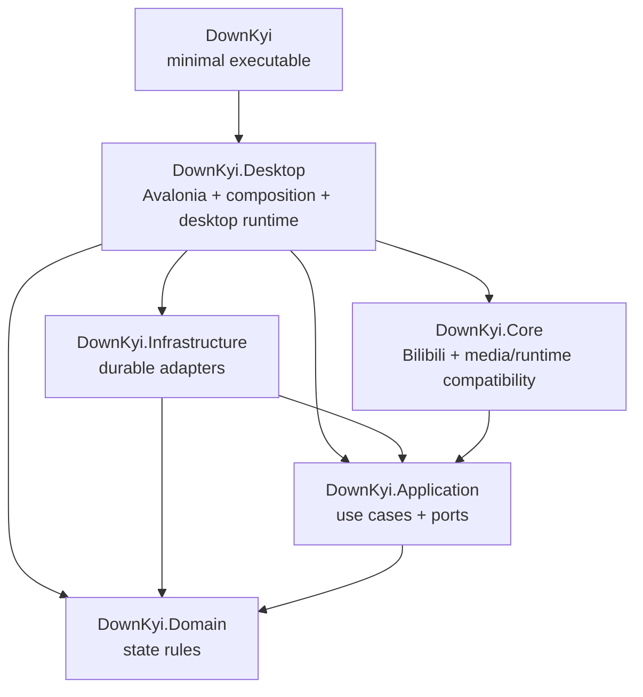
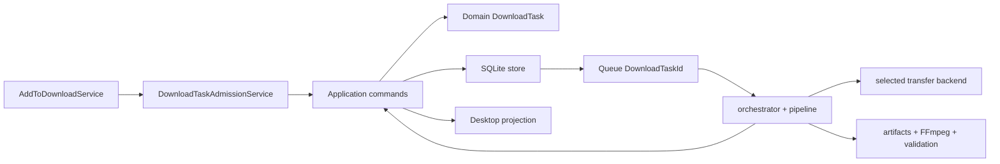

# DownKyi Architecture

本文件只保存 current owner、依賴方向、不能從程式碼直接推導的 invariant，以及對應的可執行防線。具體類別清單、呼叫順序與數量以 current code 和 audit 結果為準；若兩者不一致，在同一 PR 修正本文件。

## 閱讀入口

1. 從 `src/DownKyi.Desktop/Composition/DesktopComposition.cs` 找產品組裝。
2. 跟進受影響模組的 local composition、contract、constructor 與 focused tests。
3. 需要正式命令時只讀 `docs/operations/verification-and-rollback.md`。
4. 目前工作只從 [DownKyiCore 工作項目](https://github.com/users/crazysmile-PhD/projects/2) 選取；單一工作的背景、scope、evidence 與驗收看其 linked Issue，完成歷史看 Project、Git、PR 與 `CHANGELOG.md`。

領域路由見 `docs/maintenance.md`；仍有效的設計理由見 `docs/design-docs/README.md`。

## Current owner map

```mermaid
flowchart TD
    Entry["DownKyi\nminimal executable"] --> Desktop["DownKyi.Desktop\nAvalonia + composition + desktop runtime"]
    Desktop --> Core["DownKyi.Core\nBilibili + media/runtime compatibility"]
    Desktop --> Application["DownKyi.Application\nuse cases + ports"]
    Desktop --> Domain["DownKyi.Domain\nstate rules"]
    Desktop --> Infrastructure["DownKyi.Infrastructure\ndurable adapters"]
    Infrastructure --> Application
    Infrastructure --> Domain
    Core --> Application
    Application --> Domain
```

- `DownKyi` 只含最小 `Program` bootstrap，只引用 Desktop；不得擁有 UI、套件、資源或生命週期。
- `DownKyi.Desktop` 擁有 Avalonia App、Views、ViewModels、UI projections、desktop adapters、Host composition、導航／對話框與下載 runtime。`DesktopThemeController` 是唯一 theme switch owner；semantic tokens 由 `DesignTokens.axaml` 擁有。
- `DownKyi.Application` 擁有 use cases，以及 Bilibili HTTP、cookie／buvid、logging、physical output path 等 ports。
- `DownKyi.Domain` 的 `DownloadTask` 是 durable state transition 的權威。
- `DownKyi.Infrastructure` 擁有 SQLite、async Bilibili transport、single-flight buvid、write-behind、physical path resolver 與 private logging sink／retention／exporter。
- `DownKyi.Core` 必須保持 headless；Bilibili DTO／protocol、aria2、FFmpeg 與部分 filesystem compatibility 目前仍在此。把後三者搬到 Infrastructure 是 ownership 方向，不是已完成事實。

Prism、DryIoc、EventAggregator、RegionManager、ContainerLocator、第二個 router／container 或 service locator 都不得重新引入。否則會產生平行生命週期、導航狀態或依賴解析 owner。

## Composition 與外部協定

Desktop composition root 只選擇模組；Navigation／Dialog／Download 的實作、生命週期和多介面 alias 由各自 local composition 接合。`DownKyiHost` 驗證必要依賴與 lifetime，但不能取代產品組裝與行為測試。

Bilibili endpoint adapters 留在 `DownKyi.Core/BiliApi` 以維持 DTO 與協定相容。所有 production 呼叫必須使用注入的 async port：普通 API 經 `IBilibiliApiClient`；QR 登入由同一個隔離 `IBilibiliLoginSession` 貫穿 generate、poll 與 trusted callback，以保留 response cookies。Host 是 client、session factory、cookie、buvid 與 network settings 的唯一組合點；不得恢復 static client、global `Configure()` 或同步 HTTP compatibility path。

## Navigation 與 UserSpace invariant

- ViewModel／caller 只依賴 Application 的 `IAppNavigationService` 與 `IAppDialogService`。只有 local composition 的 factories 可依 typed enum 選擇已註冊的 transient View／ViewModel；adapter 不得持有 container。
- Main-region back 必須先縮減既有 history 並恢復原 View／ViewModel instance；只有沒有 history 時才建立 typed parent route。違反會遺失頁面、查詢與選取狀態。
- UserSpace 公開收藏由單一 coordinator 映射成 snapshot；返回相同 MID 時保留原頁面與清單。失效收藏仍可辨識，但不可選取、開啟或加入下載。
- 裸 `/list/<MID>` 使用 `PublicationNavigationPayload` 表示全部投稿；帶正整數 `sid` 的 URL 使用獨立 `SeriesNavigationPayload` 載入指定系列。無效 `sid`、API failure 或 MID／series identity 不匹配都 fail closed，不得退回全部投稿。
- 投稿分頁以 WBI `page.count` 為準；收藏的 `media_count` 不是 filtered count，只能依 `has_more` 擴展。返回時保留 query、頁碼與既有 media instances；只有被取消的未完成頁補載。
- 可變 `PathIconData` geometry 必須由 factory 為各 ViewModel 建立獨立 instance，避免主題更新污染其他頁面。

## Download invariant

```mermaid
flowchart LR
    Add["AddToDownloadService"] --> Admission["DownloadTaskAdmissionService"]
    Admission --> App["Application commands"]
    App --> Domain["Domain DownloadTask"]
    App --> Store["SQLite store"]
    Store --> Queue["Queue DownloadTaskId"]
    Queue --> Runtime["orchestrator + pipeline"]
    Runtime --> Backend["selected transfer backend"]
    Runtime --> Media["artifacts + FFmpeg + validation"]
    Runtime --> App
    App --> Projection["Desktop projection"]
```

### Durable state

- 所有 durable command 都先載入 aggregate、執行合法 transition、以 optimistic version 寫入 SQLite，再發布 committed snapshot。若先更新 UI，crash 後 UI 與可恢復狀態會分裂。
- Runtime 不得從 mutable UI model 或 lossy history 重建 Domain task。`DownloadTask.Restore` 只允許 SQLite materializer 與 legacy migration adapter 使用。
- 使用者要求的 audio／video／danmaku／subtitle／cover 由 Domain `DownloadContentSelection` 表達；舊字串 map 只存在於 dialog、SQLite 與 NRBF compatibility boundary。
- `PreparedDownload` 以允許的輸出組合描述 media capability，而不是把 audio／video presence 當成可獨立選擇。DURL 只支援 video-only 與 audio+video，不支援 audio-only；`DownloadContentConflictResolver` 必須在 task 建立前把使用者要求收斂成相容子集並寫入 finalized selection。後續 refresh 不得改變已確定的 transport、quality、codec 或 audio／video intent。
- 啟動恢復、新增與續傳只傳 `DownloadTaskId`，不得輪詢 UI collection。啟動查詢同時提供 Domain snapshots 與 projections；runtime decision 只用前者。

### Execution 與 retry

- `DownloadExecutionContextFactory` 是 immutable `DownloadExecutionInput` 的唯一 owner，只能從 committed Domain snapshot 與當次 settings 建立 context，不得擷取 page／projection 的 discovery `PlayUrl`。它必須同時凍結 transfer-file mapping 與 completed keys；`ResolvePlaybackStage` 在 staging adoption 後由兩者交集及實體完整性恢復已完成的 DASH component。有尚未完成 media component 時才依 finalized transport、quality、codec 與 audio fresh resolve；resolved payload 與後續 refresh 只存在於該 execution context。
- `DownloadMediaContract` 只驗證尚未完成的 finalized transport component 與其 quality／codec／audio；同一來源可以同時提供 DASH 與 DURL，但只有 finalized transport 參與本次執行。同一影片頁面的網頁與 API 回應可分別提供已確定的影片及獨立音訊；各 component 必須有可用地址、保留自己的來源與下載資訊，DURL 片段則維持單一來源的完整 manifest。預覽、非零 API 回應與無效地址不得充當 media component，也不得要求來源再次提供已完成且有效的 component。
- 若所有可用來源都無法完整滿足尚未完成的 finalized selection，`DownloadPlaybackResolver` 必須回傳 `download.playback.selection-unavailable` typed failure，由 pipeline 原樣持久化，不得讓 expected availability drift 冒泡成 `download.runtime.failed`。API response error、transport failure 與 caller cancellation 保留各自語義。缺少舊 contract 的 unfinished task 必須重建，不得猜測 fallback；已完成且有效的 selected artifact 在普通 refresh 與重啟續傳時都不因新來源缺少該 stream 而撤銷或重新下載。
- Pipeline 依序執行 typed stages；每個 stage 以 typed result 保存 failure taxonomy，失敗立即停止並由 typed state writer 更新狀態。不得用 empty／null success sentinel 隱藏錯誤。Presenter／projector 只按 `DownloadTaskId` 更新 UI；`DownloadListState` 只公開穩定 read-only collection。
- Retry 只有一個預算 owner：coordinator 決定 typed retry／refresh／source switch，backend 每次只嘗試一個 URL。不得在 backend、RPC caller 或外層另加 retry，否則預算會相乘。
- Built-in resume 必須先比較 resource identity；沒有 validator 時驗證已保存 bytes 的 overlap。Mismatch 回報 `ResumeRejected`，coordinator 清除該 transfer artifacts 後，同地址最多重試一次。
- Cancellation 保持 cancellation，不得轉成 failure 或 retry。來源切換前必須停止舊 transfer 並清除該 identity／target／sidecars；teardown 或 cleanup 失敗要 fail closed。
- aria2 RPC failure 必須保留最新 GID；只有 terminal failure、確定 task-not-found 或安全完成的 source-switch teardown 才可清除。

### Artifact 與完成邊界

- 來源、partial、resume sidecar 與 completed key 在所有必要 stage 通過前都是 retry checkpoint。Artifact、mux、validation、cancellation 或 durable completion 失敗都必須保留。
- FFmpeg 只能發布已驗證輸出，且不得因一般非零 exit code 推定來源損壞。只有 fail-on-error decode 的明確證據才可撤銷對應 completed key、identity 與 source。
- 只有 finalize 成功提交 Domain `Completed` 後，既有 file service 才能清理該任務的精確來源與 sidecars。
- `FfmpegProcessRunner` 是 FFmpeg concurrency、timeout、cancellation 與 process tree 的唯一 owner。

### Runtime lifecycle

`DownloadComposition.AddDownloadModule()` 是唯一註冊入口。Queue gateway 的 queue／availability interfaces 必須解析到同一 singleton；bootstrap hosted service 的 service／hosted aliases 也必須共用同一 singleton。拆成不同 instance 會產生第二套 queue、start／stop 或 dispose owner。

## aria2 security boundary

- Packaged aria2 是 process-local child：每次使用 ephemeral loopback port、fresh high-entropy secret、restricted temporary config，且只有 supervised child 存活時 readiness 才有效。
- Process arguments 不得含 Cookie、RPC secret 或 caller-combined argument text。
- Custom remote aria2 由外部擁有；非 loopback endpoint 必須 HTTPS，禁止 RPC redirect。
- Credential header 屬於 task，且只可給 exact HTTPS `bilibili.com` host／subdomain；其他 host 不得收到。傳輸前的單一候選安全預檢拒絕只可切換到下一個獨立候選，且每個候選都必須重新通過完整預檢；實際傳輸的 TLS failure 仍是 terminal failure，不得 retry 或 downgrade。
- Runtime 啟動 packaged binary 前驗 sidecar digest，再由 RPC 驗 required feature。

來源、六 RID real-binary gate、legacy migration 與 residual risk 見 `docs/operations/aria2-security.md`；RPC adapter 責任見 `docs/design-docs/aria2-rpc-client-ownership.md`。

## Layer rules

### Domain

- 不依賴 UI、HTTP、SQLite、FFmpeg、aria2、settings 或 logging implementation。
- 所有 state transition 由 aggregate method 驗證。

### Application

- 不依賴 Avalonia 或 Desktop presentation types。
- Contract 使用 Domain 或 Application DTO；`DownloadTaskApplicationService` 是下載狀態 command 的唯一 owner。
- Committed event 只能在 store 成功後發布；cancellation、error taxonomy、retry decision 必須可測。

### Infrastructure

- 實作 Application ports，不依賴 Desktop types 或 UI collections。
- 現行 owner 以本文件的 current map 為準；ownership 搬移必須先有 adapter／migration 與測試，再移除舊 owner。

### Desktop

- 擁有 Views、ViewModels、typed navigation、dialogs、dispatcher、projections 與 app lifecycle。
- View 只取得 read-only projection；background runtime 不得讀寫 UI collection 取得工作。

## Compatibility invariant

- 既有 JSON property 與 migration 保持可讀；SQLite records、unfinished tasks、partial files、GID、completed keys 與 resume data 不可遺失。
- Bilibili envelope、WBI、DURL 與 protobuf contract 由 deterministic fixtures 保護。Live probe 只提供清理後的時點證據，不能取代 fixtures，也不得保存 credential、raw response 或 account value。
- QR callback 只允許 HTTPS Bilibili host；只有 parent-domain Cookie 可離開隔離 session。合併 callback 與 `Set-Cookie` 後，必須 atomic persist、reload 並通過 `/nav isLogin=true`，才能顯示成功或取代原登入檔。
- 舊 Cookie JSON 缺少 wire-value marker 時，保持既有編碼語意。
- XAML resource URI、compiled binding 與 typed route rename 必須有 UI smoke coverage。
- 任何跨層搬移都先建立 adapter／migration，再移除舊 owner。

## Executable defenses

- Project／module direction：`tests/DownKyi.Architecture.Tests/ProjectDependencyTests.cs`、`ModuleBoundaryBaselineTests.cs`、`LocalModuleWiringArchitectureTests.cs`
- Repository knowledge／composition：`tests/DownKyi.Architecture.Tests/AgentEnvironmentArchitectureTests.cs`、`script/audit-module-boundaries.ps1`
- Bilibili contracts：`tests/DownKyi.Architecture.Tests/BilibiliApiInventoryArchitectureTests.cs`、`script/audit-bilibili-api.ps1`
- Secrets：`script/scan-secrets.ps1`
- Host／XAML／composition：`tests/DownKyi.Desktop.Tests/UiSmokeTests.cs`、`tests/DownKyi.Tests/LocalModuleCompositionTests.cs`

Boundary tests 使用 ratchet：既有違規只可減少，新增違規會失敗。Baseline 不是豁免。實體行數也不是架構限制；owner 是否合理由責任、依賴方向、failure semantics 與行為 contract 判定。
