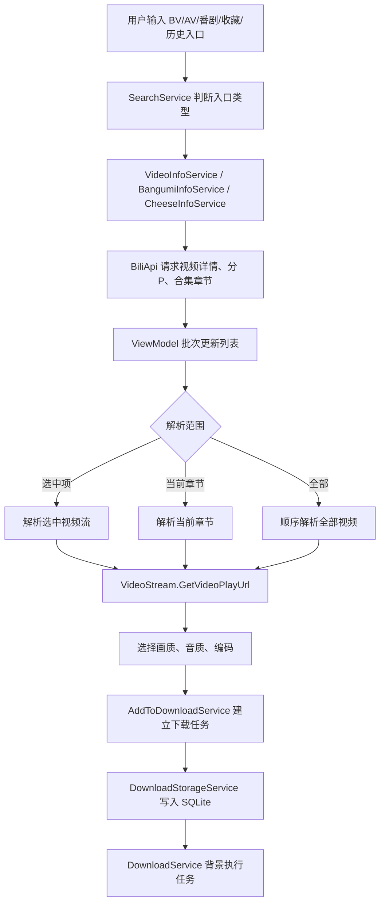
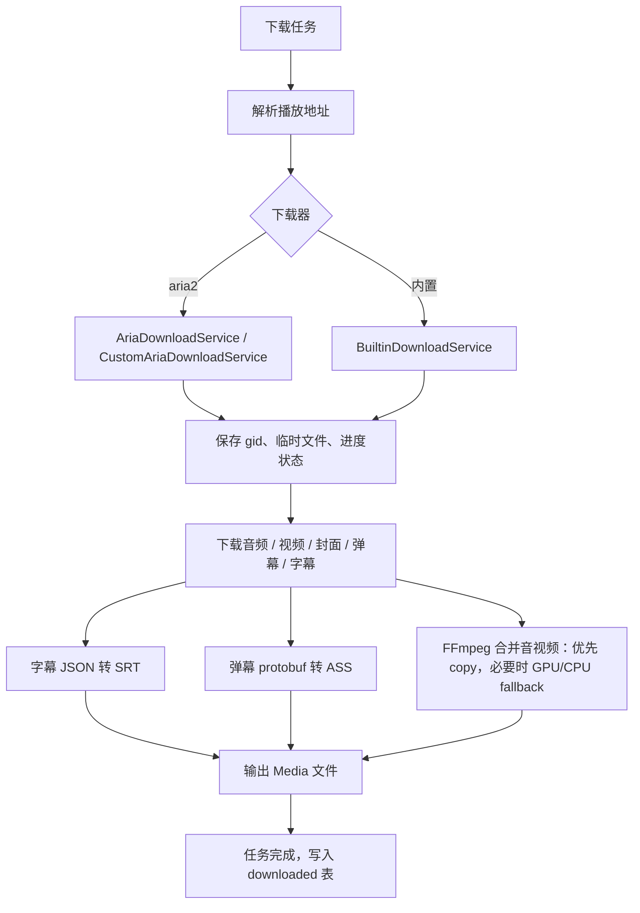

# DownKyi Core

<div align="center">

[](https://github.com/crazysmile-PhD/downkyicore/stargazers)
[](https://github.com/crazysmile-PhD/downkyicore/network)
[](https://github.com/crazysmile-PhD/downkyicore/issues)
[](https://github.com/crazysmile-PhD/downkyicore/blob/main/LICENSE)

</div>

DownKyi Core 是基于哔哩下载姬 Windows 版与 Avalonia 的跨平台 B 站视频下载工具。当前项目已迁移到 .NET 10，并针对启动速度、下载续传、任务清理、日志诊断、SQLite 存储和 CI 发布流程做了维护。

## 下载

[](https://github.com/crazysmile-PhD/downkyicore/releases/latest)
[](https://github.com/crazysmile-PhD/downkyicore/releases/latest)
[](https://github.com/crazysmile-PhD/downkyicore/releases/latest)

- Windows: `DownKyi-*-win-x64.zip` 或 `DownKyi-*-win-x86.zip`
- macOS: `DownKyi-*-osx-arm64.dmg` 或 `DownKyi-*-osx-x64.dmg`
- Linux: AppImage / deb / rpm

更新内容见 [CHANGELOG.md](CHANGELOG.md)。

## 功能

- 支持视频、合集、番剧、课程、收藏、历史记录、稍后再看等入口解析。
- 支持音频、视频、封面、弹幕、普通字幕和 AI 字幕下载。
- 支持 aria2 与内置下载器，并保留断点续传所需的临时文件与状态。
- 下载中删除任务时会同步停止下载器并清理已产生的媒体、`.aria2`、`.download` 等临时文件。
- 支持诊断日志导出，导出内容会脱敏 Cookie、token、邮箱、uid 和本机用户路径。
- 默认使用 AppData / Application Support / XDG 配置目录保存数据，避免把用户数据写进程序目录。

## 运行与数据目录

发布包包含运行所需的 .NET、ffmpeg 和 aria2，不需要用户额外安装。Windows x64 与 Linux 使用 BtbN GPL FFmpeg build，macOS 使用同时提供 x64 / arm64 的静态 FFmpeg build；这些发布包会优先携带可用的硬件 encoder。Windows x86 仍保留兼容性 build，硬件加速不可用时会自动降级。

FFmpeg 合并策略遵循“效能优先，但成功率更重要”：优先无损 stream copy；只有必须重新编码时才自动检测 NVENC / QSV / AMF / VAAPI / VideoToolbox；如果 GPU encoder 不存在、驱动不可用或参数失败，程序会记录原因并回退到低 CPU 软编码。

默认数据目录：

- Windows: `%APPDATA%\DownKyi`
- macOS: `~/Library/Application Support/DownKyi`
- Linux: `$XDG_CONFIG_HOME/DownKyi`，未设置时通常是 `~/.config/DownKyi`

常用子目录：

- `Media`: 默认下载目录
- `Logs`: 应用日志和诊断日志
- `Storage`: SQLite 下载数据库
- `Config`: 设置与登录信息
- `Cache`: 图片和运行缓存
- `Aria`: aria2 session/log

可选模式：

- 设置 `DOWNKYI_DATA_DIR` 可指定完整数据根目录。
- 设置 `DOWNKYI_PORTABLE=1`，或在程序目录放置 `portable` / `.portable` / `DownKyi.portable`，可启用便携模式。

## 工作流程





## 诊断

软件内可在关于页面打开日志目录或导出诊断日志。诊断日志用于快速排查：

- 网络请求失败、超时、状态码异常
- 下载器启动、暂停、续传、清理失败
- 字幕、弹幕、封面、音视频合并异常
- 退出时 aria2 或后台任务未按预期关闭

导出的诊断日志会过滤大量普通调试噪音，并自动遮蔽敏感信息。

## 开发

需要 .NET 10 SDK。

```powershell
dotnet restore
dotnet build .\DownKyi\DownKyi.csproj -c Release
```

本机运行：

```powershell
dotnet run --project .\DownKyi\DownKyi.csproj
```

发布由 GitHub Actions 触发 tag 完成：

```powershell
git tag -a v1.0.x -m "v1.0.x"
git push origin main
git push origin v1.0.x
```

当前 Windows 发布包使用正常 self-contained zip。由于 Avalonia / Prism / Xaml.Behaviors / Newtonsoft.Json 组合并不适合 full trim，项目暂不发布 Windows `-trimmed` 包。

## 免责申明

1. 本软件只提供视频解析，不提供任何资源上传、存储到服务器的功能。
2. 本软件仅解析来自 B 站的内容，不会对解析到的音视频进行二次编码，部分视频会进行有限的格式转换、拼接等操作。
3. 本软件解析得到的所有内容均来自 B 站 UP 主上传、分享，其版权均归原作者所有。内容提供者、上传者应对其提供、上传的内容承担全部责任。
4. 本软件提供的所有内容，仅可用作学习交流使用，未经原作者授权，禁止用于其他用途。请在下载 24 小时内删除。为尊重作者版权，请前往资源的原始发布网站观看，支持原创。
5. 因使用本软件产生的版权问题，软件作者概不负责。
