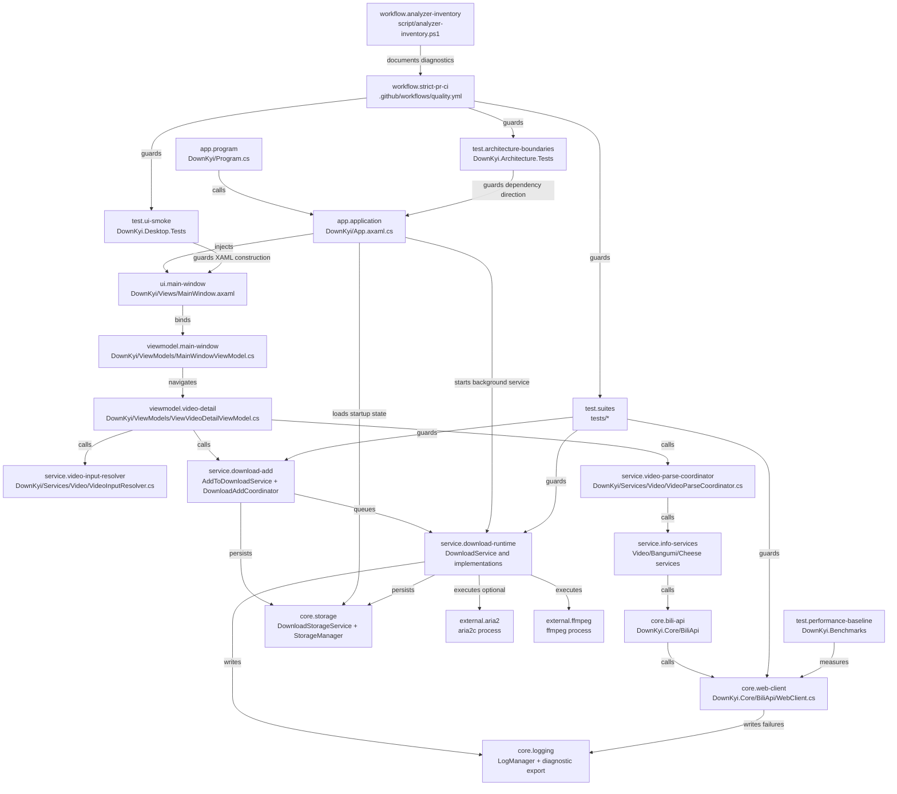
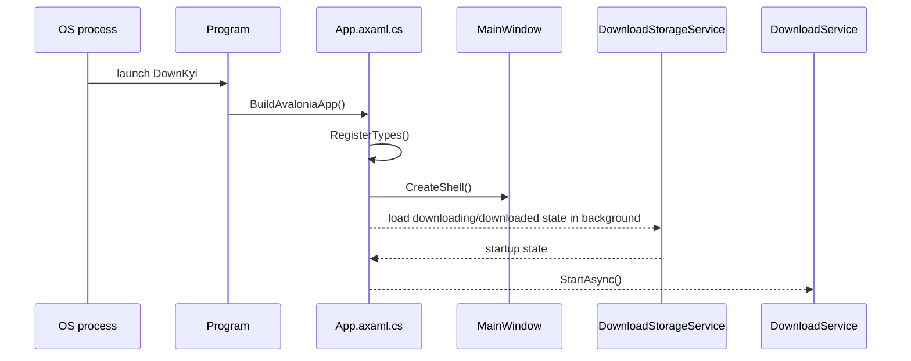
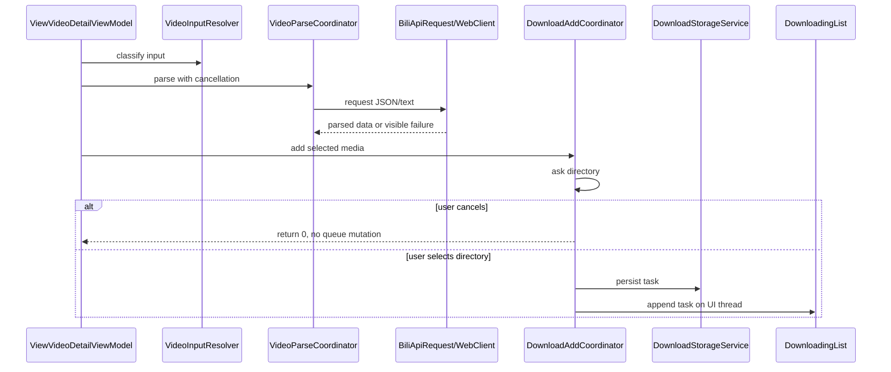
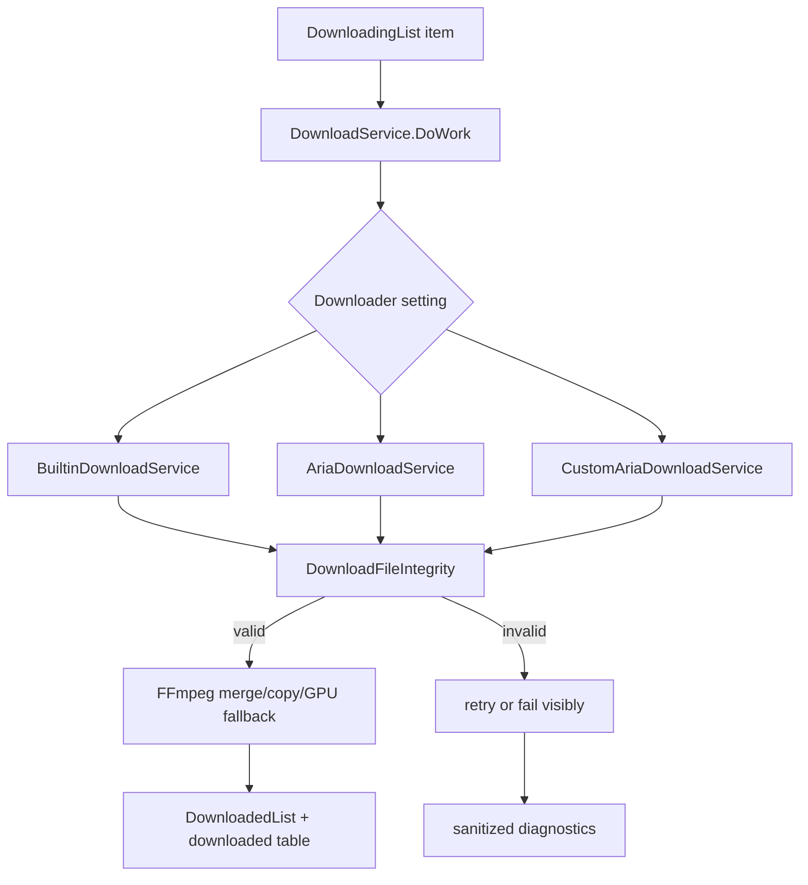

# AI Knowledge Graph

Status: maintained architecture index
Schema version: 1.0
Last reviewed: 2026-07-10

This document is the first file an AI agent should read before changing DownKyi. Its goal is to preserve stable knowledge about project structure, ownership boundaries, and call relationships so agents do not rediscover the same code paths from scratch.

## Update Rules

- Update this file in the same PR when a change adds, removes, or redirects a module boundary.
- Prefer stable responsibilities over implementation trivia. Link exact files only when they are useful entry points.
- Use the node and edge vocabulary below so future tooling can parse this document.
- If reality and this graph disagree, trust the code, fix the code task, then fix this graph.

## Vocabulary

Node types:

- `app`: process startup, DI, shell, global lifecycle.
- `ui`: Avalonia view or UI behavior.
- `viewmodel`: binding state and command wiring.
- `service`: application service with business workflow.
- `core`: reusable API, storage, settings, logging, media, or utility logic.
- `external`: outside process, binary, web API, or package.
- `test`: executable test coverage.
- `workflow`: CI, release, or maintenance automation.
- `doc`: human/AI guidance.

Edge types:

- `calls`: direct method or service call.
- `injects`: dependency registration or constructor injection.
- `publishes`: event aggregator or callback notification.
- `persists`: writes durable app state.
- `reads`: reads durable state or external input.
- `executes`: starts external binary or process.
- `guards`: test or CI protects behavior.
- `documents`: documentation explains a node or edge.

Node record format:

```yaml
id: stable.node.id
type: service
paths:
  - relative/path/File.cs
responsibility: One sentence.
inbound:
  - caller.node.id
outbound:
  - callee.node.id
contracts:
  - Stable behavior other modules rely on.
hazards:
  - Known fragility, performance risk, privacy risk, or platform risk.
tests:
  - test.node.id
```

## System Graph



## Canonical Nodes

### app.program

```yaml
id: app.program
type: app
paths:
  - DownKyi/Program.cs
responsibility: Builds the Avalonia AppBuilder and starts the classic desktop lifetime.
inbound:
  - external.os-process
outbound:
  - app.application
contracts:
  - Do not run Avalonia-dependent code before AppMain/lifetime initialization.
  - Debug-only developer tooling must not enter Release output.
hazards:
  - Avalonia major upgrades often change AppBuilder extension methods.
tests:
  - test.ui-smoke
```

### app.application

```yaml
id: app.application
type: app
paths:
  - DownKyi/App.axaml.cs
responsibility: Owns Prism registration, shell creation, global download lists, startup download-state loading, and graceful exit cleanup.
inbound:
  - app.program
outbound:
  - ui.main-window
  - service.download-runtime
  - core.storage
  - core.logging
contracts:
  - UI shell should appear before heavy download state and service startup finish.
  - Download startup and shutdown must be cancellation-aware.
  - Global downloading/downloaded lists are shared UI state and must be mutated on the UI thread.
hazards:
  - Any synchronous database, aria2, or file scan here directly hurts startup time.
  - Exit cleanup can leave aria2 running if cancellation and timeout paths drift.
tests:
  - test.ui-smoke
```

### viewmodel.main-window

```yaml
id: viewmodel.main-window
type: viewmodel
paths:
  - DownKyi/ViewModels/MainWindowViewModel.cs
responsibility: Owns main window commands, clipboard debounce, navigation entry points, and window close behavior.
inbound:
  - ui.main-window
outbound:
  - viewmodel.video-detail
  - core.logging
contracts:
  - Commands should be cached properties, not rebuilt on every getter call.
  - Clipboard detection must be debounced and cancellation-aware.
hazards:
  - Recreating commands breaks command identity and can cause UI churn.
  - Background clipboard work can outlive the window if cancellation is not wired.
tests:
  - test.ui-smoke
```

### viewmodel.video-detail

```yaml
id: viewmodel.video-detail
type: viewmodel
paths:
  - DownKyi/ViewModels/ViewVideoDetailViewModel.cs
responsibility: Exposes video-detail binding state and wires parse, selection, and add-to-download commands.
inbound:
  - viewmodel.main-window
outbound:
  - service.video-input-resolver
  - service.video-parse-coordinator
  - service.video-selection-state
  - service.download-add
contracts:
  - Keep UI state and command wiring here; keep pure parsing and selection rules in services.
  - Canceling directory selection must not enqueue download work.
hazards:
  - This file historically accumulated unrelated parsing, selection, and download orchestration logic.
  - Any JSON clone/deep-copy pattern here is a performance and schema-fragility smell.
tests:
  - test.video-input-resolver
  - test.video-selection-state
  - test.download-add
```

### service.video-input-resolver

```yaml
id: service.video-input-resolver
type: service
paths:
  - DownKyi/Services/Video/VideoInputResolver.cs
responsibility: Classifies and normalizes BV/AV, video URL, bangumi, and cheese/course entry inputs.
inbound:
  - viewmodel.video-detail
outbound:
  - core.bili-api
contracts:
  - Input classification must match the parse flow and add-to-download flow.
  - Resolver functions should stay pure and fast.
hazards:
  - Divergence between parse and download input handling causes "can parse but cannot download" bugs.
tests:
  - test.video-input-resolver
```

### service.video-parse-coordinator

```yaml
id: service.video-parse-coordinator
type: service
paths:
  - DownKyi/Services/Video/VideoParseCoordinator.cs
  - DownKyi/Services/VideoInfoService.cs
  - DownKyi/Services/BangumiInfoService.cs
  - DownKyi/Services/CheeseInfoService.cs
responsibility: Chooses the correct info service and coordinates refresh/cancellation for parsed video detail data.
inbound:
  - viewmodel.video-detail
outbound:
  - service.info-services
contracts:
  - Cancellation must propagate to Bili API calls.
  - Info-service selection must follow VideoInputResolver results.
hazards:
  - Caching the wrong info service across input kinds can leak stale state.
tests:
  - test.video-input-resolver
```

### service.video-selection-state

```yaml
id: service.video-selection-state
type: service
paths:
  - DownKyi/Services/Video/VideoSelectionState.cs
responsibility: Applies section/page selection, all-selected checks, and parse-scope page selection rules.
inbound:
  - viewmodel.video-detail
outbound: []
contracts:
  - Selection state should be deterministic and unit-testable without Avalonia UI.
hazards:
  - Direct ObservableCollection mutation from background threads can destabilize UI.
tests:
  - test.video-selection-state
```

### core.bili-api

```yaml
id: core.bili-api
type: core
paths:
  - DownKyi.Core/BiliApi
  - DownKyi.Core/BiliApi/BiliApiRequest.cs
responsibility: Wraps Bilibili API endpoints, response parsing, and shared request failure handling.
inbound:
  - service.info-services
  - service.download-runtime
outbound:
  - core.web-client
  - core.logging
contracts:
  - API failures should be visible at the API boundary; do not turn errors into valid empty payloads.
  - OperationCanceledException must be rethrown.
hazards:
  - Bilibili schema changes can deserialize into null and fail later in UI/download flows.
  - Logging full URLs can leak tokens, cookies, and personal query data.
tests:
  - test.web-client
  - test.json-contracts
```

### core.web-client

```yaml
id: core.web-client
type: core
paths:
  - DownKyi.Core/BiliApi/WebClient.cs
responsibility: Builds Bilibili HTTP requests, applies cookies/buvid/referer, and performs cancellation-aware retries.
inbound:
  - core.bili-api
outbound:
  - external.bilibili
  - core.logging
contracts:
  - Retry is iterative, not recursive.
  - Retry exhaustion throws HttpRequestException.
  - HTTP 200 with an empty body is a failed request, not a valid payload.
  - Cancellation is never swallowed by retry.
  - Sanitized URLs are used in diagnostics.
hazards:
  - Returning empty strings from this layer hides root-cause network failures.
  - Cookie handling must not be emitted to console or public logs.
tests:
  - test.web-client
```

### service.download-add

```yaml
id: service.download-add
type: service
paths:
  - DownKyi/Services/Download/AddToDownloadService.cs
  - DownKyi/Services/Download/DownloadAddCoordinator.cs
responsibility: Converts selected parsed media into download tasks, handles duplicate decisions, and writes queue state.
inbound:
  - viewmodel.video-detail
  - other viewmodels that support add-to-download
outbound:
  - core.storage
  - service.download-runtime
contracts:
  - Directory selection returning null means user canceled; no task should be queued.
  - Existing downloaded/downloading records must be checked before inserting duplicates.
hazards:
  - Running add logic on stale VideoInfoView snapshots can enqueue wrong media.
  - Duplicate dialog paths can accidentally remove completed records.
tests:
  - test.download-add
```

### service.download-runtime

```yaml
id: service.download-runtime
type: service
paths:
  - DownKyi/Services/Download/DownloadService.cs
  - DownKyi/Services/Download/BuiltinDownloadService.cs
  - DownKyi/Services/Download/AriaDownloadService.cs
  - DownKyi/Services/Download/CustomAriaDownloadService.cs
  - DownKyi/Services/Download/DownloadTaskFileService.cs
  - DownKyi/Services/Download/DownloadFileIntegrity.cs
  - DownKyi/Services/Download/DownloadDiagnosticLogger.cs
responsibility: Executes queued downloads, updates UI state, verifies file integrity, cleans partial files, and finalizes media.
inbound:
  - app.application
  - service.download-add
outbound:
  - core.storage
  - external.aria2
  - external.ffmpeg
  - core.logging
contracts:
  - Incomplete, empty, HTML/JSON error, and sidecar files are not valid completed media.
  - Canceled/deleted downloads should clean partial files and aria2 metadata.
  - Each multi-segment DURL has a unique key derived from stable segment order or index.
  - DURL merge input is sorted by Order and success requires ffprobe stream, duration, and seek/decode validation.
  - Multi-segment DURL output is re-encoded to rebuild timestamps, keyframes, and MP4 indexes; stream copy is not a valid first strategy.
  - Diagnostic logs should include downloader, split/parallel count, speed, and limit values without full local paths or sensitive URLs.
hazards:
  - Blocking waits in download lifecycle can freeze UI or prevent process exit.
  - Resume behavior depends on preserving partial files while delete behavior must remove them.
  - aria2 process cleanup is platform-sensitive.
  - Reusing Id+codec or runtime GetHashCode values across DURL segments overwrites temporary files and can produce non-seekable MP4 output.
tests:
  - test.download-file-integrity
  - test.fake-http-download
  - test.download-lifecycle
  - test.storage-resume
  - test.ui-smoke
  - test.durl-seekability
```

### core.storage

```yaml
id: core.storage
type: core
paths:
  - DownKyi/Services/Download/DownloadStorageService.cs
  - DownKyi.Core/Storage/StorageManager.cs
  - DownKyi.Core/Storage/Database/SqliteDatabase.cs
responsibility: Owns SQLite download records, app data directories, portable mode, and storage paths.
inbound:
  - app.application
  - service.download-add
  - service.download-runtime
outbound:
  - external.filesystem
contracts:
  - Download records must survive app restarts.
  - Storage paths used in logs must be sanitized when exported for diagnostics.
hazards:
  - Whole-table reads and global locks hurt startup and large history performance.
  - Mixing user data with program files complicates updates and permissions.
tests:
  - test.storage-contracts
  - test.storage-resume
```

### core.logging

```yaml
id: core.logging
type: core
paths:
  - DownKyi.Core/Logging/LogManager.cs
  - DownKyi.Core/Logging/LogInfo.cs
responsibility: Writes rotating logs, emits log events, exports sanitized diagnostic logs, and masks sensitive data.
inbound:
  - app.application
  - core.bili-api
  - service.download-runtime
outbound:
  - external.filesystem
contracts:
  - Diagnostic export must redact cookies, tokens, sensitive URLs, and personal local paths.
  - Flush should be available during shutdown.
hazards:
  - Synchronous or unbounded logging can block shutdown and hide errors.
  - Console logging bypasses sanitization policy.
tests:
  - test.diagnostic-log-redaction
```

### external.ffmpeg

```yaml
id: external.ffmpeg
type: external
paths:
  - DownKyi.Core/FFMpeg
  - script/ffmpeg.ps1
  - script/ffmpeg.sh
responsibility: Merges audio/video, runs delogo/extract operations, and optionally uses hardware encoders with CPU fallback.
inbound:
  - service.download-runtime
outbound:
  - external.process
contracts:
  - Stream copy is preferred when possible.
  - Hardware encode failure must fall back to CPU for success rate.
  - Release packages must include cross-platform ffmpeg binaries with checksums.
hazards:
  - GPU encoder flags differ across OS/GPU/driver.
  - Full transcode can spike CPU and memory during batch downloads.
tests:
  - test.ffmpeg-command-selection
```

### external.aria2

```yaml
id: external.aria2
type: external
paths:
  - DownKyi.Core/Aria2cNet
  - script/aria2.ps1
  - script/aria2.sh
responsibility: Provides optional aria2 RPC download backend and release-packaged aria2 binaries.
inbound:
  - service.download-runtime
outbound:
  - external.process
contracts:
  - RPC server startup/shutdown must be cancellation-aware.
  - Split, max connection, min split size, and limits should match settings.
hazards:
  - Orphaned aria2 processes prevent clean app exit and lock output files.
  - Temporary `.aria2` files must be removed when user deletes a task.
tests:
  - test.fake-http-download
  - test.process-cleanup
```

### workflow.strict-pr-ci

```yaml
id: workflow.strict-pr-ci
type: workflow
paths:
  - .github/workflows/quality.yml
responsibility: Blocks PRs that break formatting, restore, Release build, warnings-as-errors, unit tests, or vulnerable package policy.
inbound:
  - github.pull_request
outbound:
  - test.suites
contracts:
  - PR CI should block definite failures.
  - Nightly/release workflows should own heavy or noisy regression discovery.
  - Local and CI builds must use the same AnalysisMode=All analyzer policy.
  - Windows, Linux, and macOS builds expose the same analyzer diagnostics.
  - Compiler warnings block PRs during cleanup; CA warnings become blocking rule-by-rule and globally after the baseline reaches zero.
  - Cleaned analyzer rules are promoted to errors and cannot regress.
hazards:
  - Turning every historical analyzer suggestion into PR failure makes unrelated PRs impossible.
  - Broad NoWarn, global suppressions, nullable disable, or analyzer exclusions hide new defects.
tests:
  - github.actions
```

### workflow.analyzer-inventory

```yaml
id: workflow.analyzer-inventory
type: workflow
paths:
  - Directory.Build.props
  - .editorconfig
  - script/analyzer-inventory.ps1
  - docs/analyzer-baseline.md
  - docs/analyzer-baseline.csv
responsibility: Converts clean Release build diagnostics and SARIF rule metadata into a deduplicated, reviewable analyzer baseline.
inbound:
  - workflow.strict-pr-ci
outbound:
  - doc.analyzer-baseline
contracts:
  - Repository builds default to EnableNETAnalyzers=true, AnalysisMode=All, and EnforceCodeStyleInBuild=true.
  - Diagnostic identity includes rule, project, file, location, and message so repeated MSBuild summaries do not inflate counts.
  - The CSV retains every affected project, file, line, category, and compatibility-review flag.
  - Compatibility flags are review hints and never authorize mechanical API or schema changes.
hazards:
  - Reusing one SARIF path across projects loses rule metadata because later projects overwrite earlier output.
  - Comparing raw MSBuild warning totals without deduplication overstates the baseline.
tests:
  - clean Release build with AnalysisMode=All
  - git diff --check
```

## Important Call Flows

### Startup



Rule: the shell should be created before download history and aria2 startup can slow down the UI.

### Parse And Add Download



Rule: cancel means no task, no background add, no storage write.

### Download Runtime



Rule: a file is not complete just because the network library reported completion.

## Test Anchors

```yaml
test.web-client:
  paths:
    - tests/DownKyi.Core.Tests/WebClientTests.cs
    - tests/DownKyi.Core.Tests/WebClientLoopbackTests.cs
    - tests/DownKyi.Core.Tests/Infrastructure/LoopbackHttpServer.cs
  guards:
    - retry exhaustion throws HttpRequestException
    - empty HTTP 200 responses retry and fail visibly
    - HTTP 403, 429, and 500 fail visibly
    - malformed JSON and HTML are not accepted as JSON
    - Content-Length mismatch is detected while streaming
    - slow-response cancellation is not retried
    - cancellation is not retried or swallowed
    - query parameter URL building stays stable

test.download-add:
  paths:
    - tests/DownKyi.Tests/DownloadAddCoordinatorTests.cs
  guards:
    - canceling directory selection does not call add
    - selected directory reaches add service

test.download-file-integrity:
  paths:
    - tests/DownKyi.Tests/DownloadFileIntegrityTests.cs
  guards:
    - empty files, error payloads, sidecars, and short files are rejected

test.download-lifecycle:
  paths:
    - tests/DownKyi.Tests/DownloadTaskFileServiceTests.cs
  guards:
    - generated file discovery includes media, assets, and resume sidecars
    - deleting a task removes partial files and resume sidecars
    - cancellation before deletion preserves resume data

test.storage-resume:
  paths:
    - tests/DownKyi.Tests/DownloadStorageResumeTests.cs
  guards:
    - gid, partial file map, downloaded assets, paused state, and progress survive reopen

test.ffmpeg-command-selection:
  paths:
    - tests/DownKyi.Core.Tests/FfmpegProcessingPlanTests.cs
  guards:
    - stream copy runs before hardware encoding
    - CPU fallback remains last and is never removed when hardware is unavailable

test.process-cleanup:
  paths:
    - tests/DownKyi.Core.Tests/AriaServerProcessTests.cs
  guards:
    - tracked aria2-compatible process is terminated and released

test.architecture-boundaries:
  paths:
    - tests/DownKyi.Architecture.Tests/ProjectDependencyTests.cs
  guards:
    - production project references remain acyclic
    - target Domain/Application/Infrastructure/Desktop dependency direction is enforced
    - Domain cannot reference UI, SQLite, JSON, or FFmpeg framework packages

test.ui-smoke:
  paths:
    - tests/DownKyi.Desktop.Tests/UiSmokeTests.cs
  guards:
    - Avalonia headless platform initializes
    - MainWindow XAML and its ViewModel binding can be constructed
    - production AppBuilder can be created

test.performance-baseline:
  paths:
    - benchmarks/DownKyi.Benchmarks
    - docs/performance-baseline.md
  guards:
    - request preparation and JSON allocation baselines are reproducible

test.video-input-resolver:
  paths:
    - tests/DownKyi.Tests/VideoInputResolverTests.cs
  guards:
    - BV/AV/video/bangumi/cheese inputs classify consistently

test.video-selection-state:
  paths:
    - tests/DownKyi.Tests/VideoSelectionStateTests.cs
  guards:
    - page/section selection behavior is deterministic
```

## Backlog Nodes

These nodes are intentionally documented even when coverage is still missing. Add tests before major refactors.

```yaml
test.json-contracts:
  status: planned
  should_guard:
    - sample Bilibili JSON deserializes
    - missing data does not become NullReference later
    - code != 0 is visible
    - empty string and HTML error pages fail as JSON

test.composition-root:
  status: planned
  should_guard:
    - the real Host registers all main services without Prism global state
    - MainWindow and key ViewModels resolve from the real composition root
    - shutdown cancels workers and flushes storage, settings, and logs within a bounded timeout

test.durl-seekability:
  status: planned-for-pr-07-15
  should_guard:
    - DURL segment keys include stable order or index
    - DURL input is sorted by Order
    - multi-segment concat skips stream copy
    - ffprobe confirms stream, duration, middle seek, and tail seek decoding
    - invalid output is deleted and the task fails visibly

test.system-performance:
  status: planned-for-pr-30-32
  should_guard:
    - cold and warm shell startup time
    - peak working set during unfinished-task restore
    - SQLite writes per task-minute
    - aggregate throughput at 1, 4, and 8 tasks
    - UI progress notifications per second
    - FFmpeg CPU/GPU concurrency and peak memory
  metadata:
    - runtime, OS, architecture, dataset size, backend, and commit SHA
```

## AI Edit Protocol

1. Read this document before analysis or edits, then identify the affected node.
2. Read the listed entry files and test anchors.
3. Preserve the node contracts unless the user explicitly asks to change behavior.
4. If a contract changes, update this graph and add or update tests in the same PR.
5. For cross-node changes, describe the edge being added, removed, or redirected.
6. Keep diagnostic logs sanitized: no full local paths, cookies, tokens, or sensitive URLs.
7. Run the strict PR CI commands locally when possible before pushing.
