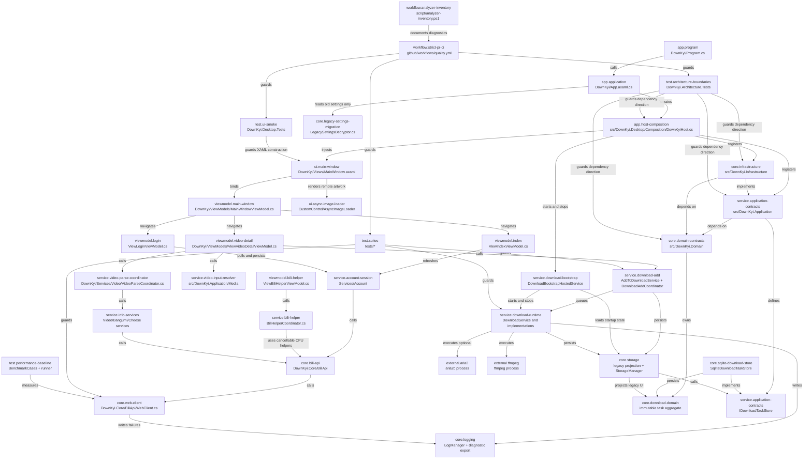
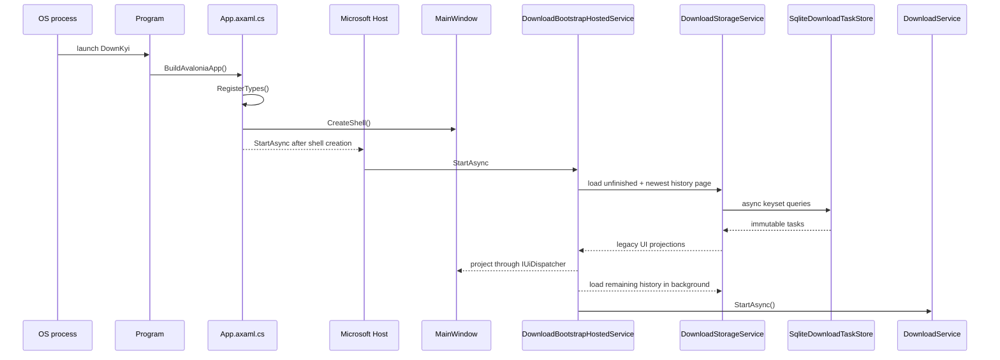
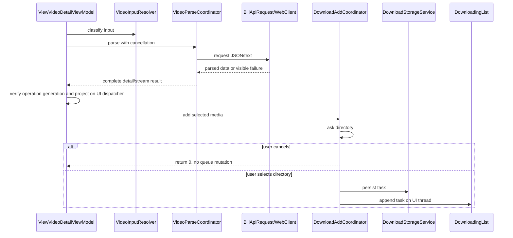
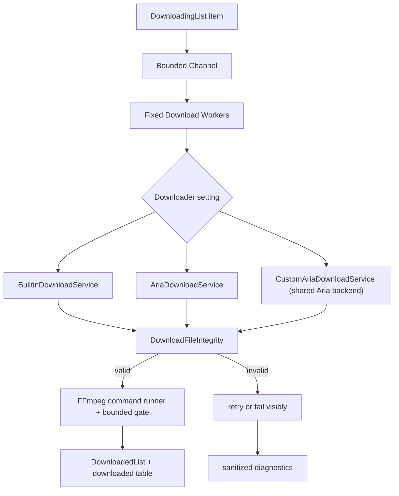

# AI Knowledge Graph

Status: maintained architecture index
Schema version: 1.0
Last reviewed: 2026-07-13

This document is the first file an AI agent should read before changing DownKyi. Its goal is to preserve stable knowledge about project structure, ownership boundaries, and call relationships so agents do not rediscover the same code paths from scratch.

## Update Rules

- Update this file in the same PR when a change adds, removes, or redirects a module boundary.
- Prefer stable responsibilities over implementation trivia. Link exact files only when they are useful entry points.
- Use the node and edge vocabulary below so future tooling can parse this document.
- If reality and this graph disagree, trust the code, fix the code task, then fix this graph.

## Vocabulary

Node types:

- `app`: process startup, DI, shell, global lifecycle.
- `ui`: Avalonia view or UI behavior.
- `viewmodel`: binding state and command wiring.
- `service`: application service with business workflow.
- `core`: reusable API, storage, settings, logging, media, or utility logic.
- `external`: outside process, binary, web API, or package.
- `test`: executable test coverage.
- `workflow`: CI, release, or maintenance automation.
- `doc`: human/AI guidance.

Edge types:

- `calls`: direct method or service call.
- `injects`: dependency registration or constructor injection.
- `publishes`: event aggregator or callback notification.
- `persists`: writes durable app state.
- `reads`: reads durable state or external input.
- `executes`: starts external binary or process.
- `guards`: test or CI protects behavior.
- `documents`: documentation explains a node or edge.

Node record format:

```yaml
id: stable.node.id
type: service
paths:
  - relative/path/File.cs
responsibility: One sentence.
inbound:
  - caller.node.id
outbound:
  - callee.node.id
contracts:
  - Stable behavior other modules rely on.
hazards:
  - Known fragility, performance risk, privacy risk, or platform risk.
tests:
  - test.node.id
```

## System Graph



## Canonical Nodes

### app.program

```yaml
id: app.program
type: app
paths:
  - DownKyi/Program.cs
responsibility: Builds the Avalonia AppBuilder and starts the classic desktop lifetime.
inbound:
  - external.os-process
outbound:
  - app.application
contracts:
  - Do not run Avalonia-dependent code before AppMain/lifetime initialization.
  - Debug-only developer tooling must not enter Release output.
hazards:
  - Avalonia major upgrades often change AppBuilder extension methods.
tests:
  - test.ui-smoke
```

### app.application

```yaml
id: app.application
type: app
paths:
  - DownKyi/App.axaml.cs
  - DownKyi/Composition/LegacyDesktopComposition.cs
responsibility: Bridges legacy Prism registrations into the Host, shows the shell, and coordinates bounded Host-level exit cleanup.
inbound:
  - app.program
outbound:
  - app.host-composition
  - ui.main-window
  - service.download-bootstrap
  - service.download-list-state
  - core.storage
  - core.logging
contracts:
  - UI shell should appear before heavy download state and service startup finish.
  - The Host is created with default configuration sources disabled and must not redirect database, settings, login, portable-mode, or aria2 session paths.
  - Download startup and shutdown are delegated to a Host-owned IHostedService and must remain cancellation-aware.
  - MainWindow defers final close until one idempotent bounded shutdown task has canceled Host/download work and flushed settings/logs; Exit never synchronously waits on a Task.
  - Host stop shares the outer five-second cleanup budget; a shorter nested timeout must not interrupt resumable-state persistence before the outer fallback runs.
  - Storage retention maintenance is an IHostedService and cannot be an App-owned fire-and-forget Task.
  - `DownloadListState` owns one stable downloading/history collection pair shared by Prism, Host services, and ViewModels; App must not expose static list properties.
  - App, download runtime, ViewModels, shared HTTP state, and process owners release their cancellation and disposable resources explicitly.
  - UI continuations use the Avalonia context; background and Core continuations do not depend on it.
hazards:
  - Any synchronous database, aria2, or file scan here directly hurts startup time.
  - Exit cleanup can leave aria2 running if cancellation and timeout paths drift; the tracked-process timeout fallback must remain bounded.
  - `LegacyDesktopComposition` and `MainWindow.AttachLegacyRegion` still bridge Prism global region state; PR 25-29 owns deletion after typed navigation takes over.
tests:
  - test.ui-smoke
  - test.composition-root
```

### app.host-composition

```yaml
id: app.host-composition
type: app
paths:
  - src/DownKyi.Desktop/Composition/DownKyiHost.cs
responsibility: Builds the single Microsoft.Extensions.Hosting composition root and owns application-wide service lifetime.
inbound:
  - app.application
outbound:
  - core.domain-contracts
  - service.application-contracts
  - core.infrastructure
  - service.download-bootstrap
contracts:
  - `DisableDefaults=true` prevents implicit configuration, logging, environment, and path side effects during composition.
  - Host stop signals the shared application shutdown token before services are disposed.
  - Only this target-architecture project references Microsoft.Extensions.Hosting.
hazards:
  - Legacy UI types are registered through a callback until PR 25-29 moves them into DownKyi.Desktop.
tests:
  - test.composition-root
  - test.architecture-boundaries
```

### core.domain-contracts

```yaml
id: core.domain-contracts
type: core
paths:
  - src/DownKyi.Domain/Results/OperationError.cs
  - src/DownKyi.Domain/Results/OperationResult.cs
  - src/DownKyi.Domain/Downloads
responsibility: Defines framework-free typed results and the immutable download task aggregate with legal lifecycle transitions.
inbound:
  - service.application-contracts
  - core.infrastructure
outbound: []
contracts:
  - Failure retains a typed error kind, stable code, and user-safe message.
  - Success values are non-null; failed results cannot expose a value without an explicit exception.
  - Download task IDs are stable strings; task versions increase monotonically and timestamps never move backward.
  - Pause, cancel, delete, failure, completion, retry, progress, and transfer updates remain distinct transitions.
hazards:
  - Error messages must not contain cookies, full sensitive URLs, or personal filesystem paths.
tests:
  - test.domain-results
  - test.download-domain
  - test.architecture-boundaries
```

### service.application-contracts

```yaml
id: service.application-contracts
type: service
paths:
  - src/DownKyi.Application/Lifetime/ApplicationCancellation.cs
  - src/DownKyi.Application/Time/IClock.cs
  - src/DownKyi.Application/Downloads/IDownloadTaskStore.cs
  - src/DownKyi.Application/Downloads/DownloadHistoryPage.cs
  - src/DownKyi.Application/Downloads/DownloadProgressWrite.cs
responsibility: Defines application lifetime, deterministic time, and async download persistence contracts without UI or infrastructure dependencies.
inbound:
  - app.host-composition
  - core.infrastructure
outbound:
  - core.domain-contracts
contracts:
  - Every long-running operation links caller cancellation with the application shutdown token.
  - Cancellation remains control flow and must not be converted into a failure result or retry.
  - Time-dependent use cases receive IClock instead of reading the system clock directly.
  - Store APIs are cancellation-aware and asynchronous; history uses stable keyset cursors rather than whole-table offsets.
  - Coalesced progress writes retain their first expected version and latest contiguous target version.
tests:
  - test.application-lifetime
  - test.architecture-boundaries
```

### core.infrastructure

```yaml
id: core.infrastructure
type: core
paths:
  - src/DownKyi.Infrastructure/Time/SystemClock.cs
  - src/DownKyi.Infrastructure/Downloads/SqliteDownloadTaskStore.cs
  - src/DownKyi.Infrastructure/Downloads/DownloadStoreSchema.cs
  - src/DownKyi.Infrastructure/Downloads/DownloadProgressWriteBehind.cs
responsibility: Implements Application time and download persistence contracts using pooled SQLite connections and bounded background writes.
inbound:
  - app.host-composition
outbound:
  - service.application-contracts
  - core.domain-contracts
contracts:
  - Infrastructure never references Desktop or Prism.
  - SystemClock returns UTC time; deterministic tests replace IClock at the composition boundary.
  - SQLite uses one short pooled connection per operation, WAL, parameterized queries, optimistic versions, and transactional state moves.
  - Existing databases are backed up before schema migration; failed migrations roll back and never advance `user_version`.
  - One malformed row is quarantined with record ID, field, and sanitized reason; raw JSON and personal paths are not copied into diagnostics.
  - The progress writer has a one-slot bounded wake channel, a bounded task set, contiguous coalescing, and a final shutdown flush.
  - `SQLite3MC.PCLRaw.bundle` must keep reading the committed SQLCipher v4 fixture before dependency updates are accepted.
tests:
  - test.infrastructure-clock
  - test.download-store
  - test.progress-write-behind
  - test.legacy-sqlcipher
  - test.architecture-boundaries
```

### viewmodel.main-window

```yaml
id: viewmodel.main-window
type: viewmodel
paths:
  - DownKyi/ViewModels/MainWindowViewModel.cs
responsibility: Owns main window commands, clipboard debounce, navigation entry points, and window close behavior.
inbound:
  - ui.main-window
outbound:
  - viewmodel.index
  - viewmodel.login
  - viewmodel.video-detail
  - core.logging
contracts:
  - Commands should be cached properties, not rebuilt on every getter call.
  - Clipboard detection must be debounced and cancellation-aware.
hazards:
  - Recreating commands breaks command identity and can cause UI churn.
  - Background clipboard work can outlive the window if cancellation is not wired.
tests:
  - test.ui-smoke
```

### viewmodel.index

```yaml
id: viewmodel.index
type: viewmodel
paths:
  - DownKyi/ViewModels/ViewIndexViewModel.cs
responsibility: Binds the home search entry, user header state, and navigation commands without performing account network work.
inbound:
  - viewmodel.main-window
outbound:
  - service.account-session
  - viewmodel.video-detail
contracts:
  - Construction does not start user API work; the first `start` navigation performs exactly one refresh.
  - A newer navigation refresh cancels the previous operation and stale results cannot change the header or login state.
  - Background settings refresh does not clear or rewrite the search input.
hazards:
  - Starting refresh in both the constructor and navigation doubles startup requests and delays first interaction.
  - A failed foreground refresh must restore login-panel visibility instead of leaving the panel hidden.
tests:
  - test.account-session
  - test.ui-smoke
  - test.architecture-boundaries
```

### viewmodel.login

```yaml
id: viewmodel.login
type: viewmodel
paths:
  - DownKyi/ViewModels/ViewLoginViewModel.cs
responsibility: Projects QR login state, messages, and navigation while delegating blocking account operations.
inbound:
  - viewmodel.index
outbound:
  - service.account-session
contracts:
  - Restarting, leaving, or disposing the page cancels the active QR generation/poll operation.
  - QR bitmap and bound-state mutation stay on the UI dispatcher; synchronous HTTP and cookie-file writes do not.
hazards:
  - Wrapping the entire UI workflow in Task.Run causes cross-thread UI/event access and hides cancellation ownership.
tests:
  - test.account-session
  - test.architecture-boundaries
```

### service.account-session

```yaml
id: service.account-session
type: service
paths:
  - DownKyi/Services/Account/UserSessionCoordinator.cs
  - DownKyi/Services/Account/LoginCoordinator.cs
responsibility: Runs synchronous account API and cookie persistence operations away from the UI thread and returns cancellable snapshots/results.
inbound:
  - viewmodel.index
  - viewmodel.login
outbound:
  - core.bili-api
  - core.legacy-settings-migration
contracts:
  - Caller cancellation is checked before and after every synchronous network or file operation.
  - Navigation user data maps to the existing `UserInfoSettings` schema without changing keys or login-file location.
  - WBI key extraction accepts absolute and protocol-relative addresses and strips query/fragment suffixes using ordinal parsing.
hazards:
  - Legacy synchronous Bilibili calls cannot abort an in-flight socket request yet; cancellation prevents later persistence and stale UI projection.
  - SettingsManager remains a compatibility dependency until injected settings snapshots replace it in PR 16-24.
tests:
  - test.account-session
  - test.ui-smoke
  - test.architecture-boundaries
```

### viewmodel.video-detail

```yaml
id: viewmodel.video-detail
type: viewmodel
paths:
  - DownKyi/ViewModels/ViewVideoDetailViewModel.cs
responsibility: Exposes video-detail binding state and wires parse, selection, and add-to-download commands.
inbound:
  - viewmodel.main-window
outbound:
  - service.video-input-resolver
  - service.video-parse-coordinator
  - service.video-selection-state
  - service.video-search-state
  - service.download-add
  - service.desktop-platform-boundaries
contracts:
  - Keep UI state and command wiring here; keep pure parsing and selection rules in services.
  - Canceling directory selection must not enqueue download work.
  - `Idle`, `Busy`, `Content`, and `Empty` are one mutually exclusive CommunityToolkit state model.
  - Ordinary row clicks toggle selection; repeated clicks clear the item and select-all has an explicit clear-selection peer.
  - Avalonia `DataGrid` selection and splitter reset mechanics live in View behaviors; this ViewModel exposes only selection intent and a scalar reset version.
  - Search filtering projects from one shallow source of the original `VideoPage` objects; clearing a search must preserve parsed stream, quality, and selection mutations.
  - Only the current operation generation may project detail/stream results or restore display state; canceled work cannot overwrite a newer request.
hazards:
  - This file historically accumulated unrelated parsing, selection, and download orchestration logic.
  - Reintroducing a complete cached section/page object graph duplicates memory and can restore stale parsed or selected state.
tests:
  - test.video-input-resolver
  - test.video-selection-state
  - test.video-search-state
  - test.download-add
```

### service.video-input-resolver

```yaml
id: service.video-input-resolver
type: service
paths:
  - src/DownKyi.Application/Media/VideoInputResolver.cs
  - DownKyi/Services/Video/VideoInputResolver.cs
responsibility: Classifies and normalizes BV/AV, video URL, bangumi, and cheese/course entry inputs.
inbound:
  - viewmodel.video-detail
outbound:
  - service.video-parse-coordinator
contracts:
  - Input classification must match the parse flow and add-to-download flow.
  - Application owns pure classification; the legacy adapter only maps the result to external `PlayStreamType`.
hazards:
  - Divergence between parse and download input handling causes "can parse but cannot download" bugs.
tests:
  - test.video-input-resolver
```

### service.desktop-platform-boundaries

```yaml
id: service.desktop-platform-boundaries
type: service
paths:
  - src/DownKyi.Application/Desktop
  - DownKyi/Platform
responsibility: Keeps clipboard and file/folder picker contracts independent of Avalonia while Desktop adapters own MainWindow and StorageProvider access.
inbound:
  - viewmodel.video-detail
  - legacy toolbox/settings/dialog viewmodels
outbound:
  - external.os-desktop
contracts:
  - Application interfaces contain no Avalonia, Prism, path-policy, or global App references.
  - Picker cancellation returns null or an empty list and never becomes a fake path.
  - Host smoke injects a fake clipboard and resolves key ViewModels without initializing Prism ContainerLocator.
hazards:
  - Notifications, dialogs, and navigation still use Prism/EventAggregator and remain in PR 16-24.
tests:
  - test.architecture-boundaries
  - test.ui-smoke
```

### viewmodel.bili-helper

```yaml
id: viewmodel.bili-helper
type: viewmodel
paths:
  - DownKyi/ViewModels/Toolbox/ViewBiliHelperViewModel.cs
responsibility: Binds AV/BV conversion, danmaku sender lookup, and external navigation results to the Bili Helper page.
inbound:
  - typed or legacy navigation
outbound:
  - service.bili-helper
  - service.desktop-platform-boundaries
contracts:
  - The ViewModel never creates background CPU work directly; it awaits the injected coordinator.
  - Starting a new lookup or disposing the page cancels the previous operation and prevents stale result projection.
hazards:
  - Assigning a canceled lookup result after a newer request overwrites the current user input result.
tests:
  - test.bili-helper
  - test.architecture-boundaries
```

### service.bili-helper

```yaml
id: service.bili-helper
type: service
paths:
  - DownKyi/Services/Toolbox/BiliHelperCoordinator.cs
  - DownKyi.Core/BiliApi/BiliUtils/BvId.cs
  - DownKyi.Core/BiliApi/BiliUtils/DanmakuSender.cs
responsibility: Validates AV/BV conversion inputs and runs the expensive danmaku-sender reverse lookup outside the UI thread with cancellation.
inbound:
  - viewmodel.bili-helper
outbound:
  - core.bili-api
contracts:
  - Invalid or empty AV/BV input leaves the existing UI value unchanged.
  - The public synchronous danmaku lookup remains compatible, while the coordinator always uses the cancellation-aware overload.
  - The coordinator passes caller cancellation into both Task scheduling and the core CPU loop.
hazards:
  - Danmaku sender reversal can inspect up to 100,000,000 candidates; running it on the UI thread freezes the application.
  - A cancellation check only before Task.Run cannot stop a search already consuming CPU; the core loop must poll the token.
tests:
  - test.bili-helper
  - test.architecture-boundaries
```

### viewmodel.user-space

```yaml
id: viewmodel.user-space
type: viewmodel
paths:
  - DownKyi/ViewModels/ViewUserSpaceViewModel.cs
  - DownKyi/Services/UserSpace/UserSpaceLoadCoordinator.cs
responsibility: Projects one background-loaded user-space snapshot into profile, publication, collection, relation, and statistics UI state.
inbound:
  - typed or legacy navigation
outbound:
  - core.bili-api
contracts:
  - Background API work returns a snapshot and never mutates Avalonia-bound properties.
  - A new navigation cancels the previous load; leaving or disposing the page cancels projection of stale results.
  - Back first uses the navigation journal and falls back to the recorded parent or index.
hazards:
  - Legacy synchronous Bilibili API methods cannot abort an in-flight socket call yet; cancellation prevents subsequent calls and stale UI projection.
tests:
  - test.architecture-boundaries
```

### service.video-parse-coordinator

```yaml
id: service.video-parse-coordinator
type: service
paths:
  - DownKyi/Services/Video/VideoParseCoordinator.cs
  - DownKyi/Services/VideoInfoService.cs
  - DownKyi/Services/BangumiInfoService.cs
  - DownKyi/Services/CheeseInfoService.cs
responsibility: Chooses the correct info service, builds complete detail/stream results in background work, and coordinates refresh/cancellation before UI projection.
inbound:
  - viewmodel.video-detail
outbound:
  - service.info-services
contracts:
  - Cancellation must propagate to Bili API calls.
  - Info-service selection must follow VideoInputResolver results.
  - Info services return data and never dispatch to Avalonia; the ViewModel projects a complete result on the UI dispatcher.
  - A service is cached only after its operation succeeds, and reuse is limited to the exact input string.
hazards:
  - Caching before cancellation checks or across a different input can leak stale service state into a later parse.
tests:
  - test.video-input-resolver
  - test.video-parse-coordinator
```

### service.video-selection-state

```yaml
id: service.video-selection-state
type: service
paths:
  - DownKyi/Services/Video/VideoSelectionState.cs
responsibility: Applies section/page selection, all-selected checks, and parse-scope page selection rules.
inbound:
  - viewmodel.video-detail
outbound: []
contracts:
  - Selection state should be deterministic and unit-testable without Avalonia UI.
  - Selection deltas affect only pages still visible in the current section; an ItemsSource swap must not clear another section's selections.
hazards:
  - Direct ObservableCollection mutation from background threads can destabilize UI.
tests:
  - test.video-selection-state
```

### ui.video-page-selection

```yaml
id: ui.video-page-selection
type: behavior
paths:
  - DownKyi/CustomAction/VideoPageSelectionBehavior.cs
  - DownKyi/CustomAction/ResetGridSplitterBehavior.cs
  - DownKyi/Views/ViewVideoDetail.axaml
responsibility: Maps pointer, keyboard, checkbox, select-all, section changes, and splitter reset bindings to Avalonia controls.
inbound:
  - viewmodel.video-detail
outbound:
  - service.video-selection-state
contracts:
  - The original `VideoPage.IsSelected` values are the durable UI selection source; DataGrid `SelectedItems` is only a synchronized projection.
  - Switching ItemsSource preserves selections owned by the previous section.
  - Behavior properties update bound scalar state without placing Avalonia controls or behavior objects in the ViewModel.
hazards:
  - Treating DataGrid selection clearing during an ItemsSource swap as a user action loses cross-section selections.
tests:
  - test.video-selection-state
  - test.ui-smoke
  - test.architecture-boundaries
```

### service.video-search-state

```yaml
id: service.video-search-state
type: service
paths:
  - DownKyi/Services/Video/VideoSearchState.cs
responsibility: Maintains the original page references for each video section and applies a visible search projection without cloning the media graph.
inbound:
  - viewmodel.video-detail
outbound: []
contracts:
  - Reset captures one shallow source list per section; filters and clears always reuse the same `VideoPage` instances.
  - Search uses explicit ordinal matching and never mutates parsed stream, quality, or selection values.
hazards:
  - Deep-copying pages creates stale parallel state and increases memory for large collections.
tests:
  - test.video-search-state
```

### core.bili-api

```yaml
id: core.bili-api
type: core
paths:
  - DownKyi.Core/BiliApi
  - DownKyi.Core/BiliApi/BiliApiRequest.cs
responsibility: Wraps Bilibili API endpoints, response parsing, and shared request failure handling.
inbound:
  - service.info-services
  - service.download-runtime
  - service.bili-helper
  - service.account-session
outbound:
  - core.web-client
  - core.logging
contracts:
  - API failures should be visible at the API boundary; do not turn errors into valid empty payloads.
  - OperationCanceledException must be rethrown.
  - WBI request signatures must match the fixed protocol vector; MD5 is limited to that external format.
hazards:
  - Bilibili schema changes can deserialize into null and fail later in UI/download flows.
  - Logging full URLs can leak tokens, cookies, and personal query data.
tests:
  - test.web-client
  - test.json-contracts
  - test.wbi-signature
```

### core.web-client

```yaml
id: core.web-client
type: core
paths:
  - DownKyi.Core/BiliApi/WebClient.cs
  - DownKyi.Core/BiliApi/BilibiliHttpClient.cs
  - DownKyi.Core/BiliApi/BilibiliHttpClientRegistration.cs
responsibility: Uses one IHttpClientFactory-managed typed client to build Bilibili requests, apply cookies/buvid/referer, and perform bounded cancellation-aware retries; WebClient is the temporary legacy facade.
inbound:
  - core.bili-api
outbound:
  - external.bilibili
  - core.logging
contracts:
  - Retry is iterative, not recursive.
  - Retry exhaustion throws HttpRequestException.
  - HTTP 200 with an empty body is a failed request, not a valid payload.
  - Cancellation is never swallowed by retry.
  - HTTP 401/403 and rejected API schemas are non-retryable; HTTP 429 honors Retry-After with a bounded delay.
  - JSON metadata uses source-generated System.Text.Json contexts; legacy endpoint DTO materialization remains Newtonsoft-compatible.
  - Sanitized URLs are used in diagnostics.
hazards:
  - Synchronous legacy endpoint signatures keep the WebClient facade alive until PR 16-24 moves callers to cancellable use cases; do not add new facade callers.
  - Cookie handling must not be emitted to console or public logs.
tests:
  - test.web-client
```

### service.download-add

```yaml
id: service.download-add
type: service
paths:
  - DownKyi/Services/Download/AddToDownloadService.cs
  - DownKyi/Services/Download/AddToDownloadServiceFactory.cs
  - DownKyi/Services/Download/DownloadAddCoordinator.cs
responsibility: Converts selected parsed media into download tasks, handles duplicate decisions, and writes queue state.
inbound:
  - viewmodel.video-detail
  - other viewmodels that support add-to-download
outbound:
  - core.storage
  - service.download-runtime
  - service.download-list-state
contracts:
  - Directory selection returning null means user canceled; no task should be queued.
  - Existing downloaded/downloading records must be checked before inserting duplicates.
  - ViewModels receive `IAddToDownloadServiceFactory`; the add service receives list/storage owners explicitly and cannot resolve them through App.
hazards:
  - Running add logic on stale VideoInfoView snapshots can enqueue wrong media.
  - Duplicate dialog paths can accidentally remove completed records.
tests:
  - test.download-add
```

### service.download-list-state

```yaml
id: service.download-list-state
type: ui-state
paths:
  - DownKyi/Services/Download/DownloadListState.cs
  - DownKyi/ViewModels/DownloadManager
responsibility: Owns the stable observable downloading/history collection identities used by bootstrap, runtime, migration, and download-manager views.
inbound:
  - service.download-bootstrap
  - service.download-add
  - service.download-runtime
outbound: []
contracts:
  - Sorting and replacement mutate the existing collection instance so XAML bindings and runtime references never diverge.
  - Collection mutation is projected on the UI thread by the calling desktop boundary.
  - Headless construction must not synchronously wait on an uninitialized Avalonia dispatcher.
hazards:
  - Replacing the collection object disconnects existing views and download workers.
  - Dispatching resource lookup without an initialized Application can deadlock parallel tests and early startup.
tests:
  - test.download-list-state
  - test.ui-smoke
  - test.architecture-boundaries
```

### service.download-bootstrap

```yaml
id: service.download-bootstrap
type: hosted-service
paths:
  - DownKyi/Services/Download/DownloadBootstrapHostedService.cs
  - DownKyi/Services/Download/DownloadRuntimeFactory.cs
  - DownKyi/Platform/IUiDispatcher.cs
  - DownKyi/Platform/AvaloniaUiDispatcher.cs
responsibility: Restores persisted download projections, pages history, selects the configured backend, and owns download runtime start/stop inside the Host lifecycle.
inbound:
  - app.host-composition
outbound:
  - core.storage
  - service.download-list-state
  - service.download-runtime
contracts:
  - Shell construction completes before Host startup performs database reads or starts a downloader backend.
  - Startup restores every unfinished task and the newest 100 history items before loading remaining history in the background.
  - Observable collection mutation crosses the explicit `IUiDispatcher` boundary; the hosted service cannot reference Avalonia Dispatcher directly.
  - Runtime creation is isolated behind `IDownloadRuntimeFactory`, and Host stop awaits runtime recovery plus any outstanding history load together.
  - Host shutdown does not impose a shorter cancellation deadline than the App-level bounded cleanup fallback.
  - Cancellation must not turn active persisted rows into abandoned `Downloading` state; runtime shutdown owns resumable-state recovery.
hazards:
  - Starting storage or aria2 work during shell construction regresses first-window latency.
  - Disposing the selected backend before its asynchronous shutdown recovery completes can corrupt resume state.
tests:
  - test.download-bootstrap
  - test.ui-smoke
  - test.architecture-boundaries
```

### service.download-runtime

```yaml
id: service.download-runtime
type: service
paths:
  - DownKyi/Services/Download/DownloadService.cs
  - DownKyi/Services/Download/BuiltinDownloadService.cs
  - DownKyi/Services/Download/AriaDownloadService.cs
  - DownKyi/Services/Download/CustomAriaDownloadService.cs
  - DownKyi/Services/Download/DownloadTaskFileService.cs
  - DownKyi/Services/Download/DownloadFileIntegrity.cs
  - DownKyi/Services/Download/DownloadDiagnosticLogger.cs
  - DownKyi/Services/Download/DownloadShutdownCoordinator.cs
responsibility: Executes queued downloads, updates UI state, verifies file integrity, cleans partial files, and finalizes media.
inbound:
  - service.download-bootstrap
  - service.download-add
outbound:
  - core.storage
  - service.download-list-state
  - external.aria2
  - external.ffmpeg
  - core.logging
contracts:
  - A bounded Channel and fixed workers own queue consumption; global shutdown and per-task cancellation cannot create unbounded transfer tasks.
  - Built-in and aria2 backends share key generation, resume path selection, integrity checks, and awaited persistence; CustomAria only selects the shared aria backend.
  - Incomplete, empty, HTML/JSON error, and sidecar files are not valid completed media.
  - Pause and app shutdown preserve resumable partial files; explicit deletion removes media plus `.aria2` and `.download` sidecars.
  - Each multi-segment DURL key includes stable `DURL.Order`; BVID, codec, and runtime hash codes are not segment identities.
  - DURL merge input is sorted by Order and success requires ffprobe stream, duration, and middle/tail seek-decode validation.
  - Multi-segment DURL output is re-encoded to rebuild timestamps, keyframes, and MP4 indexes; hardware failure falls back to `libx264 + aac`.
  - State transitions await persistence; high-rate progress uses the bounded write-behind boundary.
  - Runtime receives `DownloadListState` and `DownloadStorageService` through construction; it cannot resolve either through App/Prism.
  - Shutdown cancellation while dispatch waits for capacity cannot skip fixed-worker drain or resumable-state recovery; active `Downloading` rows return to `WaitForDownload` and are persisted before exit completes.
  - Diagnostic logs should include downloader, split/parallel count, speed, and limit values without full local paths or sensitive URLs.
hazards:
  - Blocking waits in download lifecycle can freeze UI or prevent process exit.
  - Letting an expected shutdown `OperationCanceledException` escape before state recovery leaves rows stored as active and prevents clean resume after restart.
  - Resume behavior depends on preserving partial files while delete behavior must remove them.
  - aria2 process cleanup is platform-sensitive.
  - Reusing Id+codec or runtime GetHashCode values across DURL segments overwrites temporary files and can produce non-seekable MP4 output.
tests:
  - test.download-file-integrity
  - test.fake-http-download
  - test.download-lifecycle
  - test.storage-resume
  - test.ui-smoke
  - test.durl-seekability
```

### core.storage

```yaml
id: core.storage
type: core
paths:
  - DownKyi/Services/Download/DownloadStorageService.cs
  - DownKyi.Core/Storage/StorageManager.cs
  - DownKyi.Core/Storage/Database/SqliteDatabase.cs
responsibility: Projects immutable tasks into temporary legacy UI models and owns app data directories, portable mode, and storage paths; SQLite persistence itself belongs to core.infrastructure.
inbound:
  - service.download-bootstrap
  - service.download-add
  - service.download-runtime
outbound:
  - service.application-contracts
  - external.filesystem
contracts:
  - Download records must survive app restarts.
  - The legacy adapter never opens SQLite or serializes storage JSON directly.
  - Startup restores all unfinished tasks and only the newest 100 history items before loading remaining keyset pages later.
  - Legacy completion order is atomic: non-cascading remove is deferred and completion moves state through one store transaction.
  - Storage paths used in logs must be sanitized when exported for diagnostics.
hazards:
  - `DownloadingItem` and `DownloadedItem` projection is a PR 25-29 compatibility boundary, not a persistence model.
  - Mixing user data with program files complicates updates and permissions.
tests:
  - test.download-store
  - test.storage-resume
```

### core.logging

```yaml
id: core.logging
type: core
paths:
  - DownKyi.Core/Logging/LogManager.cs
  - DownKyi.Core/Logging/LogInfo.cs
responsibility: Writes rotating logs, emits log events, exports sanitized diagnostic logs, and masks sensitive data.
inbound:
  - app.application
  - core.bili-api
  - service.download-runtime
outbound:
  - external.filesystem
contracts:
  - Diagnostic export must redact cookies, tokens, sensitive URLs, and personal local paths.
  - Flush should be available during shutdown.
hazards:
  - Synchronous or unbounded logging can block shutdown and hide errors.
  - Console logging bypasses sanitization policy.
tests:
  - test.diagnostic-log-redaction
```

### core.legacy-settings-migration

```yaml
id: core.legacy-settings-migration
type: core
paths:
  - DownKyi.Core/Utils/Encryptor/LegacySettingsDecryptor.cs
  - DownKyi.Core/Settings/SettingsManager.cs
responsibility: Reads the historical DES settings format once so existing settings can be rewritten as current JSON.
inbound:
  - app.application
outbound:
  - core.settings
contracts:
  - This path is read-only and cannot encrypt new settings.
  - Invalid legacy payloads fail visibly to SettingsManager and never masquerade as valid JSON.
  - Successful migration uses the existing atomic settings writer and preserves user values.
hazards:
  - DES is cryptographically broken and must never be reused for credentials, integrity, or new storage.
  - Deleting the reader before the migration support window closes loses old user settings.
tests:
  - test.legacy-settings-migration
deletion_owner:
  - PR 25-29 after an explicit migration-window decision
```

### external.ffmpeg

```yaml
id: external.ffmpeg
type: external
paths:
  - DownKyi.Core/FFMpeg
  - script/ffmpeg.ps1
  - script/ffmpeg.sh
responsibility: Merges audio/video, runs delogo/extract operations, and optionally uses hardware encoders with CPU fallback.
inbound:
  - service.download-runtime
outbound:
  - external.process
contracts:
  - Stream copy may be used for ordinary compatible merge operations, but never for multi-segment DURL concat.
  - Hardware encode failure must fall back to CPU for success rate.
  - Multi-segment completion is accepted only after ffprobe verifies a video stream, positive expected duration, and decodable middle/tail seeks.
  - Command generation is separate from the async process runner; every process has cancellation, a timeout, captured stderr, and process-tree cleanup.
  - Hardware encoder discovery is cached and runs through the same bounded async process runner.
  - Release packages must include cross-platform ffmpeg and ffprobe binaries with checksums.
  - FFmpeg concurrency state belongs to the singleton runtime instance; every operation, including frame extraction, must enter and release the same bounded slot gate.
hazards:
  - GPU encoder flags differ across OS/GPU/driver.
  - Full transcode can spike CPU and memory during batch downloads.
tests:
  - test.ffmpeg-command-selection
  - test.durl-seekability
```

### external.aria2

```yaml
id: external.aria2
type: external
paths:
  - DownKyi.Core/Aria2cNet
  - script/aria2.ps1
  - script/aria2.sh
responsibility: Provides optional aria2 RPC download backend and release-packaged aria2 binaries.
inbound:
  - service.download-runtime
outbound:
  - external.process
contracts:
  - RPC server startup/shutdown must be cancellation-aware.
  - Split, max connection, min split size, and limits should match settings.
  - Only the tracked aria2 child process may be terminated; shutdown is bounded and never kills unrelated aria2 processes by name.
hazards:
  - Orphaned aria2 processes prevent clean app exit and lock output files.
  - Temporary `.aria2` files must be removed when user deletes a task.
tests:
  - test.fake-http-download
  - test.process-cleanup
```

### ui.async-image-loader

```yaml
id: ui.async-image-loader
type: ui-service
paths:
  - DownKyi/CustomControl/AsyncImageLoader/Loaders/AdvancedImage.axaml.cs
  - DownKyi/CustomControl/AsyncImageLoader/Loaders/BaseWebImageLoader.cs
  - DownKyi/CustomControl/AsyncImageLoader/Loaders/ImageSourceUriResolver.cs
responsibility: Resolves Avalonia assets, local images, and remote artwork without faulting asynchronous bindings.
inbound:
  - ui.main-window
  - viewmodel.video-detail
outbound:
  - Avalonia.Platform.AssetLoader
  - System.Net.Http.HttpClient
contracts:
  - URI scheme access is allowed only after absolute-URI validation.
  - Protocol-relative image addresses are normalized to HTTPS only at the image-loader boundary; raw Bilibili wire-model strings remain unchanged.
  - Ordinary relative sources remain Avalonia asset candidates and are never sent as HTTP requests.
  - Malformed, unavailable, unauthorized, or missing image sources return `null` so the control can retain its fallback instead of faulting the binding task.
hazards:
  - Treating `//host/path` as an Avalonia relative asset can throw before remote fallback begins.
  - Globally rewriting API address fields would alter external wire contracts and cache identity.
tests:
  - test.image-loader
```

### workflow.strict-pr-ci

```yaml
id: workflow.strict-pr-ci
type: workflow
paths:
  - .github/workflows/quality.yml
responsibility: Blocks PRs that break formatting, restore, Release build, warnings-as-errors, unit tests, or vulnerable package policy.
inbound:
  - github.pull_request
outbound:
  - test.suites
contracts:
  - PR CI should block definite failures.
  - Nightly/release workflows should own heavy or noisy regression discovery.
  - Local and CI builds must use the same AnalysisMode=All analyzer policy.
  - Windows, Linux, and macOS builds expose the same analyzer diagnostics.
  - Compiler and CA warnings block every PR on Windows, Linux, and macOS with the repository default `CodeAnalysisTreatWarningsAsErrors=true`.
  - Cleaned analyzer rules are promoted to errors and cannot regress.
hazards:
  - Turning every historical analyzer suggestion into PR failure makes unrelated PRs impossible.
  - Broad NoWarn, global suppressions, nullable disable, or analyzer exclusions hide new defects.
tests:
  - github.actions
```

### workflow.analyzer-inventory

```yaml
id: workflow.analyzer-inventory
type: workflow
paths:
  - Directory.Build.props
  - .editorconfig
  - script/analyzer-inventory.ps1
  - docs/analyzer-baseline.md
  - docs/analyzer-baseline.csv
  - docs/analyzer-cleanup-report.md
responsibility: Converts clean Release build diagnostics and SARIF rule metadata into a deduplicated, reviewable analyzer baseline.
inbound:
  - workflow.strict-pr-ci
outbound:
  - doc.analyzer-baseline
contracts:
  - Repository builds default to EnableNETAnalyzers=true, AnalysisMode=All, and EnforceCodeStyleInBuild=true.
  - Diagnostic identity includes rule, project, file, location, and message so repeated MSBuild summaries do not inflate counts.
  - The CSV retains every affected project, file, line, category, and compatibility-review flag.
  - Compatibility flags are review hints and never authorize mechanical API or schema changes.
  - Every assembly explicitly declares `CLSCompliant(false)` through `Directory.Build.props`; `CA1014` is enforced without claiming unverified CLS compatibility.
  - The full solution has zero unhandled CA diagnostics; all 77 cleaned rules and the global analyzer warning policy are blocking errors.
  - Windows Release build/tests and local Windows x86, Linux x64/arm64, and macOS x64/arm64 cross-RID builds are verified; native Linux/macOS tests run only on their CI matrix runners.
  - Parameterless singleton, settings, zone-list, and log-directory getters use properties. These types are application components shared across project boundaries, not a supported package API; internal call sites must use the properties so analyzer-clean API shape does not depend on compatibility wrappers.
  - The request-preparation benchmark deserializes to `JsonElement`, avoiding artificial public DTO contracts that exist only for measurement. The advanced-image wrapper remains private. `FfmpegHardwareAccelerationItem` is namespace-level and public because Avalonia-visible ViewModel properties expose it for option display and selection.
  - Async command event notification uses the standard protected `OnCanExecuteChanged` raiser. Dialog ViewModels call the protected `CloseDialog` action; it invokes Prism's `RequestClose` listener and is not itself an event.
  - `TabLeftBanner.NavigationData` carries the selected user-space tab payload. The downstream Prism navigation key remains the legacy string `"object"` for route compatibility.
  - Test names use analyzer-compliant identifiers. Renamed enum members preserve their numeric settings values; aria2 change-position strings are produced by `AriaClient.GetChangePositionValue`, and Bilibili history still maps `ArticleList` to `article-list`.
  - `VideoStreamApi` is the static Bilibili playback/subtitle API facade; it is not a `System.IO.Stream`. xUnit nonparallel fixtures use `...TestGroup` types while retaining their collection-name constants.
  - Favorites API models map `bv_id` to `LegacyBvid` and `bvid` to `Bvid`; both wire fields remain distinct and are covered by a JSON contract test.
  - Download diagnostic IDs use uppercase truncated SHA-256 values. NFO boolean attributes use explicit lowercase literals, and FFmpeg cleanup errors go only through `LogManager` rather than duplicate terminal output.
  - Aria2, clipboard, logging, and pager notifications use standard `EventHandler` contracts. Pager veto semantics use `CancelEventArgs` plus `ProposedCurrent`; `ClipboardListener` remains desktop-internal.
  - DURL descriptors are selected from an `Order`-sorted list and use `Order` plus the literal codec marker `durl` to form stable download keys; BVID and codec hashes are prohibited as segment identity.
  - Role-specific names replace namespace collisions: `HistoryApi`, `DynamicApi`, `FileNameBuilder`, `FfmpegProcessor`, `BilibiliDanmakuConverter`, `FavoritesPageItem`, and `ThemedDialog`. Bilibili protobuf danmaku parsing lives under `DownKyi.Core.BiliApi.DanmakuApi`.
  - Executable-only application/UI types are internal. BenchmarkDotNet cases are the deliberate exception: public, non-sealed types live in `DownKyi.BenchmarkCases`, while the executable runner remains internal and discovers the case assembly explicitly.
  - NFO XML DTOs remain public in `DownKyi.Core/Models/NfoModels.cs`; `XmlSerializer` requires public root and member types. Their `DownKyi.Models` namespace and XML contract are stable even though assembly ownership moved out of the executable.
  - Raw Bilibili and aria2 address fields remain strings with exact `JsonProperty` wire names; CLR members use semantic `...Address` names. Login QR and redirect consumers validate absolute `Uri` values before use. Do not normalize protocol-relative media addresses or aria2 option strings into `System.Uri`. Protocol, path, token, and marker comparisons use explicit ordinal semantics.
hazards:
  - Reusing one SARIF path across projects loses rule metadata because later projects overwrite earlier output.
  - Comparing raw MSBuild warning totals without deduplication overstates the baseline.
tests:
  - clean Release build with AnalysisMode=All
  - git diff --check
```

## Important Call Flows

### Startup



Rule: create the shell first, restore every unfinished task plus at most 100 recent history items, then page remaining history after the first screen; aria2 startup cannot block shell construction.

### Parse And Add Download



Rule: cancel means no task, no background add, no storage write.

### Download Runtime



Rule: a file is not complete just because the network library reported completion.

## Test Anchors

```yaml
test.web-client:
  paths:
    - tests/DownKyi.Core.Tests/WebClientTests.cs
    - tests/DownKyi.Core.Tests/WebClientLoopbackTests.cs
    - tests/DownKyi.Core.Tests/BilibiliHttpClientTests.cs
    - tests/DownKyi.Core.Tests/BiliApiContractSampleTests.cs
    - tests/DownKyi.Core.Tests/Infrastructure/LoopbackHttpServer.cs
  guards:
    - retry exhaustion throws HttpRequestException
    - empty HTTP 200 responses retry and fail visibly
    - HTTP 403, 429, and 500 fail visibly
    - malformed JSON and HTML are not accepted as JSON
    - Content-Length mismatch is detected while streaming
    - slow-response cancellation is not retried
    - cancellation is not retried or swallowed
    - query parameter URL building stays stable
    - typed client registration, Retry-After handling, and API failure contracts remain explicit

test.download-add:
  paths:
    - tests/DownKyi.Tests/DownloadAddCoordinatorTests.cs
  guards:
    - canceling directory selection does not call add
    - selected directory reaches add service

test.bili-helper:
  paths:
    - tests/DownKyi.Tests/BiliHelperCoordinatorTests.cs
    - tests/DownKyi.Core.Tests/DanmakuSenderTests.cs
    - tests/DownKyi.Architecture.Tests/MediaAndHttpRuntimeArchitectureTests.cs
  guards:
    - supported AV/BV identifiers round-trip without background UI mutation
    - invalid identifiers do not produce fabricated values
    - danmaku sender lookup preserves cancellation before and during CPU search
    - Bili Helper ViewModel cannot regain direct Task.Run calls

test.account-session:
  paths:
    - tests/DownKyi.Tests/UserSessionCoordinatorTests.cs
    - tests/DownKyi.Tests/LoginCoordinatorTests.cs
    - tests/DownKyi.Desktop.Tests/UiSmokeTests.cs
    - tests/DownKyi.Architecture.Tests/MediaAndHttpRuntimeArchitectureTests.cs
  guards:
    - constructing ViewIndexViewModel performs no account API work
    - missing and logged-in navigation users map to the unchanged settings schema
    - WBI keys remain stable for absolute and protocol-relative image addresses
    - pre-canceled login work cannot start a network request
    - the real Host resolves ViewIndexViewModel with its injected session coordinator
    - index and login ViewModels cannot regain direct Task.Run calls

test.download-list-state:
  paths:
    - tests/DownKyi.Tests/DownloadListStateTests.cs
    - tests/DownKyi.Architecture.Tests/AppLifecycleArchitectureTests.cs
    - tests/DownKyi.Architecture.Tests/DownloadRuntimeArchitectureTests.cs
  guards:
    - sort and replacement preserve the collection object used by bindings and workers
    - self-replacement snapshots before clearing
    - App has no static downloading/history collections and download runtime has no App service locator

test.download-bootstrap:
  paths:
    - tests/DownKyi.Tests/DownloadBootstrapHostedServiceTests.cs
    - tests/DownKyi.Architecture.Tests/AppLifecycleArchitectureTests.cs
    - tests/DownKyi.Architecture.Tests/DownloadRuntimeArchitectureTests.cs
  guards:
    - Host start restores download projections and starts the selected runtime
    - Host stop awaits runtime shutdown and remaining history work together
    - App cannot regain storage reads, backend creation, or runtime ownership
    - UI projection remains behind IUiDispatcher

test.download-file-integrity:
  paths:
    - tests/DownKyi.Tests/DownloadFileIntegrityTests.cs
  guards:
    - empty files, error payloads, sidecars, and short files are rejected

test.download-lifecycle:
  paths:
    - tests/DownKyi.Tests/DownloadTaskFileServiceTests.cs
    - tests/DownKyi.Tests/DownloadShutdownCoordinatorTests.cs
  guards:
    - generated file discovery includes media, assets, and resume sidecars
    - deleting a task removes partial files and resume sidecars
    - cancellation before deletion preserves resume data
    - shutdown cancellation while dispatch waits still drains workers and runs state recovery exactly once
    - unexpected dispatch failures recover state before they propagate

test.image-loader:
  paths:
    - tests/DownKyi.Tests/ImageSourceUriResolverTests.cs
  guards:
    - protocol-relative image sources use HTTPS without faulting the loader
    - ordinary relative image sources do not become external HTTP requests
    - missing Avalonia assets fail gracefully when the asset service is unavailable

test.storage-resume:
  paths:
    - tests/DownKyi.Tests/DownloadStorageResumeTests.cs
  guards:
    - gid, partial file map, downloaded assets, paused state, and progress survive reopen

test.wbi-signature:
  paths:
    - tests/DownKyi.Core.Tests/WbiSignTests.cs
  guards:
    - fixed Bilibili WBI keys, timestamp, and parameters produce the expected w_rid

test.legacy-settings-migration:
  paths:
    - tests/DownKyi.Core.Tests/LegacySettingsDecryptorTests.cs
  guards:
    - a fixed pre-1.0.21 DES settings fixture still decrypts exactly

test.ffmpeg-command-selection:
  paths:
    - tests/DownKyi.Core.Tests/FfmpegProcessingPlanTests.cs
  guards:
    - stream copy runs before hardware encoding
    - CPU fallback remains last and is never removed when hardware is unavailable

test.durl-seekability:
  paths:
    - tests/DownKyi.Core.Tests/FfmpegConcatRuntimeTests.cs
    - tests/DownKyi.Core.Tests/FfmpegMediaValidatorTests.cs
    - tests/DownKyi.Core.Tests/FfmpegSeekabilityIntegrationTests.cs
    - tests/DownKyi.Tests/DurlDownloadIdentityTests.cs
  guards:
    - DURL segment identity includes stable order and merge input is sorted
    - invalid or non-seekable output is removed and cannot be finalized
    - a real multi-segment MP4 decodes after middle and tail seeks

test.process-cleanup:
  paths:
    - tests/DownKyi.Core.Tests/AriaServerProcessTests.cs
  guards:
    - tracked aria2-compatible process is terminated and released

test.null-contracts:
  paths:
    - tests/DownKyi.Core.Tests/BiliApiModelContractTests.cs
    - tests/DownKyi.Core.Tests/WebClientTests.cs
    - tests/DownKyi.Tests/DownloadTaskFileServiceTests.cs
    - tests/DownKyi.Tests/RangeObservableCollectionTests.cs
  guards:
    - externally visible non-null inputs fail immediately with ArgumentNullException
    - URL, parser, download-file, collection, navigation, and UI callback entry points do not defer null failures

test.enum-values:
  paths:
    - tests/DownKyi.Core.Tests/EnumValueContractTests.cs
  guards:
    - analyzer-required None members remain zero without shifting persisted, settings, or protocol enum values

test.architecture-boundaries:
  paths:
    - tests/DownKyi.Architecture.Tests/ProjectDependencyTests.cs
    - tests/DownKyi.Architecture.Tests/RootViewArchitectureTests.cs
    - tests/DownKyi.Architecture.Tests/DownloadRuntimeArchitectureTests.cs
    - tests/DownKyi.Architecture.Tests/MediaAndHttpRuntimeArchitectureTests.cs
  guards:
    - production project references remain acyclic
    - target Domain/Application/Infrastructure/Desktop dependency direction is enforced
    - target projects exist exactly once and forbidden source namespaces cannot cross inward
    - Domain cannot reference UI, SQLite, JSON, or FFmpeg framework packages
    - only DownKyi.Desktop can own the Host package
    - every temporary legacy bridge names the PR that deletes it
    - Host-independent root XAML cannot use Prism ViewModelLocator or RegionManager attached properties
    - production C# cannot reference Prism ContainerLocator directly
    - download and FFmpeg runtime cannot restore synchronous async/process waits
    - Host composition must register the typed Bilibili client and API parsing cannot return null fallbacks
    - video-detail search cannot restore `CaCheVideoSections`, `CloneForCache`, or another cloned media graph
    - video-detail ViewModel cannot own `DataGrid`, Avalonia control, or behavior instances
    - Bili Helper CPU work cannot move back into the ViewModel or lose core-loop cancellation
    - account network and cookie work cannot move back into index/login ViewModels

test.ui-smoke:
  paths:
    - tests/DownKyi.Desktop.Tests/UiSmokeTests.cs
  guards:
    - Avalonia headless platform initializes
    - MainWindow XAML and its ViewModel binding resolve from the real Host without setting Prism ContainerLocator
    - Prism ContainerLocator is uninitialized before Host creation and remains uninitialized after root XAML construction
    - MainWindow, index, video-detail, and download-manager ViewModels resolve from Microsoft DI
    - Host creation does not redirect database, settings, login, portable-mode, or aria2 paths
    - production AppBuilder can be created

test.composition-root:
  paths:
    - tests/DownKyi.Desktop.Tests/UiSmokeTests.cs
  guards:
    - the real Host starts and stops without Prism global container state
    - Host stop signals the shared application shutdown token
    - video-page selection behavior synchronizes model/Grid state and preserves another section's selections
    - the shell and key ViewModels resolve from the same service provider

test.domain-results:
  paths:
    - tests/DownKyi.Domain.Tests/OperationResultTests.cs
  guards:
    - successful results expose their non-null value
    - failed results preserve the exact typed error and do not expose a value

test.download-domain:
  paths:
    - tests/DownKyi.Domain.Tests/DownloadTaskStateMachineTests.cs
  guards:
    - legal lifecycle transitions produce new immutable task versions
    - illegal pause, resume, retry, completion, and terminal updates return typed conflicts
    - timestamps and transfer/progress payloads preserve aggregate invariants

test.application-lifetime:
  paths:
    - tests/DownKyi.Application.Tests/ApplicationCancellationTests.cs
  guards:
    - application shutdown cancels every linked operation
    - caller cancellation does not cancel unrelated work or global shutdown

test.infrastructure-clock:
  paths:
    - tests/DownKyi.Infrastructure.Tests/SystemClockTests.cs
  guards:
    - SystemClock returns a current UTC timestamp through the Application contract

test.download-store:
  paths:
    - tests/DownKyi.Infrastructure.Tests/SqliteDownloadTaskStoreTests.cs
    - tests/DownKyi.Tests/DownloadStorageResumeTests.cs
  guards:
    - fresh schema initialization and legacy schema migration reach the current version
    - every legacy migration writes a pre-migration backup and failed migration rolls back columns and version
    - GID, partial file map, completed assets, paused state, progress, and optimistic version survive reopen
    - malformed JSON quarantines only the affected row and does not expose raw personal data
    - completed state moves atomically from downloading to keyset-paged history
    - a legacy success row left in downloading is queued for recovery instead of quarantined

test.progress-write-behind:
  paths:
    - tests/DownKyi.Application.Tests/DownloadProgressWriteTests.cs
    - tests/DownKyi.Infrastructure.Tests/DownloadProgressWriteBehindTests.cs
  guards:
    - contiguous progress versions coalesce to one store write
    - pending task capacity is bounded and updates to an admitted task remain accepted
    - shutdown interrupts the delay and flushes pending progress
    - optimistic conflicts are counted without terminating the writer

test.legacy-sqlcipher:
  paths:
    - tests/DownKyi.Infrastructure.Tests/LegacySqlCipherCompatibilityTests.cs
    - tests/DownKyi.Infrastructure.Tests/Fixtures/legacy-sqlcipher-v4.db
  guards:
    - current SQLite3 Multiple Ciphers opens a database generated by the removed SQLCipher v4 provider
    - an incorrect password cannot open or query the encrypted fixture

test.performance-baseline:
  paths:
    - benchmarks/DownKyi.BenchmarkCases
    - benchmarks/DownKyi.Benchmarks
    - docs/performance-baseline.md
  guards:
    - request preparation and JSON allocation baselines are reproducible
    - a benchmark run must produce a result row; process exit code zero alone does not prove BenchmarkDotNet executed a case

test.video-input-resolver:
  paths:
    - tests/DownKyi.Application.Tests/VideoInputResolverTests.cs
    - tests/DownKyi.Tests/VideoInputResolverTests.cs
  guards:
    - BV/AV/video/bangumi/cheese inputs classify consistently

test.video-selection-state:
  paths:
    - tests/DownKyi.Tests/VideoSelectionStateTests.cs
  guards:
    - page/section selection behavior is deterministic

test.video-search-state:
  paths:
    - tests/DownKyi.Tests/VideoSearchStateTests.cs
  guards:
    - filtering reuses original page instances instead of cloning the media graph
    - clearing a filter preserves selection and parsed state changes

test.video-parse-coordinator:
  paths:
    - tests/DownKyi.Tests/VideoParseCoordinatorTests.cs
    - tests/DownKyi.Architecture.Tests/MediaAndHttpRuntimeArchitectureTests.cs
  guards:
    - detail results are complete before they are returned for UI projection
    - cancellation prevents section/page reads and prevents a canceled service from entering the cache
    - stream parsing returns detached results and does not mutate bound `VideoPage` objects on worker threads
    - video info services do not dispatch through `App` or Avalonia
```

## Backlog Nodes

These nodes are intentionally documented even when coverage is still missing. Add tests before major refactors.

```yaml
test.json-contracts:
  status: partial
  paths:
    - tests/DownKyi.Core.Tests/BiliApiModelContractTests.cs
    - tests/DownKyi.Core.Tests/DanmakuAndZoneContractTests.cs
    - tests/DownKyi.Core.Tests/VideoSettingsContractTests.cs
    - tests/DownKyi.Tests/DownloadStorageResumeTests.cs
    - tests/DownKyi.Tests/NfoModelContractTests.cs
  should_guard:
    - sample Bilibili JSON arrays deserialize into read-only public collection contracts without changing wire format
    - video settings collection arrays round-trip without changing property names
    - SQLite reload preserves download files, completed segment keys, GID, paused state, and progress
    - NFO collection elements round-trip through XmlSerializer
    - BVID web-page URL construction prefers BVID and falls back to AID only when BVID is empty
    - zone icon fallback, quality dimensions, and injected subtitle output encoding remain deterministic
    - missing data does not become NullReference later
    - code != 0 is visible
    - empty string and HTML error pages fail as JSON

test.durl-seekability:
  status: planned-for-pr-07-15
  should_guard:
    - DURL segment keys include stable order or index
    - DURL input is sorted by Order
    - multi-segment concat skips stream copy
    - ffprobe confirms stream, duration, middle seek, and tail seek decoding
    - invalid output is deleted and the task fails visibly

test.system-performance:
  status: planned-for-pr-30-32
  should_guard:
    - cold and warm shell startup time
    - peak working set during unfinished-task restore
    - SQLite writes per task-minute
    - aggregate throughput at 1, 4, and 8 tasks
    - UI progress notifications per second
    - FFmpeg CPU/GPU concurrency and peak memory
  metadata:
    - runtime, OS, architecture, dataset size, backend, and commit SHA
```

## AI Edit Protocol

1. Read this document before analysis or edits, then identify the affected node.
2. Read the listed entry files and test anchors.
3. Preserve the node contracts unless the user explicitly asks to change behavior.
4. If a contract changes, update this graph and add or update tests in the same PR.
5. For cross-node changes, describe the edge being added, removed, or redirected.
6. Keep diagnostic logs sanitized: no full local paths, cookies, tokens, or sensitive URLs.
7. Run the strict PR CI commands locally when possible before pushing.
