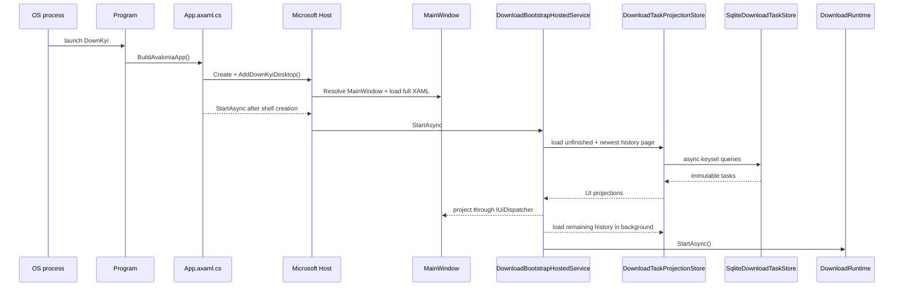
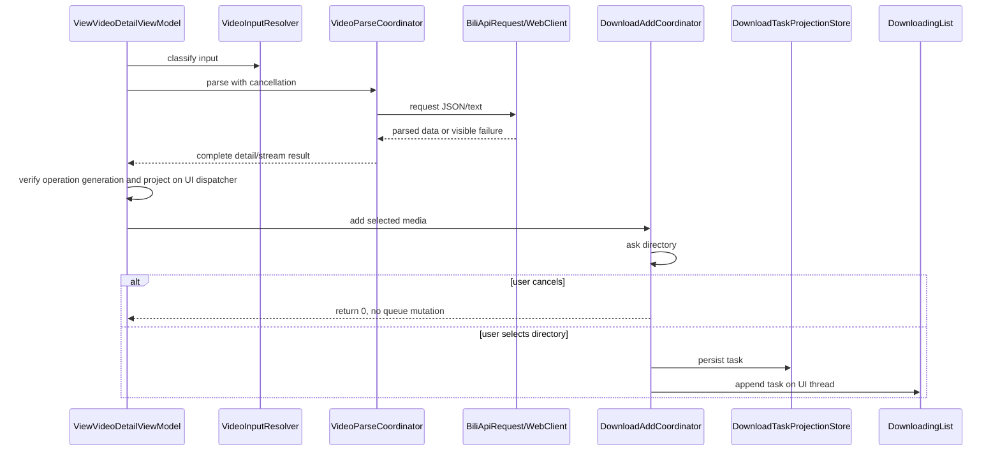
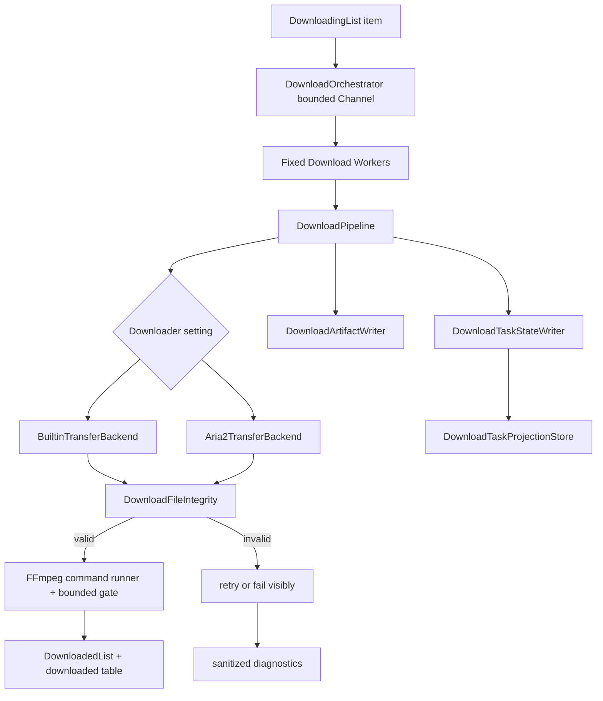

# AI Knowledge Graph

Status: maintained architecture index
Schema version: 1.0
Last reviewed: 2026-07-16

This document is the first file an AI agent should read before changing DownKyi. Its goal is to preserve stable knowledge about project structure, ownership boundaries, and call relationships so agents do not rediscover the same code paths from scratch.

## Update Rules

- Update this file in the same PR when a change adds, removes, or redirects a module boundary.
- Prefer stable responsibilities over implementation trivia. Link exact files only when they are useful entry points.
- Use the node and edge vocabulary below so future tooling can parse this document.
- If reality and this graph disagree, trust the code, fix the code task, then fix this graph.

## Vocabulary

Node types:

- `app`: process startup, DI, shell, global lifecycle.
- `ui`: Avalonia view or UI behavior.
- `viewmodel`: binding state and command wiring.
- `service`: application service with business workflow.
- `core`: reusable API, storage, settings, logging, media, or utility logic.
- `external`: outside process, binary, web API, or package.
- `test`: executable test coverage.
- `workflow`: CI, release, or maintenance automation.
- `doc`: human/AI guidance.

Edge types:

- `calls`: direct method or service call.
- `injects`: dependency registration or constructor injection.
- `publishes`: event aggregator or callback notification.
- `persists`: writes durable app state.
- `reads`: reads durable state or external input.
- `executes`: starts external binary or process.
- `guards`: test or CI protects behavior.
- `documents`: documentation explains a node or edge.

Node record format:

```yaml
id: stable.node.id
type: service
paths:
  - relative/path/File.cs
responsibility: One sentence.
inbound:
  - caller.node.id
outbound:
  - callee.node.id
contracts:
  - Stable behavior other modules rely on.
hazards:
  - Known fragility, performance risk, privacy risk, or platform risk.
tests:
  - test.node.id
```

## System Graph

```mermaid
flowchart TD
    Program["app.program\nDownKyi/Program.cs"]
    App["app.application\nDownKyi/App.axaml.cs"]
    Lifecycle["service.application-lifecycle\nIApplicationLifecycle + Avalonia adapter"]
    Host["app.host-composition\nsrc/DownKyi.Desktop/Composition/DownKyiHost.cs"]
    Domain["core.domain-contracts\nsrc/DownKyi.Domain"]
    ApplicationLayer["service.application-contracts\nsrc/DownKyi.Application"]
    Infrastructure["core.infrastructure\nsrc/DownKyi.Infrastructure"]
    MainWindow["ui.main-window\nDownKyi/Views/MainWindow.axaml"]
    AsyncImage["ui.async-image-loader\nCustomControl/AsyncImageLoader"]
    MainVm["viewmodel.main-window\nDownKyi/ViewModels/MainWindowViewModel.cs"]
    IndexVm["viewmodel.index\nViewIndexViewModel.cs"]
    LoginVm["viewmodel.login\nViewLoginViewModel.cs"]
    AccountSession["service.account-session\nServices/Account"]
    FriendVms["viewmodel.friend-relations\nFriends ViewModels"]
    FriendRelations["service.friend-relations\nFriendRelationCoordinator.cs"]
    SeasonsSeriesVm["viewmodel.seasons-series\nViewSeasonsSeriesViewModel.cs"]
    SeasonsSeries["service.seasons-series\nSeasonsSeriesCoordinator.cs"]
    FavoritesVms["viewmodel.favorites\nPrivate/Public Favorites ViewModels"]
    Favorites["service.favorites\nFavoritesCoordinator.cs"]
    PersonalMediaVms["viewmodel.personal-media\nHistory/Watch-later ViewModels"]
    PersonalMedia["service.personal-media\nPersonalMediaCoordinator.cs"]
    UserSpacePageVms["viewmodel.user-space-pages\nPublication/My-space ViewModels"]
    UserSpacePages["service.user-space-pages\nUserSpacePageCoordinator.cs"]
    VideoVm["viewmodel.video-detail\nDownKyi/ViewModels/ViewVideoDetailViewModel.cs"]
    SettingsVms["viewmodel.settings-pages\nSettings ViewModels"]
    NetworkSettings["service.network-settings\nNetworkSettingsCoordinator.cs"]
    BiliHelperVm["viewmodel.bili-helper\nViewBiliHelperViewModel.cs"]
    BiliHelper["service.bili-helper\nBiliHelperCoordinator.cs"]
    Resolver["service.video-input-resolver\nsrc/DownKyi.Application/Media"]
    Parser["service.video-parse-coordinator\nDownKyi/Services/Video/VideoParseCoordinator.cs"]
    InfoServices["service.info-services\nVideo/Bangumi/Cheese services"]
    VideoTags["service.video-tag-provider\nVideoTagProvider + VideoPage.LoadTagsAsync"]
    WbiProvider["core.wbi-key-provider\nIWbiKeyProvider + WbiKeyProvider"]
    WbiExecutor["core.wbi-request-executor\nWbiRequestExecutor"]
    BiliApi["core.bili-api\nDownKyi.Core/BiliApi"]
    WebClient["core.web-client\nDownKyi.Core/BiliApi/WebClient.cs"]
    Settings["core.settings\nISettingsStore + SettingsStore"]
    LegacySettings["core.legacy-settings-migration\nLegacySettingsDecryptor.cs"]
    DownloadAdd["service.download-add\nAddToDownloadService + DownloadAddCoordinator"]
    DownloadBootstrap["service.download-bootstrap\nDownloadBootstrapHostedService"]
    DownloadService["service.download-runtime\nFactory + Orchestrator + Pipeline"]
    DownloadDomain["core.download-domain\nimmutable task aggregate"]
    StoreContract["service.application-contracts\nIDownloadTaskStore"]
    SqliteStore["core.sqlite-download-store\nSqliteDownloadTaskStore"]
    Storage["core.storage\nProjectionStore + StorageManager"]
    Aria["external.aria2\naria2c process"]
    FFmpeg["external.ffmpeg\nffmpeg process"]
    Logs["core.logging\nApplicationLogProvider + diagnostic export"]
    Tests["test.suites\ntests/*"]
    ArchitectureTests["test.architecture-boundaries\nDownKyi.Architecture.Tests"]
    UiSmoke["test.ui-smoke\nDownKyi.Desktop.Tests"]
    Benchmarks["test.performance-baseline\nBenchmarkCases + runner"]
    CI["workflow.strict-pr-ci\n.github/workflows/quality.yml"]
    AnalyzerInventory["workflow.analyzer-inventory\nscript/analyzer-inventory.ps1"]

    Program -->|calls| App
    Program -->|runs restart helper| Lifecycle
    App -->|creates| Host
    App -->|attaches Host and shell| Lifecycle
    Host -->|injects| MainWindow
    Host -->|registers| ApplicationLayer
    Host -->|registers| Infrastructure
    ApplicationLayer -->|depends on| Domain
    Infrastructure -->|implements| ApplicationLayer
    Infrastructure -->|depends on| Domain
    Domain -->|owns| DownloadDomain
    ApplicationLayer -->|defines| StoreContract
    SqliteStore -->|implements| StoreContract
    SqliteStore -->|persists| DownloadDomain
    Storage -->|projects legacy UI| DownloadDomain
    Storage -->|calls| StoreContract
    MainWindow -->|binds| MainVm
    MainWindow -->|awaits close cleanup| Lifecycle
    MainWindow -->|renders remote artwork| AsyncImage
    MainVm -->|navigates| IndexVm
    MainVm -->|navigates| LoginVm
    MainVm -->|navigates| VideoVm
    IndexVm -->|refreshes| AccountSession
    LoginVm -->|polls and persists| AccountSession
    AccountSession -->|calls| BiliApi
    FriendVms -->|loads pages| FriendRelations
    FriendRelations -->|calls| BiliApi
    SeasonsSeriesVm -->|loads and queues| SeasonsSeries
    SeasonsSeries -->|calls| BiliApi
    FavoritesVms -->|loads snapshots| Favorites
    Favorites -->|calls| BiliApi
    FavoritesVms -->|queues selected media| DownloadAdd
    PersonalMediaVms -->|loads snapshots| PersonalMedia
    PersonalMedia -->|calls| BiliApi
    PersonalMediaVms -->|queues selected media| DownloadAdd
    UserSpacePageVms -->|loads snapshots| UserSpacePages
    UserSpacePages -->|calls| BiliApi
    UserSpacePageVms -->|queues publications| DownloadAdd
    BiliHelperVm -->|calls| BiliHelper
    BiliHelper -->|uses cancellable CPU helpers| BiliApi
    VideoVm -->|calls| Resolver
    VideoVm -->|calls| Parser
    SettingsVms -->|network commands| NetworkSettings
    SettingsVms -->|other pages read and write| Settings
    NetworkSettings -->|validates and writes| Settings
    NetworkSettings -->|requests restart| Lifecycle
    Parser -->|calls| InfoServices
    InfoServices -->|executes signed requests through| WbiExecutor
    InfoServices -->|calls unsigned endpoints| BiliApi
    InfoServices -->|creates current-token loaders| VideoTags
    DownloadAdd -->|loads optional metadata through| VideoTags
    VideoTags -->|calls tag endpoint| BiliApi
    WbiExecutor -->|gets or refreshes keys| WbiProvider
    WbiExecutor -->|invokes signed endpoint| BiliApi
    WbiProvider -->|bootstraps and persists compatible keys| Settings
    WbiProvider -->|loads navigation metadata| BiliApi
    BiliApi -->|calls| WebClient
    Lifecycle -->|stops| Host
    Lifecycle -->|flushes on shutdown| Settings
    Lifecycle -->|flushes on shutdown| Logs
    VideoVm -->|reads| Settings
    Settings -->|migrates old format through| LegacySettings
    VideoVm -->|calls| DownloadAdd
    DownloadAdd -->|persists| Storage
    DownloadAdd -->|queues| DownloadService
    Host -->|starts and stops| DownloadBootstrap
    DownloadBootstrap -->|loads startup state| Storage
    DownloadBootstrap -->|starts and stops| DownloadService
    DownloadService -->|persists| Storage
    DownloadService -->|executes optional| Aria
    DownloadService -->|executes| FFmpeg
    DownloadService -->|writes| Logs
    WebClient -->|throws visible failures| BiliApi
    Tests -->|guards| WebClient
    Tests -->|guards| DownloadAdd
    Tests -->|guards| DownloadService
    ArchitectureTests -->|guards dependency direction| Domain
    ArchitectureTests -->|guards dependency direction| ApplicationLayer
    ArchitectureTests -->|guards dependency direction| Infrastructure
    ArchitectureTests -->|guards dependency direction| Host
    UiSmoke -->|guards XAML construction| MainWindow
    Benchmarks -->|measures| WebClient
    CI -->|guards| Tests
    CI -->|guards| ArchitectureTests
    CI -->|guards| UiSmoke
    AnalyzerInventory -->|documents diagnostics| CI
```



## Canonical Nodes

### app.program

```yaml
id: app.program
type: app
paths:
  - DownKyi/Program.cs
responsibility: Runs the internal restart-helper mode when requested, otherwise builds the Avalonia AppBuilder and starts the classic desktop lifetime.
inbound:
  - external.os-process
outbound:
  - app.application
contracts:
  - Do not run Avalonia-dependent code before AppMain/lifetime initialization.
  - Restart-helper mode waits asynchronously for the old process, relaunches without helper arguments, and never initializes Avalonia or acquires the single-instance guard.
  - Debug-only developer tooling must not enter Release output.
hazards:
  - Avalonia major upgrades often change AppBuilder extension methods.
tests:
  - test.ui-smoke
  - test.application-lifetime
```

### app.application

```yaml
id: app.application
type: app
paths:
  - DownKyi/App.axaml.cs
  - DownKyi/Composition/DesktopComposition.cs
responsibility: Keeps App focused on XAML initialization, Host attachment, shell creation, observed startup, and final resource disposal while DesktopComposition owns registrations.
inbound:
  - app.program
outbound:
  - app.host-composition
  - service.application-lifecycle
  - ui.main-window
  - service.download-bootstrap
  - service.download-list-state
  - core.storage
  - core.settings
  - core.logging
contracts:
  - UI shell should appear before heavy download state and service startup finish.
  - The Host is created with default configuration sources disabled and must not redirect database, settings, login, portable-mode, or aria2 session paths.
  - Download startup and shutdown are delegated to a Host-owned IHostedService and must remain cancellation-aware.
  - MainWindow defers final close through `IApplicationLifecycle`; App cannot own the cleanup Task, restart process, main-window service locator, Mutex naming, or Host stop implementation.
  - Host stop shares the outer five-second cleanup budget; a shorter nested timeout must not interrupt resumable-state persistence before the outer fallback runs.
  - Storage retention maintenance is an IHostedService and cannot be an App-owned fire-and-forget Task.
  - `DownloadListState` owns one stable downloading/history collection pair shared by Host services and ViewModels; App must not expose static list properties.
  - App cannot contain concrete service, navigation, or dialog registration; `DesktopComposition` is the single registration owner.
  - Download runtime construction and hosted-service wiring stay in `DesktopComposition`, not App.
  - App startup, Host services, and lifecycle adapter share one injected `ISettingsStore`; shutdown flush must not block the UI thread.
  - App creates one `ApplicationLogProvider`; all Host services share its `ILoggerFactory`, while the lifecycle adapter awaits provider flush before App disposes the provider.
  - App, download runtime, ViewModels, shared HTTP state, and process owners release their cancellation and disposable resources explicitly.
  - UI continuations use the Avalonia context; background and Core continuations do not depend on it.
hazards:
  - Any synchronous database, aria2, or file scan here directly hurts startup time.
  - Exit cleanup can leave aria2 running if cancellation and timeout paths drift; the tracked-process timeout fallback must remain bounded.
  - Any second container, global service locator, or XAML auto-wiring path can create competing service lifetimes and is forbidden by architecture tests.
tests:
  - test.ui-smoke
  - test.composition-root
```

### service.application-lifecycle

```yaml
id: service.application-lifecycle
type: service
paths:
  - src/DownKyi.Application/Lifetime/IApplicationLifecycle.cs
  - DownKyi/Platform/AvaloniaApplicationLifecycle.cs
  - DownKyi/Platform/AvaloniaDesktopContext.cs
  - DownKyi/Platform/ProcessRestartLauncher.cs
  - DownKyi/Platform/SingleInstanceGuard.cs
responsibility: Owns idempotent Host startup/shutdown, bounded cleanup, settings/log flush, desktop exit, restart handoff, attached main-window access, and per-install single-instance guarding.
inbound:
  - app.program
  - app.application
  - ui.main-window
  - viewmodel.settings-pages
  - legacy upgrade dialog
outbound:
  - app.host-composition
  - core.settings
  - core.logging
  - external.aria2
  - external.os-process
contracts:
  - Shutdown cancellation is requested once; Host stop, startup completion, and settings flush share one five-second budget before tracked aria2 fallback.
  - Repeated shutdown calls return the same Task and never synchronously wait.
  - Restart launches a non-shell helper before cleanup; helper failure keeps the current process alive, while success waits for the old process and its Mutex to exit before relaunch.
  - Framework-dependent execution preserves the managed entry assembly argument; packaged execution relaunches the current executable directly.
  - Single-instance identity is stable per absolute install directory and contains only a truncated SHA-256 path hash, not the personal path.
  - ViewModels cannot access `App.Current`, Avalonia lifetime objects, or `System.Diagnostics.Process` for lifecycle work.
hazards:
  - Bypassing the helper can race the old process Mutex and make restart appear to do nothing.
  - Moving cleanup back into App or a ViewModel recreates untestable shutdown paths and can leave resumable tasks active.
tests:
  - test.application-lifetime
  - test.composition-root
  - test.architecture-boundaries
```

### app.host-composition

```yaml
id: app.host-composition
type: app
paths:
  - src/DownKyi.Desktop/Composition/DownKyiHost.cs
  - DownKyi/Composition/DesktopComposition.cs
responsibility: Builds the single Microsoft.Extensions.Hosting composition root and owns application-wide service lifetime.
inbound:
  - app.application
outbound:
  - core.domain-contracts
  - service.application-contracts
  - core.infrastructure
  - service.download-bootstrap
contracts:
  - `DisableDefaults=true` prevents implicit configuration, environment, and path side effects; `AddLogging()` explicitly enables typed loggers without adding an implicit console or file provider.
  - Production composition supplies the App-owned logger factory/provider, while isolated Host tests receive the same `ILogger<T>` contract with no filesystem sink.
  - Host stop signals the shared application shutdown token before services are disposed.
  - Only this target-architecture project references Microsoft.Extensions.Hosting.
hazards:
  - Adding implicit Host defaults can redirect configuration or user-data paths during startup and tests.
tests:
  - test.composition-root
  - test.architecture-boundaries
```

### core.domain-contracts

```yaml
id: core.domain-contracts
type: core
paths:
  - src/DownKyi.Domain/Results/OperationError.cs
  - src/DownKyi.Domain/Results/OperationResult.cs
  - src/DownKyi.Domain/Downloads
responsibility: Defines framework-free typed results and the immutable download task aggregate with legal lifecycle transitions.
inbound:
  - service.application-contracts
  - core.infrastructure
outbound: []
contracts:
  - Failure retains a typed error kind, stable code, and user-safe message.
  - Success values are non-null; failed results cannot expose a value without an explicit exception.
  - Download task IDs are stable strings; task versions increase monotonically and timestamps never move backward.
  - Pause, cancel, delete, failure, completion, retry, progress, and transfer updates remain distinct transitions.
hazards:
  - Error messages must not contain cookies, full sensitive URLs, or personal filesystem paths.
tests:
  - test.domain-results
  - test.download-domain
  - test.architecture-boundaries
```

### service.application-contracts

```yaml
id: service.application-contracts
type: service
paths:
  - src/DownKyi.Application/Lifetime/ApplicationCancellation.cs
  - src/DownKyi.Application/Time/IClock.cs
  - src/DownKyi.Application/Downloads/IDownloadTaskStore.cs
  - src/DownKyi.Application/Downloads/DownloadHistoryPage.cs
  - src/DownKyi.Application/Downloads/DownloadProgressWrite.cs
responsibility: Defines application lifetime, deterministic time, and async download persistence contracts without UI or infrastructure dependencies.
inbound:
  - app.host-composition
  - core.infrastructure
outbound:
  - core.domain-contracts
contracts:
  - Every long-running operation links caller cancellation with the application shutdown token.
  - Cancellation remains control flow and must not be converted into a failure result or retry.
  - Time-dependent use cases receive IClock instead of reading the system clock directly.
  - Store APIs are cancellation-aware and asynchronous; history uses stable keyset cursors rather than whole-table offsets.
  - Coalesced progress writes retain their first expected version and latest contiguous target version.
tests:
  - test.application-lifetime
  - test.architecture-boundaries
```

### core.infrastructure

```yaml
id: core.infrastructure
type: core
paths:
  - src/DownKyi.Infrastructure/Time/SystemClock.cs
  - src/DownKyi.Infrastructure/Downloads/SqliteDownloadTaskStore.cs
  - src/DownKyi.Infrastructure/Downloads/DownloadStoreSchema.cs
  - src/DownKyi.Infrastructure/Downloads/DownloadProgressWriteBehind.cs
responsibility: Implements Application time and download persistence contracts using pooled SQLite connections and bounded background writes.
inbound:
  - app.host-composition
outbound:
  - service.application-contracts
  - core.domain-contracts
contracts:
  - Infrastructure never references Desktop or Prism.
  - SystemClock returns UTC time; deterministic tests replace IClock at the composition boundary.
  - SQLite uses one short pooled connection per operation, WAL, parameterized queries, optimistic versions, and transactional state moves.
  - Existing databases are backed up before schema migration; failed migrations roll back and never advance `user_version`.
  - One malformed row is quarantined with record ID, field, and sanitized reason; raw JSON and personal paths are not copied into diagnostics.
  - The progress writer has a one-slot bounded wake channel, a bounded task set, contiguous coalescing, and a final shutdown flush.
  - `SQLite3MC.PCLRaw.bundle` must keep reading the committed SQLCipher v4 fixture before dependency updates are accepted.
tests:
  - test.infrastructure-clock
  - test.download-store
  - test.progress-write-behind
  - test.legacy-sqlcipher
  - test.architecture-boundaries
```

### viewmodel.main-window

```yaml
id: viewmodel.main-window
type: viewmodel
paths:
  - DownKyi/ViewModels/MainWindowViewModel.cs
responsibility: Owns main window commands, clipboard debounce, navigation entry points, and window close behavior.
inbound:
  - ui.main-window
outbound:
  - viewmodel.index
  - viewmodel.login
  - viewmodel.video-detail
  - core.logging
  - service.desktop-platform-boundaries
contracts:
  - Commands should be cached properties, not rebuilt on every getter call.
  - Clipboard detection must be debounced and cancellation-aware.
  - Clipboard polling comes from the injected desktop monitor; the ViewModel cannot construct a listener from a global MainWindow.
  - Automatic update checks carry the window lifetime token; closing the window cancels network work and expected shutdown cancellation is not reported as an error.
  - Update failures use the injected typed logger and never include a repository response body or request URL.
  - Shell notifications, dialogs, active-view lookup, startup routing, and clipboard URL routing use framework-neutral Desktop contracts; MainWindowViewModel cannot reference Prism events, regions, dialog types, or route tags.
hazards:
  - Recreating commands breaks command identity and can cause UI churn.
  - Background clipboard work can outlive the window if cancellation is not wired.
tests:
  - test.ui-smoke
```

### viewmodel.index

```yaml
id: viewmodel.index
type: viewmodel
paths:
  - DownKyi/ViewModels/ViewIndexViewModel.cs
responsibility: Binds the home search entry, user header state, and navigation commands without performing account network work.
inbound:
  - viewmodel.main-window
outbound:
  - service.account-session
  - viewmodel.video-detail
contracts:
  - Construction does not start user API work; the first `start` navigation performs exactly one refresh.
  - A newer navigation refresh cancels the previous operation and stale results cannot change the header or login state.
  - Background settings refresh does not clear or rewrite the search input.
  - Search input produces typed `AppNavigationRequest` values; SearchService and the index ViewModel cannot publish Prism navigation events.
hazards:
  - Starting refresh in both the constructor and navigation doubles startup requests and delays first interaction.
  - A failed foreground refresh must restore login-panel visibility instead of leaving the panel hidden.
tests:
  - test.account-session
  - test.ui-smoke
  - test.architecture-boundaries
```

### viewmodel.login

```yaml
id: viewmodel.login
type: viewmodel
paths:
  - DownKyi/ViewModels/ViewLoginViewModel.cs
responsibility: Projects QR login state, messages, and navigation while delegating blocking account operations.
inbound:
  - viewmodel.index
outbound:
  - service.account-session
contracts:
  - Restarting, leaving, or disposing the page cancels the active QR generation/poll operation.
  - QR bitmap and bound-state mutation stay on the UI dispatcher; synchronous HTTP and cookie-file writes do not.
hazards:
  - Wrapping the entire UI workflow in Task.Run causes cross-thread UI/event access and hides cancellation ownership.
tests:
  - test.account-session
  - test.architecture-boundaries
```

### service.account-session

```yaml
id: service.account-session
type: service
paths:
  - DownKyi/Services/Account/UserSessionCoordinator.cs
  - DownKyi/Services/Account/LoginCoordinator.cs
responsibility: Runs synchronous account API and cookie persistence operations away from the UI thread and returns cancellable snapshots/results.
inbound:
  - viewmodel.index
  - viewmodel.login
outbound:
  - core.bili-api
  - core.legacy-settings-migration
contracts:
  - Caller cancellation is checked before and after every synchronous network or file operation.
  - Navigation user data maps to the existing `UserInfoSettings` schema without changing keys or login-file location.
  - WBI key extraction accepts absolute and protocol-relative addresses and strips query/fragment suffixes using ordinal parsing.
  - Missing or partial navigation WBI metadata cannot erase previously validated persisted keys.
hazards:
  - Legacy synchronous Bilibili calls cannot abort an in-flight socket request yet; cancellation prevents later persistence and stale UI projection.
  - Internal settings persistence still uses the historical partial `SettingsManager` implementation, but it has no singleton/global access and is reachable only through the injected store.
tests:
  - test.account-session
  - test.ui-smoke
  - test.architecture-boundaries
```

### viewmodel.friend-relations

```yaml
id: viewmodel.friend-relations
type: viewmodel
paths:
  - DownKyi/ViewModels/Friends/ViewFollowingViewModel.cs
  - DownKyi/ViewModels/Friends/ViewFollowerViewModel.cs
responsibility: Projects following groups, following/follower pages, pager state, loading state, and user navigation.
inbound:
  - typed or legacy navigation
outbound:
  - service.friend-relations
contracts:
  - ViewModels never perform relation API work or mutate bound collections from worker threads.
  - Each page result is projected with one `AddRange` notification rather than one dispatcher post per user.
  - Replacing or disposing a pager detaches `CurrentChanging` and `CountChanged` handlers.
  - New navigation/page work and `OnNavigatedFrom` cancel the previous request; stale results cannot change visibility or contents.
  - Leaving during a load restores enabled/non-loading UI state so a cached page remains usable when revisited.
hazards:
  - Per-item dispatcher posts make large relation lists stutter and can reorder results after navigation.
  - Retaining old pager event subscriptions keeps ViewModels alive and can issue duplicate page requests.
tests:
  - test.friend-relations
  - test.architecture-boundaries
```

### service.friend-relations

```yaml
id: service.friend-relations
type: service
paths:
  - DownKyi/Services/Friends/FriendRelationCoordinator.cs
responsibility: Loads relation overview, private groups, following pages, and follower pages as cancellation-aware snapshots.
inbound:
  - viewmodel.friend-relations
outbound:
  - core.bili-api
contracts:
  - Private whisper/group data is requested only for the current logged-in user.
  - Coordinator methods return API models without accessing Avalonia, Prism, settings paths, or bound collections.
  - Caller cancellation is checked before and after every legacy synchronous API operation.
hazards:
  - Legacy synchronous relation calls cannot abort an in-flight socket request; cancellation still blocks stale projection and subsequent calls.
tests:
  - test.friend-relations
  - test.architecture-boundaries
```

### viewmodel.seasons-series

```yaml
id: viewmodel.seasons-series
type: viewmodel
paths:
  - DownKyi/ViewModels/ViewSeasonsSeriesViewModel.cs
responsibility: Projects one season/series page, selection state, pager state, navigation, and add-to-download results.
inbound:
  - viewmodel.user-space
outbound:
  - service.seasons-series
  - service.download-add
contracts:
  - Season and series pages share one result projection and one batched collection update.
  - Canceling directory selection returns before parsing or queueing any media.
  - Navigation, pager replacement, and disposal cancel outstanding page/download work and detach pager events.
  - Back navigation uses the typed router history and falls back to the typed parent route.
hazards:
  - Duplicated season/series loops drift in cover normalization, dates, loading flags, and cancellation behavior.
  - Running parse/add after a null directory silently queues work the user canceled.
tests:
  - test.seasons-series
  - test.download-add
  - test.architecture-boundaries
```

### service.seasons-series

```yaml
id: service.seasons-series
type: service
paths:
  - DownKyi/Services/UserSpace/SeasonsSeriesCoordinator.cs
responsibility: Loads season/series archive snapshots and delegates legacy per-video parse/add work to the shared media coordinator.
inbound:
  - viewmodel.seasons-series
outbound:
  - core.bili-api
  - service.download-add
contracts:
  - `SeasonsSeriesKind` selects the matching Bilibili endpoint and invalid values fail explicitly.
  - Page calls check caller cancellation before and after synchronous legacy API work.
  - Add work checks cancellation between items and receives a confirmed non-empty directory.
hazards:
  - Legacy synchronous page and parse calls cannot abort in flight; cancellation blocks subsequent work and stale UI projection.
  - The add path depends only on typed dialog and notification contracts implemented by Desktop adapters.
tests:
  - test.seasons-series
  - test.architecture-boundaries
```

### viewmodel.favorites

```yaml
id: viewmodel.favorites
type: viewmodel
paths:
  - DownKyi/ViewModels/ViewMyFavoritesViewModel.cs
  - DownKyi/ViewModels/ViewPublicFavoritesViewModel.cs
  - DownKyi/Views/ViewMyFavorites.axaml
  - DownKyi/Views/ViewPublicFavorites.axaml
responsibility: Projects private/public favorite folders and media snapshots, selection, pager, navigation, and add-to-download results.
inbound:
  - viewmodel.user-space
  - viewmodel.main-window
outbound:
  - service.favorites
  - service.download-add
contracts:
  - ViewModels never perform favorite API or parse/add work on their own worker tasks.
  - Network results are returned as snapshots and applied with one `AddRange` UI notification.
  - Canceling directory selection returns before creating a download snapshot or parsing media.
  - Leaving, replacing a request, or disposing cancels folder, page, and download work; pager replacement detaches old handlers.
  - Favorite lists use `Multiple,Toggle`, so an ordinary click toggles each selected item without a modifier key.
hazards:
  - Mutating observable collections from the worker thread can fault Avalonia bindings and leave stale rows after navigation.
  - Starting parse/add before checking a null directory performs work after the user explicitly canceled.
  - Replacing a pager without detaching events retains the ViewModel and issues duplicate page requests.
tests:
  - test.favorites
  - test.download-add
  - test.architecture-boundaries
```

### service.favorites

```yaml
id: service.favorites
type: service
paths:
  - DownKyi/Services/FavoritesCoordinator.cs
  - DownKyi/Services/FavoritesService.cs
  - DownKyi/Services/IFavoritesService.cs
responsibility: Loads favorite folders, metadata, and media off the UI thread and returns fully mapped read-only snapshots.
inbound:
  - viewmodel.favorites
outbound:
  - core.bili-api
contracts:
  - `FavoritesService` is a pure mapper/API adapter and never accesses `App`, Dispatcher, or observable collections.
  - Pre-canceled requests cannot start legacy synchronous API work.
  - Invalid favorite videos remain filtered and timestamp/number projection preserves the existing UI contract.
hazards:
  - Legacy synchronous Bilibili calls cannot abort in flight; cancellation prevents subsequent calls and stale UI projection.
  - API model and UI model both use `FavoritesMedia`; aliases must remain explicit at the mapping boundary.
tests:
  - test.favorites
  - test.architecture-boundaries
```

### viewmodel.personal-media

```yaml
id: viewmodel.personal-media
type: viewmodel
paths:
  - DownKyi/ViewModels/ViewMyHistoryViewModel.cs
  - DownKyi/ViewModels/ViewMyToViewVideoViewModel.cs
  - DownKyi/Views/ViewMyHistory.axaml
  - DownKyi/Views/ViewMyToViewVideo.axaml
responsibility: Projects history/watch-later snapshots, history cursor state, selection, navigation, and add-to-download results.
inbound:
  - viewmodel.user-space
outbound:
  - service.personal-media
  - service.download-add
contracts:
  - ViewModels do not own worker tasks or mutate bound collections from background threads.
  - History paging applies only the current request version; canceled or stale responses cannot replace newer state.
  - `LoadMoreCommand` has stable identity and concurrent load-more requests are rejected.
  - Canceling directory selection returns before snapshot creation or media parsing.
  - Lists use `Multiple,Toggle`, allowing ordinary clicks to toggle independent selections.
hazards:
  - Recreating `LoadMoreCommand` on every binding read creates avoidable command/event churn.
  - An old history response can overwrite a newer navigation request unless both cancellation and request version are checked.
  - Unknown history business types must be skipped; they must not abort supported items later in the batch.
tests:
  - test.personal-media
  - test.download-add
  - test.architecture-boundaries
```

### service.personal-media

```yaml
id: service.personal-media
type: service
paths:
  - DownKyi/Services/Media/PersonalMediaCoordinator.cs
  - DownKyi.Core/BiliApi/History/ToView.cs
responsibility: Loads and maps history/watch-later API data into read-only UI snapshots away from the UI thread.
inbound:
  - viewmodel.personal-media
outbound:
  - core.bili-api
contracts:
  - Watch-later and history requests pass caller cancellation into the Bilibili API boundary.
  - Pre-canceled requests cannot start API work and mapping checks cancellation between watch-later items.
  - Only archive and pgc history entries are projected; protocol-relative image addresses are normalized without `Uri.Scheme` access.
hazards:
  - Legacy synchronous requests may remain in flight until their current HTTP operation returns; stale projection is still blocked.
  - Platform icon creation remains a desktop mapping concern and must not migrate into `DownKyi.Core`.
tests:
  - test.personal-media
  - test.architecture-boundaries
```

### viewmodel.video-detail

```yaml
id: viewmodel.video-detail
type: viewmodel
paths:
  - DownKyi/ViewModels/ViewVideoDetailViewModel.cs
  - DownKyi/ViewModels/UiState/VideoDetailUiState.cs
  - DownKyi/Views/ViewVideoDetail.axaml
responsibility: Wires video-detail commands, navigation, and UI result projection while one CommunityToolkit state object exposes mutually consistent bindings.
inbound:
  - viewmodel.main-window
outbound:
  - service.video-input-resolver
  - service.video-parse-coordinator
  - service.video-selection-state
  - service.video-search-state
  - service.video-detail-workflow
  - service.download-add
  - service.desktop-platform-boundaries
contracts:
  - Keep UI state and command wiring here; keep pure parsing and selection rules in services.
  - Canceling directory selection must not enqueue download work.
  - `Idle`, `Busy`, `Content`, and `Empty` are one mutually exclusive CommunityToolkit state model.
  - Input, video metadata, selected page, select-all, splitter reset, and display mode bindings are owned by the same generated state object.
  - Ordinary row clicks toggle selection; repeated clicks clear the item and select-all has an explicit clear-selection peer.
  - Avalonia `DataGrid` selection and splitter reset mechanics live in View behaviors; this ViewModel exposes only selection intent and a scalar reset version.
  - Search filtering projects from one shallow source of the original `VideoPage` objects; clearing a search must preserve parsed stream, quality, and selection mutations.
  - Only the current operation generation may project detail/stream results or restore display state; canceled work cannot overwrite a newer request.
  - The ViewModel remains at or below 425 lines and cannot regain parse-service construction, search-source ownership, cancellation-source ownership, or download-service construction.
hazards:
  - This file historically accumulated unrelated parsing, selection, and download orchestration logic.
  - Reintroducing a complete cached section/page object graph duplicates memory and can restore stale parsed or selected state.
tests:
  - test.video-input-resolver
  - test.video-selection-state
  - test.video-search-state
  - test.download-add
  - test.video-detail-download
```

### viewmodel.settings-pages

```yaml
id: viewmodel.settings-pages
type: viewmodel
paths:
  - DownKyi/ViewModels/Settings/ViewBasicViewModel.cs
  - DownKyi/ViewModels/Settings/ViewNetworkViewModel.cs
  - DownKyi/ViewModels/Settings/ViewNetworkViewModel.State.cs
  - DownKyi/ViewModels/Settings/ViewVideoViewModel.cs
  - DownKyi/ViewModels/Settings/ViewDanmakuViewModel.cs
  - DownKyi/ViewModels/Settings/ViewAboutViewModel.cs
responsibility: Projects current settings into Avalonia binding state and wires commands to typed settings owners.
inbound:
  - typed navigation through the Avalonia router
outbound:
  - core.settings
  - service.network-settings
  - service.desktop-platform-boundaries
contracts:
  - Basic, video, danmaku, and about pages receive `ISettingsStore`; the network page receives only `INetworkSettingsCoordinator` and cannot persist, validate, prompt, or restart directly.
  - Existing setting getter/setter behavior, persisted JSON names, and enum values remain unchanged during the compatibility migration.
  - Network binding properties live in a dedicated partial state file; the main file remains below 700 lines and contains navigation projection plus command wiring.
tests:
  - test.network-settings
  - test.architecture-boundaries
```

### service.network-settings

```yaml
id: service.network-settings
type: coordinator
paths:
  - DownKyi/Services/Settings/NetworkSettingsCoordinator.cs
responsibility: Owns immutable option catalogs, validated network-setting updates, localized feedback, restart confirmation, and asynchronous restart requests.
inbound:
  - viewmodel.settings-pages
outbound:
  - core.settings
  - service.application-lifecycle
  - service.desktop-platform-boundaries
contracts:
  - Option catalogs are immutable and constructed once; opening the settings page does not allocate repeated range/list graphs.
  - Every update passes through `ISettingsStore.Update` and a post-validation predicate before success is reported.
  - Initialization-triggered binding commands can persist normalized values but cannot display feedback, open restart dialogs, or restart the process.
  - Failed validation never opens a restart prompt; accepted prompts call only the cancellation-aware `IApplicationLifecycle.RestartAsync` boundary.
  - The coordinator changes no JSON names, enum values, validation ranges, or settings storage paths.
hazards:
  - Prompting during initial binding projection can restart the app merely by opening the page.
  - Bypassing the post-validation predicate reports invalid or clamped settings as successfully applied.
tests:
  - test.network-settings
  - test.ui-smoke
  - test.architecture-boundaries
```

### service.video-input-resolver

```yaml
id: service.video-input-resolver
type: service
paths:
  - src/DownKyi.Application/Media/VideoInputResolver.cs
  - DownKyi/Services/Video/VideoInputResolver.cs
responsibility: Classifies and normalizes BV/AV, video URL, bangumi, and cheese/course entry inputs.
inbound:
  - viewmodel.video-detail
outbound:
  - service.video-parse-coordinator
contracts:
  - Input classification must match the parse flow and add-to-download flow.
  - Application owns pure classification; the legacy adapter only maps the result to external `PlayStreamType`.
hazards:
  - Divergence between parse and download input handling causes "can parse but cannot download" bugs.
tests:
  - test.video-input-resolver
```

### service.video-detail-workflow

```yaml
id: service.video-detail-workflow
type: coordinator
paths:
  - DownKyi/Services/Video/VideoDetailWorkflowCoordinator.cs
responsibility: Owns the current normalized input, cancellable operation generation, parse-service lifetime, and shallow search source for the video-detail page.
inbound:
  - viewmodel.video-detail
outbound:
  - service.video-input-resolver
  - service.video-parse-coordinator
  - service.video-selection-state
  - service.video-search-state
contracts:
  - Starting another detail, parse, or add operation cancels and invalidates the previous generation.
  - Only a current operation can load or return detail and stream results.
  - Reset clears the cached info service, current input, and search source without mutating a bound page graph from a worker thread.
hazards:
  - Disposing the workflow while work is active must cancel it before releasing the cancellation source.
tests:
  - test.video-parse-coordinator
  - test.architecture-boundaries
```

### service.desktop-platform-boundaries

```yaml
id: service.desktop-platform-boundaries
type: service
paths:
  - src/DownKyi.Application/Desktop
  - DownKyi/Platform
responsibility: Keeps lifecycle, notifications, dialogs, typed navigation, clipboard, file/folder picker, and external launch contracts independent of Avalonia while Desktop adapters own framework integration and diagnostics.
inbound:
  - viewmodel.video-detail
  - application ViewModels and dialog coordinators
outbound:
  - external.os-desktop
contracts:
  - Application interfaces contain no Avalonia, removed composition framework, path-policy, or global App references.
  - Picker cancellation returns null or an empty list and never becomes a fake path.
  - External launch requests return success/failure, preserve cancellation, and log only redacted operational failures; ViewModels own localized user feedback.
  - Linux launch uses `xdg-open` with `ProcessStartInfo.ArgumentList`; no path or URI is interpolated into `/bin/sh -c`.
  - Disk-space probes use the complete platform path; low-level helpers propagate typed failures and the injected ViewModel logger owns redacted diagnostics.
  - Delayed DataGrid scrolling invalidates stale requests by version and cannot retain a disposable cancellation source in an Avalonia behavior.
  - Host smoke resolves MainWindow, complete root XAML, and key ViewModels while no removed Prism runtime assembly is loaded.
  - Platform adapters receive `AvaloniaDesktopContext`; they cannot recover MainWindow through `App.Current`.
  - Clipboard polling is one disposable injected monitor, starts with its first subscriber, and stops after its final subscriber.
  - Every app route, nested region, and dialog has one enum value and one concrete Avalonia mapping; ViewModels never pass view names, region names, or dialog tags through the contracts.
  - `DesktopNotificationService` publishes one typed event; MainWindow owns presentation timing and UI dispatch.
  - Media page-item models receive `IAppNavigationService` plus a typed parent route from their coordinator or ViewModel; they cannot publish global navigation events or infer parent routes from command strings.
  - `IDesktopInteractionContext` groups notification, navigation, and dialog contracts for `ViewModelBase` without exposing framework types or a service locator.
  - Non-dialog ViewModels cannot reference EventAggregator, RegionManager, legacy dialog services, navigation/message events, or the string-route helper.
  - The Avalonia dialog adapter marshals calls to the UI thread; download/add services await only `IAppDialogService` and cannot dispatch framework work themselves.
hazards:
  - Bypassing typed routes/dialog results with raw view construction would reintroduce untestable UI ownership and history drift.
tests:
  - test.desktop-interactions
  - test.architecture-boundaries
  - test.ui-smoke
```

### viewmodel.bili-helper

```yaml
id: viewmodel.bili-helper
type: viewmodel
paths:
  - DownKyi/ViewModels/Toolbox/ViewBiliHelperViewModel.cs
responsibility: Binds AV/BV conversion, danmaku sender lookup, and external navigation results to the Bili Helper page.
inbound:
  - typed navigation
outbound:
  - service.bili-helper
  - service.desktop-platform-boundaries
contracts:
  - The ViewModel never creates background CPU work directly; it awaits the injected coordinator.
  - Starting a new lookup or disposing the page cancels the previous operation and prevents stale result projection.
hazards:
  - Assigning a canceled lookup result after a newer request overwrites the current user input result.
tests:
  - test.bili-helper
  - test.architecture-boundaries
```

### service.bili-helper

```yaml
id: service.bili-helper
type: service
paths:
  - DownKyi/Services/Toolbox/BiliHelperCoordinator.cs
  - DownKyi.Core/BiliApi/BiliUtils/BvId.cs
  - DownKyi.Core/BiliApi/BiliUtils/DanmakuSender.cs
responsibility: Validates AV/BV conversion inputs and runs the expensive danmaku-sender reverse lookup outside the UI thread with cancellation.
inbound:
  - viewmodel.bili-helper
outbound:
  - core.bili-api
contracts:
  - Invalid or empty AV/BV input leaves the existing UI value unchanged.
  - The public synchronous danmaku lookup remains compatible, while the coordinator always uses the cancellation-aware overload.
  - The coordinator passes caller cancellation into both Task scheduling and the core CPU loop.
hazards:
  - Danmaku sender reversal can inspect up to 100,000,000 candidates; running it on the UI thread freezes the application.
  - A cancellation check only before Task.Run cannot stop a search already consuming CPU; the core loop must poll the token.
tests:
  - test.bili-helper
  - test.architecture-boundaries
```

### viewmodel.user-space

```yaml
id: viewmodel.user-space
type: viewmodel
paths:
  - DownKyi/ViewModels/ViewUserSpaceViewModel.cs
  - DownKyi/Services/UserSpace/UserSpaceLoadCoordinator.cs
responsibility: Projects one background-loaded user-space snapshot into profile, publication, collection, relation, and statistics UI state.
inbound:
  - typed or legacy navigation
outbound:
  - core.bili-api
contracts:
  - Background API work returns a snapshot and never mutates Avalonia-bound properties.
  - A new navigation cancels the previous load; leaving or disposing the page cancels projection of stale results.
  - Back first uses the navigation journal and falls back to the recorded parent or index.
hazards:
  - Legacy synchronous Bilibili API methods cannot abort an in-flight socket call yet; cancellation prevents subsequent calls and stale UI projection.
tests:
  - test.architecture-boundaries
```

### viewmodel.user-space-pages

```yaml
id: viewmodel.user-space-pages
type: viewmodel
paths:
  - DownKyi/ViewModels/ViewPublicationViewModel.cs
  - DownKyi/ViewModels/ViewMySpaceViewModel.cs
  - DownKyi/ViewModels/ViewMyBangumiFollowViewModel.cs
  - DownKyi/Views/ViewPublication.axaml
  - DownKyi/Views/ViewMyBangumiFollow.axaml
responsibility: Projects publication pages and the signed-in user's profile/statistics while owning pager, selection, navigation, and visibility state.
inbound:
  - viewmodel.user-space
  - viewmodel.main-window
outbound:
  - service.user-space-pages
  - service.download-add
contracts:
  - ViewModels never perform user-space API work or mutate bindings from worker threads.
  - Publication and bangumi-follow results use one `AddRange` notification and ordinary clicks toggle independent selections.
  - Replacing/leaving publication or bangumi pagers detaches handlers and cancels page/download work.
  - My-space renders the primary profile first; balance/relation failure does not hide an already loaded profile.
  - Canceling publication directory selection returns before media parsing.
hazards:
  - Per-item dispatcher calls stutter on large publication pages and can project stale rows after navigation.
  - Worker-thread mutation of profile properties and `StatusList` is unsafe for Avalonia bindings.
  - Binding status flags must be assigned both true and false; retaining an old false value hides a newly bound account.
tests:
  - test.user-space-pages
  - test.download-add
  - test.architecture-boundaries
```

### service.user-space-pages

```yaml
id: service.user-space-pages
type: service
paths:
  - DownKyi/Services/UserSpace/UserSpacePageCoordinator.cs
  - DownKyi.Core/BiliApi/Users/UserSpace.cs
  - DownKyi.Core/BiliApi/Users/UserInfo.cs
  - DownKyi.Core/BiliApi/Users/UserStatus.cs
responsibility: Loads publication, signed-in profile, balance, and relation data off the UI thread and returns immutable snapshots.
inbound:
  - viewmodel.user-space-pages
outbound:
  - core.bili-api
contracts:
  - Publication, bangumi-follow, settings, my-info, navigation-info, and relation-stat requests pass cancellation to the HTTP boundary.
  - Pre-canceled requests cannot start API work and mapping checks cancellation between publication items.
  - Profile and statistics are separate operations so secondary API latency does not delay first content.
hazards:
  - `Services.UserSpace` and the core `UserSpace` API share a name; use an explicit alias at the boundary.
  - Legacy custom publication JSON handling remains because Bilibili sometimes returns `"--"` for play counts.
tests:
  - test.user-space-pages
  - test.architecture-boundaries
```

### service.video-parse-coordinator

```yaml
id: service.video-parse-coordinator
type: service
paths:
  - DownKyi/Services/Video/VideoParseCoordinator.cs
  - DownKyi/Services/VideoInfoService.cs
  - DownKyi/Services/BangumiInfoService.cs
  - DownKyi/Services/CheeseInfoService.cs
responsibility: Chooses the correct info service, builds complete detail/stream results in background work, and owns one cancellable operation generation plus search-source lifetime before UI projection.
inbound:
  - service.video-detail-workflow
outbound:
  - service.info-services
  - service.video-tag-provider
  - core.wbi-request-executor
contracts:
  - Cancellation must propagate to Bili API calls.
  - Info-service selection must follow VideoInputResolver results.
  - Info services return data and never dispatch to Avalonia; the ViewModel projects a complete result on the UI dispatcher.
  - A service is cached only after its operation succeeds, and reuse is limited to the exact input string.
  - Starting another detail, parse, or add operation cancels the previous generation; only the current generation can return projectable results.
  - Parsed pages keep a reusable tag loader, never the parse operation token; every later caller supplies its own token.
hazards:
  - Caching before cancellation checks or across a different input can leak stale service state into a later parse.
tests:
  - test.video-input-resolver
  - test.video-parse-coordinator
  - test.video-tag-loading
```

### service.info-services

```yaml
id: service.info-services
type: service
paths:
  - DownKyi/Services/VideoInfoService.cs
  - DownKyi/Services/BangumiInfoService.cs
  - DownKyi/Services/CheeseInfoService.cs
responsibility: Maps ordinary-video, bangumi, and cheese endpoint models into shared video detail/page/stream projections without owning UI state.
inbound:
  - service.video-parse-coordinator
  - service.download-add
outbound:
  - core.wbi-request-executor
  - core.bili-api
  - service.video-tag-provider
contracts:
  - Ordinary video details and playback acquire WBI keys on demand; parsing cannot depend on home-page account refresh or login state.
  - Ordinary video playback selects `data`, bangumi selects `result`, and cheese selects `data` from their declared endpoint envelopes.
  - Video info requires valid AV/BV identifiers, at least one page, and a positive CID before it can become a successful detail result.
  - Stream and tag operations receive the token owned by their current caller; no service or page captures an earlier operation token.
hazards:
  - Treating a missing envelope as an empty DTO produces a later UI/download failure with the original API reason lost.
  - Reusing an info service for a different input can return stale pages or playback streams.
tests:
  - test.video-parse-coordinator
  - test.json-contracts
  - test.wbi-signature
```

### service.video-tag-provider

```yaml
id: service.video-tag-provider
type: service
paths:
  - DownKyi/Services/Video/VideoTagProvider.cs
  - DownKyi/ViewModels/PageViewModels/VideoPage.cs
  - DownKyi/Services/VideoInfoService.cs
  - DownKyi/Services/BangumiInfoService.cs
responsibility: Loads optional video tags on demand with the token owned by the current caller and provides immutable local tag snapshots for media types that already include styles.
inbound:
  - service.video-parse-coordinator
  - service.download-add
outbound:
  - core.bili-api
contracts:
  - Long-lived pages cannot store or capture a parse, command, navigation, or shutdown operation token.
  - `LoadTagsAsync` is invoked afresh for each metadata operation; a cancellation or failure is never cached permanently.
  - Ordinary-video tag HTTP work runs away from the UI thread and receives the current add operation token through `IVideoTagProvider`.
  - Bangumi styles are snapshotted locally and do not perform deferred network I/O.
  - Expected cancellation propagates; classified tag transport or API failures are optional metadata failures and cannot prevent a valid download task from being created.
hazards:
  - Reintroducing `Lazy<T>` around network work can permanently cache `OperationCanceledException` and bind page lifetime to a stale operation.
  - Swallowing cancellation while treating tags as optional can queue a task after the user canceled the add operation.
tests:
  - test.video-tag-loading
  - test.architecture-boundaries
```

### service.video-selection-state

```yaml
id: service.video-selection-state
type: service
paths:
  - DownKyi/Services/Video/VideoSelectionState.cs
responsibility: Applies section/page selection, all-selected checks, and parse-scope page selection rules.
inbound:
  - viewmodel.video-detail
outbound: []
contracts:
  - Selection state should be deterministic and unit-testable without Avalonia UI.
  - Selection deltas affect only pages still visible in the current section; an ItemsSource swap must not clear another section's selections.
hazards:
  - Direct ObservableCollection mutation from background threads can destabilize UI.
tests:
  - test.video-selection-state
```

### ui.video-page-selection

```yaml
id: ui.video-page-selection
type: behavior
paths:
  - DownKyi/CustomAction/VideoPageSelectionBehavior.cs
  - DownKyi/CustomAction/ResetGridSplitterBehavior.cs
  - DownKyi/Views/ViewVideoDetail.axaml
responsibility: Maps pointer, keyboard, checkbox, select-all, section changes, and splitter reset bindings to Avalonia controls.
inbound:
  - viewmodel.video-detail
outbound:
  - service.video-selection-state
contracts:
  - The original `VideoPage.IsSelected` values are the durable UI selection source; DataGrid `SelectedItems` is only a synchronized projection.
  - Switching ItemsSource preserves selections owned by the previous section.
  - Behavior properties update bound scalar state without placing Avalonia controls or behavior objects in the ViewModel.
hazards:
  - Treating DataGrid selection clearing during an ItemsSource swap as a user action loses cross-section selections.
tests:
  - test.video-selection-state
  - test.ui-smoke
  - test.architecture-boundaries
```

### service.video-search-state

```yaml
id: service.video-search-state
type: service
paths:
  - DownKyi/Services/Video/VideoSearchState.cs
responsibility: Maintains the original page references for each video section and applies a visible search projection without cloning the media graph.
inbound:
  - viewmodel.video-detail
outbound: []
contracts:
  - Reset captures one shallow source list per section; filters and clears always reuse the same `VideoPage` instances.
  - Search uses explicit ordinal matching and never mutates parsed stream, quality, or selection values.
hazards:
  - Deep-copying pages creates stale parallel state and increases memory for large collections.
tests:
  - test.video-search-state
```

### core.bili-api

```yaml
id: core.bili-api
type: core
paths:
  - DownKyi.Core/BiliApi
  - DownKyi.Core/BiliApi/BiliApiRequest.cs
responsibility: Wraps Bilibili API endpoints, response parsing, and shared request failure handling.
inbound:
  - service.info-services
  - service.download-runtime
  - service.bili-helper
  - service.account-session
  - service.friend-relations
  - service.seasons-series
outbound:
  - core.web-client
  - core.settings
contracts:
  - API failures should be visible at the API boundary; do not turn errors into valid empty payloads.
  - Typed transport and parser failures propagate to injected application coordinators; legacy recoverable `null`/`false` results are logged there without URL, cookie, path, or account identifiers.
  - Subtitle parsing remains per-track fault tolerant; parser exceptions are reported to the injected download caller without exposing the subtitle address.
  - Static endpoint facades cannot write through `LogManager` or terminal output.
  - OperationCanceledException must be rethrown.
  - WBI request signatures must match the fixed protocol vector; MD5 is limited to that external format.
  - WBI endpoint methods receive explicit keys and timestamp; signing cannot read settings or initialize user state.
  - Optional `data`/`result` fields remain nullable, and each endpoint selects its documented field before validating a non-empty payload.
hazards:
  - Bilibili schema changes must fail at this boundary rather than deserialize into a plausible empty success object.
  - Logging full URLs can leak tokens, cookies, and personal query data.
tests:
  - test.web-client
  - test.json-contracts
  - test.wbi-signature
```

### core.wbi-key-provider

```yaml
id: core.wbi-key-provider
type: core-service
paths:
  - DownKyi.Core/BiliApi/Sign/WbiKeys.cs
  - DownKyi.Core/BiliApi/Sign/WbiKeyProvider.cs
responsibility: Owns validated runtime WBI keys, one shared refresh operation, expiry, and compatible persistence of the last complete key pair.
inbound:
  - core.wbi-request-executor
  - app.host-composition
outbound:
  - core.bili-api
  - core.settings
contracts:
  - Persisted keys are examined once as a startup candidate; runtime validity expires after six hours and is not inferred forever from settings.
  - Missing keys trigger refresh on first use. Only a complete validated pair is atomically published to memory and settings.
  - Concurrent callers share one refresh. A caller cancellation stops only that wait and cannot cancel refresh for other callers.
  - Provider disposal cancels owned refresh work and prevents a completed fetch from publishing after disposal.
hazards:
  - Making a UI background refresh the only key source reintroduces an immediate-start race.
  - Passing one caller token into the shared fetch lets one canceled page fail unrelated concurrent parses.
tests:
  - test.wbi-signature
  - test.settings-store
```

### core.wbi-request-executor

```yaml
id: core.wbi-request-executor
type: core-service
paths:
  - DownKyi.Core/BiliApi/Sign/WbiRequestExecutor.cs
responsibility: Acquires current keys, invokes one signed endpoint operation with an explicit timestamp, and performs the bounded stale-signature recovery policy.
inbound:
  - service.info-services
  - service.download-runtime
  - service.user-space-pages
outbound:
  - core.wbi-key-provider
  - core.bili-api
contracts:
  - A `-403` returned by a request executed as a WBI operation forces one refresh and one retry.
  - A second `-403`, every non-`-403` API error, network failure, schema failure, and cancellation propagate without another refresh.
  - Synchronous compatibility endpoints run outside the UI thread and still receive the current operation token at their HTTP boundary.
hazards:
  - A general retry loop would hide permission, missing-video, rate-limit, and schema errors as key failures.
tests:
  - test.wbi-signature
```

### core.web-client

```yaml
id: core.web-client
type: core
paths:
  - DownKyi.Core/BiliApi/WebClient.cs
  - DownKyi.Core/BiliApi/BilibiliHttpClient.cs
  - DownKyi.Core/BiliApi/BilibiliHttpClientRegistration.cs
responsibility: Uses one IHttpClientFactory-managed typed client to build Bilibili requests, apply cookies/buvid/referer, and perform bounded cancellation-aware retries; WebClient is the temporary legacy facade.
inbound:
  - core.bili-api
outbound:
  - external.bilibili
  - core.settings
contracts:
  - Host composition creates the typed client and handler from the shared injected settings owner before any legacy API call.
  - The static WebClient facade does not create a fallback client, read process-global settings, or dispose the Host-owned connection pool.
  - Retry is iterative, not recursive.
  - Retry exhaustion throws HttpRequestException.
  - HTTP 200 with an empty body is a failed request, not a valid payload.
  - Cancellation is never swallowed by retry.
  - HTTP 401/403 and rejected API schemas are non-retryable; HTTP 429 honors Retry-After with a bounded delay.
  - JSON metadata uses source-generated System.Text.Json contexts; legacy endpoint DTO materialization remains Newtonsoft-compatible.
  - The static compatibility facade emits no request diagnostics; injected callers own redacted operational context.
hazards:
  - Synchronous compatibility endpoint signatures keep the WebClient facade alive; isolate them behind application services and do not add UI callers.
  - Cookie handling must not be emitted to console or public logs.
tests:
  - test.web-client
```

### service.download-add

```yaml
id: service.download-add
type: service
paths:
  - DownKyi/Services/Download/AddToDownloadService.cs
  - DownKyi/Services/Download/AddToDownloadServiceFactory.cs
  - DownKyi/Services/Download/IAddToDownloadSession.cs
  - src/DownKyi.Application/Downloads/DownloadAddCoordinator.cs
  - DownKyi/Services/Video/VideoDetailDownloadCoordinator.cs
  - DownKyi/Services/Media/ContentDownloadCoordinator.cs
responsibility: Converts immutable selected-media snapshots into download tasks, centralizes directory selection and cancellable per-item parsing, handles duplicate decisions, and writes queue state.
inbound:
  - viewmodel.video-detail
  - viewmodel.seasons-series
  - viewmodel.favorites
  - viewmodel.personal-media
  - viewmodel.user-space-pages
  - other viewmodels that support add-to-download
outbound:
  - core.storage
  - service.download-runtime
  - service.download-list-state
  - service.video-tag-provider
contracts:
  - `ContentDownloadCoordinator` owns the session factory, checks selection/cancellation before opening a dialog, selects one directory, and checks cancellation between queued items.
  - Video and bangumi info-service construction is selected by an injected factory and receives the operation cancellation token; ViewModels cannot construct sessions, select directories, or duplicate parse/add loops.
  - Directory selection returning null means user canceled; no task should be queued.
  - Existing downloaded/downloading records must be checked before inserting duplicates.
  - Video-detail receives `IVideoDetailDownloadCoordinator`; favorites, history, watch-later, publication, bangumi-follow, and season/series pages receive only their shared coordinator.
  - `IAddToDownloadSession` isolates the legacy mutable add implementation so queue orchestration is tested without network, SQLite, dialogs, or user paths.
  - Duplicate-task feedback goes through the injected `IUserNotificationService`; add sessions and coordinators cannot accept or publish global event-bus messages.
  - Directory selection, duplicate confirmation, parsing, and persistence propagate the operation cancellation token through the typed dialog boundary.
  - The add service receives list/storage owners explicitly and cannot resolve them through App.
  - Add factory, content coordinator, and info-service construction share the injected settings owner; file naming, quality selection, and duplicate policy cannot read a global singleton.
  - Movie metadata is built asynchronously. Optional tags receive the current add token; expected cancellation aborts the add, while classified tag API/transport failures log one warning and continue with empty tags.
hazards:
  - Running add logic on stale VideoInfoView snapshots can enqueue wrong media.
  - Duplicate dialog paths can accidentally remove completed records.
tests:
  - test.download-add
  - test.video-detail-download
  - test.video-tag-loading
```

### service.download-list-state

```yaml
id: service.download-list-state
type: ui-state
paths:
  - DownKyi/Services/Download/DownloadListState.cs
  - DownKyi/Services/Download/DownloadManagerCoordinator.cs
  - DownKyi/Services/Download/DownloadTaskFileService.cs
  - DownKyi/ViewModels/DownloadManager
responsibility: Owns stable observable downloading/history projections and coordinates download-manager pause, resume, retry, deletion, history, and artifact-open operations outside ViewModels.
inbound:
  - service.download-bootstrap
  - service.download-add
  - service.download-runtime
outbound: []
contracts:
  - Sorting and replacement mutate the existing collection instance so XAML bindings and runtime references never diverge.
  - Collection mutation is projected on the UI thread by the calling desktop boundary.
  - Headless construction must not synchronously wait on an uninitialized Avalonia dispatcher.
  - Download-manager ViewModels own only confirmation, localized feedback, binding state, and command wiring; they cannot access storage, generated files, or platform launch APIs directly.
  - Single and bulk pause/resume transitions are persisted before the command completes; persistence failure restores the prior UI projection.
  - Explicit deletion persists a paused state, cancels the active backend, removes media and resume sidecars, deletes the store row, and only then removes the UI projection.
  - If generated-file cleanup reports a failure, the database row and UI projection remain so deletion can be retried; once physical deletion starts, store/list cleanup is not interrupted by shutdown cancellation.
  - File and folder probing belongs to the coordinator and returns a typed open result without exposing filesystem checks to ViewModels.
hazards:
  - Replacing the collection object disconnects existing views and download workers.
  - Dispatching resource lookup without an initialized Application can deadlock parallel tests and early startup.
  - aria2 cancellation still crosses a static RPC client compatibility boundary; configuration mutation must not race active runtimes.
tests:
  - test.download-list-state
  - test.download-manager
  - test.ui-smoke
  - test.architecture-boundaries
```

### service.legacy-upgrade

```yaml
id: service.legacy-upgrade
type: migration-service
paths:
  - DownKyi/Services/Migration/LegacyUpgradeCoordinator.cs
  - DownKyi/ViewModels/Dialogs/ViewUpgradingDialogViewModel.cs
responsibility: Converts legacy NRBF login/download data into current storage while the dialog owns only progress, cancellation, result projection, and restart state.
inbound:
  - app.application
outbound:
  - core.storage
  - service.download-list-state
contracts:
  - Closing or disposing the dialog cancels migration; cancellation is rethrown by the coordinator and never reported as data corruption.
  - Missing legacy login data does not skip an independently present legacy download database.
  - A malformed legacy login payload is logged and isolated; it cannot prevent an independently present download database from migrating.
  - Each legacy SQLite connection is validated, read, and disposed before the source database is deleted, moved, or renamed.
  - Valid records are persisted in bounded batches; one malformed record is logged and skipped without discarding the rest of its batch.
  - Failed databases are preserved under a collision-resistant backup name and UI diagnostics reveal only the backup filename, never a full personal path.
  - Migration context owns typed diagnostics; the low-level SQLite helper rethrows without duplicating or printing failures.
  - The dialog cannot own NRBF, SQLite, storage lookup, worker scheduling, or dispatcher code.
hazards:
  - Deleting the source database before every batch is committed loses user download history.
  - Retrying after partial writes must remain idempotent through the current storage upsert contract.
tests:
  - test.legacy-upgrade
  - test.architecture-boundaries
```

### service.download-bootstrap

```yaml
id: service.download-bootstrap
type: hosted-service
paths:
  - DownKyi/Services/Download/DownloadBootstrapHostedService.cs
  - DownKyi/Services/Download/DownloadRuntimeFactory.cs
  - DownKyi/Platform/IUiDispatcher.cs
  - DownKyi/Platform/AvaloniaUiDispatcher.cs
responsibility: Restores persisted download projections, pages history, selects the configured backend, and owns download runtime start/stop inside the Host lifecycle.
inbound:
  - app.host-composition
outbound:
  - core.storage
  - service.download-list-state
  - service.download-runtime
contracts:
  - Shell construction completes before Host startup performs database reads or starts a downloader backend.
  - Startup restores every unfinished task and the newest 100 history items before loading remaining history in the background.
  - Observable collection mutation crosses the explicit `IUiDispatcher` boundary; the hosted service cannot reference Avalonia Dispatcher directly.
  - Runtime creation is isolated behind `IDownloadRuntimeFactory`, and Host stop awaits runtime recovery plus any outstanding history load together.
  - Download completion projects observable collection mutations through injected `IUiDispatcher`; runtime code cannot call App dispatcher helpers.
  - Host shutdown does not impose a shorter cancellation deadline than the App-level bounded cleanup fallback.
  - Cancellation must not turn active persisted rows into abandoned `Downloading` state; runtime shutdown owns resumable-state recovery.
hazards:
  - Starting storage or aria2 work during shell construction regresses first-window latency.
  - Disposing the selected backend before its asynchronous shutdown recovery completes can corrupt resume state.
tests:
  - test.download-bootstrap
  - test.ui-smoke
  - test.architecture-boundaries
```

### service.download-runtime

```yaml
id: service.download-runtime
type: service
paths:
  - DownKyi/Services/Download/DownloadRuntimeFactory.cs
  - DownKyi/Services/Download/DownloadOrchestrator.cs
  - DownKyi/Services/Download/DownloadPipeline.cs
  - DownKyi/Services/Download/BuiltinTransferBackend.cs
  - DownKyi/Services/Download/Aria2TransferBackend.cs
  - DownKyi/Services/Download/DownloadArtifactWriter.cs
  - DownKyi/Services/Download/DownloadTaskStateWriter.cs
  - DownKyi/Services/Download/DownloadTaskFileService.cs
  - DownKyi/Services/Download/DownloadFileIntegrity.cs
  - DownKyi/Services/Download/DownloadDiagnosticLogger.cs
  - DownKyi/Services/Download/DownloadShutdownCoordinator.cs
responsibility: Selects one transfer backend, dispatches bounded workers, executes media stages, writes auxiliary artifacts and task state through dedicated owners, verifies integrity, and finalizes media.
inbound:
  - service.download-bootstrap
  - service.download-add
outbound:
  - core.storage
  - service.download-list-state
  - external.aria2
  - external.ffmpeg
  - core.logging
  - core.settings
contracts:
  - A bounded Channel and fixed workers own queue consumption; global shutdown and per-task cancellation cannot create unbounded transfer tasks.
  - Built-in and aria2 backends share key generation, resume path selection, integrity checks, and awaited persistence; custom aria settings select the same aria backend with external process ownership.
  - Incomplete, empty, HTML/JSON error, and sidecar files are not valid completed media.
  - Pause and app shutdown preserve resumable partial files; explicit deletion removes media plus `.aria2` and `.download` sidecars.
  - Each multi-segment DURL key includes stable `DURL.Order`; BVID, codec, and runtime hash codes are not segment identities.
  - DURL merge input is sorted by Order and success requires ffprobe stream, duration, and middle/tail seek-decode validation.
  - Multi-segment DURL output is re-encoded to rebuild timestamps, keyframes, and MP4 indexes; hardware failure falls back to `libx264 + aac`.
  - State transitions await persistence; high-rate progress uses the bounded write-behind boundary.
  - Runtime receives `DownloadListState`, `DownloadTaskProjectionStore`, and dedicated state/artifact writers through construction; it cannot resolve dependencies through App or a global container.
  - Runtime factory, backends, workers, and diagnostic logger share the Host-injected `ISettingsStore`; no download service reads the global settings singleton.
  - Runtime alerts depend on `IAppDialogService`; backend constructors cannot accept framework-specific dialog services.
  - Runtime factory creates a typed backend logger, and every download/file-lifecycle/maintenance owner uses the shared provider; this directory cannot call static `LogManager`.
  - Download diagnostic throttling belongs to the injected runtime logger instance; scopes contain only a SHA-256-derived short task ID and cannot retain raw task IDs in process-wide static state.
  - `DownloadTaskFileService` is an injected instance so cancellation, sidecar cleanup, retry, and permission failures use the same logger without a static owner.
  - Shutdown cancellation while dispatch waits for capacity cannot skip fixed-worker drain or resumable-state recovery; active `Downloading` rows return to `WaitForDownload` and are persisted before exit completes.
  - Recovery persistence after cancellation explicitly ignores the canceled operation token; ordinary transfer and progress writes continue to propagate their caller token.
  - `DownloadArtifactWriter` owns cover, subtitle, danmaku, and NFO generation; `DownloadTaskStateWriter` owns projection updates and narrow persistence error handling.
  - `DownloadPipeline` cannot regain subtitle API, danmaku converter, NFO XML, direct projection-update, or SQLite exception implementation details.
  - Diagnostic logs should include downloader, split/parallel count, speed, and limit values without full local paths or sensitive URLs.
hazards:
  - Blocking waits in download lifecycle can freeze UI or prevent process exit.
  - Letting an expected shutdown `OperationCanceledException` escape before state recovery leaves rows stored as active and prevents clean resume after restart.
  - Resume behavior depends on preserving partial files while delete behavior must remove them.
  - aria2 process cleanup is platform-sensitive.
  - Reusing Id+codec or runtime GetHashCode values across DURL segments overwrites temporary files and can produce non-seekable MP4 output.
tests:
  - test.download-file-integrity
  - test.fake-http-download
  - test.download-lifecycle
  - test.storage-resume
  - test.ui-smoke
  - test.durl-seekability
```

### core.storage

```yaml
id: core.storage
type: core
paths:
  - DownKyi/Services/Download/DownloadTaskProjectionStore.cs
  - DownKyi.Core/Storage/StorageManager.cs
  - src/DownKyi.Application/Downloads/IDownloadTaskStore.cs
  - src/DownKyi.Infrastructure/Downloads/SqliteDownloadTaskStore.cs
responsibility: Projects immutable stored tasks into existing UI models while StorageManager owns app-data, portable-mode, cache, log, and aria paths and Infrastructure owns SQLite persistence.
inbound:
  - service.download-bootstrap
  - service.download-add
  - service.download-runtime
outbound:
  - service.application-contracts
  - external.filesystem
contracts:
  - Download records must survive app restarts.
  - The projection owner never opens SQLite or serializes storage JSON directly.
  - Startup restores all unfinished tasks and only the newest 100 history items before loading remaining keyset pages later.
  - Legacy completion order is atomic: non-cascading remove is deferred and completion moves state through one store transaction.
  - Storage paths used in logs must be sanitized when exported for diagnostics.
hazards:
  - `DownloadingItem` and `DownloadedItem` remain UI projection models, never persistence models.
  - Mixing user data with program files complicates updates and permissions.
tests:
  - test.download-store
  - test.storage-resume
```

### core.logging

```yaml
id: core.logging
type: core
paths:
  - DownKyi.Core/Logging/ApplicationLogProvider.cs
  - DownKyi.Core/Logging/ApplicationLogOptions.cs
  - DownKyi.Core/Logging/ApplicationLogRecord.cs
  - DownKyi.Core/Logging/IApplicationLogService.cs
  - DownKyi.Core/Logging/SensitiveDataRedactor.cs
responsibility: Provides the Microsoft.Extensions.Logging sink, bounded asynchronous persistence, rotation/retention, recent-event diagnostics, export, and one sensitive-data redaction policy.
inbound:
  - app.application
  - core.bili-api
  - service.download-runtime
outbound:
  - external.filesystem
contracts:
  - Diagnostic export must redact cookies, tokens, sensitive URLs, and personal local paths.
  - Accepted entries pass through one redactor before entering either the bounded recent-event buffer or the bounded writer queue.
  - Every entry records timestamp, category, event ID, process ID, thread ID, and captured scope context.
  - Explicit flush drains accepted entries, closes the active file handle so logs are immediately readable on Windows, and reports writer failures.
  - Rotation is size/day based; startup retention bounds both age and file count.
  - Async disposal drains accepted entries without a synchronous wait.
  - Async commands and ViewModel fire-and-forget observation require an injected logger; cancellation retains cancellation semantics while operational failures are sanitized and recorded.
  - Production code cannot restore `LogManager`, the legacy terminal wrapper, or direct terminal diagnostics.
hazards:
  - Bypassing the shared provider loses redaction, bounded buffering, retention, and export consistency.
tests:
  - test.diagnostic-log-redaction
  - test.architecture-boundaries
```

### core.settings

```yaml
id: core.settings
type: core
paths:
  - DownKyi.Core/Settings/ISettingsStore.cs
  - DownKyi.Core/Settings/ApplicationSettings.cs
  - DownKyi.Core/Settings/SettingsManager.cs
  - DownKyi.Core/Settings/SettingsManager.Snapshot.cs
  - DownKyi.Core/Settings/SettingsSchemaMigrator.cs
responsibility: Publishes validated immutable settings snapshots, applies typed updates, migrates persisted schemas, and owns debounced atomic persistence plus shutdown flush.
inbound:
  - app.application
  - app.host-composition
  - ui.main-window
  - viewmodel.main-window
  - viewmodel.index
  - viewmodel.video-detail
  - viewmodel.settings-pages
  - dialogs and download/friend ViewModels
  - service.account-session
  - service.download-runtime
  - service.video-parse-coordinator
  - service.download-add
  - service.user-space-navigation
  - core.login-session
outbound:
  - core.legacy-settings-migration
  - external.filesystem
contracts:
  - Microsoft Host composition creates one store instance; production consumers must not create competing settings owners.
  - Production consumers cannot reach through `SettingsManager`; the non-singleton manager is an internal persistence implementation owned only by `SettingsStore`.
  - `ISettingsStore` exposes only validated immutable `Current`, typed `Update`, explicit flush, and disposal contracts; it cannot expose the mutable manager.
  - Basic, network, video, danmaku, and about settings pages use the same injected owner for reads and writes.
  - MainWindow has no parameterless singleton fallback; Host composition supplies its ViewModel, settings owner, and application lifecycle.
  - Video, bangumi, and cheese info services receive settings from their parse/add coordinator; manually constructed info services cannot fall back to global state.
  - User-space navigation compares the target MID with the user from its injected settings owner; it cannot inspect process-global settings.
  - Logout deletes the existing login file, invalidates the in-memory cookie cache, and resets the user through the caller's injected settings owner.
  - The persisted JSON property names, enum values, and storage path remain compatible with existing user settings.
  - Schema migrations advance one explicit version at a time; schema zero preserves the historical DTO field names.
  - A malformed settings file is moved to a unique `.invalid-*` backup before defaults can be written.
  - A settings file from a newer schema is never overwritten by an older application.
  - Updates publish a new immutable `ApplicationSettings` value; rejected enum, range, proxy, FFmpeg, danmaku, and window values are replaced with safe defaults before persistence.
  - HTTP, WBI, logout, UI, navigation, media, download planning/runtime, diagnostics, and FFmpeg consume validated snapshots instead of the mutable compatibility manager.
  - Debounced and explicit flushes share one async write gate and replace the destination only after a complete UTF-8 temporary file is flushed.
  - Shutdown flush is awaited without synchronously blocking the UI thread.
  - Production composition constructs the settings owner with the shared `ILoggerFactory`; validation, migration, load, flush, and cleanup diagnostics cannot use static `LogManager` or terminal output.
hazards:
  - Exposing the internal mutable manager would bypass validation and create competing in-memory snapshots.
  - Synchronous disposal intentionally stops scheduled writes without flushing; application shutdown and owners that require persistence must call `FlushAsync` or `DisposeAsync`.
  - Timer callbacks and shutdown flush must not race into partial or non-atomic writes.
tests:
  - test.settings-store
  - test.architecture-boundaries
```

### core.legacy-settings-migration

```yaml
id: core.legacy-settings-migration
type: core
paths:
  - DownKyi.Core/Utils/Encryptor/LegacySettingsDecryptor.cs
  - DownKyi.Core/Settings/SettingsManager.cs
responsibility: Reads the historical DES settings format once so existing settings can be rewritten as current JSON.
inbound:
  - app.application
outbound:
  - core.settings
contracts:
  - This path is read-only and cannot encrypt new settings.
  - Invalid legacy payloads fail visibly to the settings store and never masquerade as valid JSON.
  - Successful migration uses the existing atomic settings writer, advances through `SettingsSchemaMigrator`, and preserves user values.
hazards:
  - DES is cryptographically broken and must never be reused for credentials, integrity, or new storage.
  - Deleting the reader before the migration support window closes loses old user settings.
tests:
  - test.legacy-settings-migration
retention_policy:
  - Keep the read-only decryptor until an explicit migration-window decision includes release telemetry and user-data recovery guidance.
```

### external.ffmpeg

```yaml
id: external.ffmpeg
type: external
paths:
  - DownKyi.Core/FFMpeg
  - script/ffmpeg.ps1
  - script/ffmpeg.sh
responsibility: Merges audio/video, runs delogo/extract operations, and optionally uses hardware encoders with CPU fallback.
inbound:
  - service.download-runtime
outbound:
  - external.process
contracts:
  - Stream copy may be used for ordinary compatible merge operations, but never for multi-segment DURL concat.
  - Hardware encode failure must fall back to CPU for success rate.
  - Host composition creates one `FfmpegProcessor`; downloads and toolbox operations share one concurrency gate.
  - `FfmpegProcessor.Instance` is forbidden because separate or implicit owners can exceed the configured CPU/GPU concurrency.
  - Multi-segment completion is accepted only after ffprobe verifies a video stream, positive expected duration, and decodable middle/tail seeks.
  - Command generation is separate from the async process runner; every process has cancellation, a timeout, captured stderr, and process-tree cleanup.
  - Hardware encoder discovery is cached and runs through the same bounded async process runner.
  - `FfmpegProcessor`, concat validation, and hardware encoder detection use typed loggers from the shared application `ILoggerFactory`; static `LogManager` access is forbidden in this boundary.
  - The hardware encoder cache is owned by the injected detector instance, which in production belongs to the singleton `FfmpegProcessor` composition owner.
  - Release packages must include cross-platform ffmpeg and ffprobe binaries with checksums.
  - FFmpeg concurrency state belongs to the singleton runtime instance; every operation, including frame extraction, must enter and release the same bounded slot gate.
hazards:
  - GPU encoder flags differ across OS/GPU/driver.
  - Full transcode can spike CPU and memory during batch downloads.
tests:
  - test.ffmpeg-command-selection
  - test.durl-seekability
```

### external.aria2

```yaml
id: external.aria2
type: external
paths:
  - DownKyi.Core/Aria2cNet
  - script/aria2.ps1
  - script/aria2.sh
responsibility: Provides optional aria2 RPC download backend and release-packaged aria2 binaries.
inbound:
  - service.download-runtime
outbound:
  - external.process
contracts:
  - RPC server startup/shutdown must be cancellation-aware.
  - Split, max connection, min split size, and limits should match settings.
  - Only the tracked aria2 child process may be terminated; shutdown is bounded and never kills unrelated aria2 processes by name.
  - Host owns one injected `AriaServer`; normal backend shutdown and App timeout cleanup must address that same tracked-process owner.
  - Manager, server, and process-supervisor diagnostics use typed loggers from the shared application factory; `Aria2cNet` cannot call static `LogManager`.
  - RPC requests use iterative asynchronous retry and cannot occupy a worker thread with synchronous `HttpClient.Send` or recursive retry.
hazards:
  - Orphaned aria2 processes prevent clean app exit and lock output files.
  - Temporary `.aria2` files must be removed when user deletes a task.
tests:
  - test.fake-http-download
  - test.process-cleanup
```

### ui.async-image-loader

```yaml
id: ui.async-image-loader
type: ui-service
paths:
  - DownKyi/CustomControl/AsyncImageLoader/Loaders/AdvancedImage.axaml.cs
  - DownKyi/CustomControl/AsyncImageLoader/Loaders/BaseWebImageLoader.cs
  - DownKyi/CustomControl/AsyncImageLoader/Loaders/ImageSourceUriResolver.cs
responsibility: Resolves Avalonia assets, local images, and remote artwork without faulting asynchronous bindings.
inbound:
  - ui.main-window
  - viewmodel.video-detail
outbound:
  - Avalonia.Platform.AssetLoader
  - System.Net.Http.HttpClient
contracts:
  - URI scheme access is allowed only after absolute-URI validation.
  - Protocol-relative image addresses are normalized to HTTPS only at the image-loader boundary; raw Bilibili wire-model strings remain unchanged.
  - Ordinary relative sources remain Avalonia asset candidates and are never sent as HTTP requests.
  - Malformed, unavailable, unauthorized, or missing image sources return `null` so the control can retain its fallback instead of faulting the binding task.
hazards:
  - Treating `//host/path` as an Avalonia relative asset can throw before remote fallback begins.
  - Globally rewriting API address fields would alter external wire contracts and cache identity.
tests:
  - test.image-loader
```

### workflow.strict-pr-ci

```yaml
id: workflow.strict-pr-ci
type: workflow
paths:
  - .github/workflows/quality.yml
responsibility: Blocks PRs that break formatting, restore, Release build, warnings-as-errors, unit tests, or vulnerable package policy.
inbound:
  - github.pull_request
outbound:
  - test.suites
contracts:
  - PR CI should block definite failures.
  - Nightly/release workflows should own heavy or noisy regression discovery.
  - Local and CI builds must use the same AnalysisMode=All analyzer policy.
  - Windows, Linux, and macOS builds expose the same analyzer diagnostics.
  - Compiler and CA warnings block every PR on Windows, Linux, and macOS with the repository default `CodeAnalysisTreatWarningsAsErrors=true`.
  - Cleaned analyzer rules are promoted to errors and cannot regress.
hazards:
  - Turning every historical analyzer suggestion into PR failure makes unrelated PRs impossible.
  - Broad NoWarn, global suppressions, nullable disable, or analyzer exclusions hide new defects.
tests:
  - github.actions
```

### workflow.analyzer-inventory

```yaml
id: workflow.analyzer-inventory
type: workflow
paths:
  - Directory.Build.props
  - .editorconfig
  - script/analyzer-inventory.ps1
  - docs/analyzer-baseline.md
  - docs/analyzer-baseline.csv
  - docs/analyzer-cleanup-report.md
responsibility: Converts clean Release build diagnostics and SARIF rule metadata into a deduplicated, reviewable analyzer baseline.
inbound:
  - workflow.strict-pr-ci
outbound:
  - doc.analyzer-baseline
contracts:
  - Repository builds default to EnableNETAnalyzers=true, AnalysisMode=All, and EnforceCodeStyleInBuild=true.
  - Diagnostic identity includes rule, project, file, location, and message so repeated MSBuild summaries do not inflate counts.
  - The CSV retains every affected project, file, line, category, and compatibility-review flag.
  - Compatibility flags are review hints and never authorize mechanical API or schema changes.
  - Every assembly explicitly declares `CLSCompliant(false)` through `Directory.Build.props`; `CA1014` is enforced without claiming unverified CLS compatibility.
  - The full solution has zero unhandled CA diagnostics; all 77 cleaned rules and the global analyzer warning policy are blocking errors.
  - Windows Release build/tests and local Windows x86, Linux x64/arm64, and macOS x64/arm64 cross-RID builds are verified; native Linux/macOS tests run only on their CI matrix runners.
  - Parameterless singleton, settings, zone-list, and log-directory getters use properties. These types are application components shared across project boundaries, not a supported package API; internal call sites must use the properties so analyzer-clean API shape does not depend on compatibility wrappers.
  - The request-preparation benchmark deserializes to `JsonElement`, avoiding artificial public DTO contracts that exist only for measurement. The advanced-image wrapper remains private. `FfmpegHardwareAccelerationItem` is namespace-level and public because Avalonia-visible ViewModel properties expose it for option display and selection.
  - Async command event notification uses the standard protected `OnCanExecuteChanged` raiser. Dialog ViewModels complete a typed dialog result through the injected Avalonia dialog boundary.
  - `TabLeftBanner.NavigationData` carries the selected user-space tab payload through `AppNavigationRequest.Parameter`; no framework-specific navigation key is exposed.
  - Test names use analyzer-compliant identifiers. Renamed enum members preserve their numeric settings values; aria2 change-position strings are produced by `AriaClient.GetChangePositionValue`, and Bilibili history still maps `ArticleList` to `article-list`.
  - `VideoStreamApi` is the static Bilibili playback/subtitle API facade; it is not a `System.IO.Stream`. xUnit nonparallel fixtures use `...TestGroup` types while retaining their collection-name constants.
  - Favorites API models map `bv_id` to `LegacyBvid` and `bvid` to `Bvid`; both wire fields remain distinct and are covered by a JSON contract test.
  - Download diagnostic IDs use uppercase truncated SHA-256 values. NFO boolean attributes use explicit lowercase literals, and FFmpeg cleanup errors go only through the shared injected logger rather than duplicate terminal output.
  - Aria2, clipboard, logging, and pager notifications use standard `EventHandler` contracts. Pager veto semantics use `CancelEventArgs` plus `ProposedCurrent`; `AvaloniaClipboardMonitor` remains desktop-internal.
  - DURL descriptors are selected from an `Order`-sorted list and use `Order` plus the literal codec marker `durl` to form stable download keys; BVID and codec hashes are prohibited as segment identity.
  - Role-specific names replace namespace collisions: `HistoryApi`, `DynamicApi`, `FileNameBuilder`, `FfmpegProcessor`, `BilibiliDanmakuConverter`, `FavoritesPageItem`, and `ThemedDialog`. Bilibili protobuf danmaku parsing lives under `DownKyi.Core.BiliApi.DanmakuApi`.
  - Executable-only application/UI types are internal. BenchmarkDotNet cases are the deliberate exception: public, non-sealed types live in `DownKyi.BenchmarkCases`, while the executable runner remains internal and discovers the case assembly explicitly.
  - NFO XML DTOs remain public in `DownKyi.Core/Models/NfoModels.cs`; `XmlSerializer` requires public root and member types. Their `DownKyi.Models` namespace and XML contract are stable even though assembly ownership moved out of the executable.
  - Raw Bilibili and aria2 address fields remain strings with exact `JsonProperty` wire names; CLR members use semantic `...Address` names. Login QR and redirect consumers validate absolute `Uri` values before use. Do not normalize protocol-relative media addresses or aria2 option strings into `System.Uri`. Protocol, path, token, and marker comparisons use explicit ordinal semantics.
hazards:
  - Reusing one SARIF path across projects loses rule metadata because later projects overwrite earlier output.
  - Comparing raw MSBuild warning totals without deduplication overstates the baseline.
tests:
  - clean Release build with AnalysisMode=All
  - git diff --check
```

## Important Call Flows

### Startup



Rule: create the shell first, restore every unfinished task plus at most 100 recent history items, then page remaining history after the first screen; aria2 startup cannot block shell construction.

### Parse And Add Download



Rule: cancel means no task, no background add, no storage write.

### Download Runtime



Rule: a file is not complete just because the network library reported completion.

## Test Anchors

```yaml
test.web-client:
  paths:
    - tests/DownKyi.Core.Tests/WebClientTests.cs
    - tests/DownKyi.Core.Tests/WebClientLoopbackTests.cs
    - tests/DownKyi.Core.Tests/BilibiliHttpClientTests.cs
    - tests/DownKyi.Core.Tests/BiliApiContractSampleTests.cs
    - tests/DownKyi.Core.Tests/WebClientConfigurationTests.cs
    - tests/DownKyi.Core.Tests/WebClientTestContext.cs
    - tests/DownKyi.Core.Tests/Infrastructure/LoopbackHttpServer.cs
  guards:
    - retry exhaustion throws HttpRequestException
    - empty HTTP 200 responses retry and fail visibly
    - HTTP 403, 429, and 500 fail visibly
    - malformed JSON and HTML are not accepted as JSON
    - Content-Length mismatch is detected while streaming
    - slow-response cancellation is not retried
    - cancellation is not retried or swallowed
    - query parameter URL building stays stable
    - typed client registration, Retry-After handling, and API failure contracts remain explicit
    - requests fail clearly before Host configuration instead of silently constructing a global fallback
    - User-Agent and proxy configuration come only from an isolated injected settings owner

test.download-add:
  paths:
    - tests/DownKyi.Tests/DownloadAddCoordinatorTests.cs
    - tests/DownKyi.Tests/ContentDownloadCoordinatorTests.cs
    - tests/DownKyi.Tests/SeasonsSeriesCoordinatorTests.cs
    - tests/DownKyi.Architecture.Tests/MediaAndHttpRuntimeArchitectureTests.cs
  guards:
    - canceling directory selection does not call add
    - selected directory reaches add service
    - pre-canceled and empty-selection requests cannot create a download session or open directory selection
    - mixed video/bangumi snapshots select one directory and queue in stable input order
    - cancellation reaches info-service construction and stops before mutable session state changes
    - content ViewModels cannot regain factory ownership, directory selection, or per-item parse loops
    - page-item navigation and add-to-download notifications cannot regain Prism event-bus dependencies

test.bili-helper:
  paths:
    - tests/DownKyi.Tests/BiliHelperCoordinatorTests.cs
    - tests/DownKyi.Core.Tests/DanmakuSenderTests.cs
    - tests/DownKyi.Architecture.Tests/MediaAndHttpRuntimeArchitectureTests.cs
  guards:
    - supported AV/BV identifiers round-trip without background UI mutation
    - invalid identifiers do not produce fabricated values
    - danmaku sender lookup preserves cancellation before and during CPU search
    - Bili Helper ViewModel cannot regain direct Task.Run calls

test.account-session:
  paths:
    - tests/DownKyi.Tests/UserSessionCoordinatorTests.cs
    - tests/DownKyi.Tests/LoginCoordinatorTests.cs
    - tests/DownKyi.Desktop.Tests/UiSmokeTests.cs
    - tests/DownKyi.Architecture.Tests/MediaAndHttpRuntimeArchitectureTests.cs
  guards:
    - constructing ViewIndexViewModel performs no account API work
    - missing and logged-in navigation users map to the unchanged settings schema
    - WBI keys remain stable for absolute and protocol-relative image addresses
    - pre-canceled login work cannot start a network request
    - the real Host resolves ViewIndexViewModel with its injected session coordinator
    - index and login ViewModels cannot regain direct Task.Run calls

test.friend-relations:
  paths:
    - tests/DownKyi.Tests/FriendRelationCoordinatorTests.cs
    - tests/DownKyi.Architecture.Tests/MediaAndHttpRuntimeArchitectureTests.cs
  guards:
    - pre-canceled overview, following, and follower requests cannot start API work
    - friend relation ViewModels cannot regain Task.Run, dispatcher-per-item projection, or direct Dispatcher access
    - relation page projection uses AddRange and pager replacement detaches old event handlers

test.seasons-series:
  paths:
    - tests/DownKyi.Tests/SeasonsSeriesCoordinatorTests.cs
    - tests/DownKyi.Architecture.Tests/MediaAndHttpRuntimeArchitectureTests.cs
  guards:
    - pre-canceled season and series page requests cannot start user-space API work
    - season/series ViewModel cannot regain Task.Run, App UI dispatch, duplicated page methods, or dead channel loader code
    - page projection uses AddRange and directory cancellation precedes the coordinator add call

test.favorites:
  paths:
    - tests/DownKyi.Tests/FavoritesCoordinatorTests.cs
    - tests/DownKyi.Architecture.Tests/MediaAndHttpRuntimeArchitectureTests.cs
  guards:
    - pre-canceled private/public favorite requests cannot start API work
    - favorite ViewModels cannot regain Task.Run or App dispatcher projection
    - favorite services return snapshots rather than mutating observable collections
    - directory cancellation precedes shared download coordination and list selection remains click-toggle capable

test.personal-media:
  paths:
    - tests/DownKyi.Tests/PersonalMediaCoordinatorTests.cs
    - tests/DownKyi.Architecture.Tests/MediaAndHttpRuntimeArchitectureTests.cs
  guards:
    - pre-canceled history and watch-later requests cannot start API work
    - history mapping accepts archive/pgc, rejects unsupported business types, and normalizes protocol-relative covers
    - personal-media ViewModels cannot regain Task.Run or per-item App dispatcher projection
    - load-more command identity, directory cancellation ordering, batch projection, and click-toggle selection remain stable

test.user-space-pages:
  paths:
    - tests/DownKyi.Tests/UserSpacePageCoordinatorTests.cs
    - tests/DownKyi.Architecture.Tests/MediaAndHttpRuntimeArchitectureTests.cs
  guards:
    - pre-canceled publication, bangumi-follow, profile, and statistics requests cannot start API work
    - publication, bangumi-follow, and my-space ViewModels cannot regain Task.Run, App dispatch, or worker-thread binding mutation
    - core user-space account/stat APIs preserve cancellation through the HTTP boundary
    - publication batching, pager cleanup, directory cancellation ordering, and click-toggle selection remain stable

test.legacy-upgrade:
  paths:
    - tests/DownKyi.Tests/LegacyUpgradeViewModelTests.cs
    - tests/DownKyi.Architecture.Tests/MediaAndHttpRuntimeArchitectureTests.cs
  guards:
    - closing the upgrade dialog cancels an active migration
    - successful migration replaces the existing downloaded projection and exposes restart state
    - migration, storage, worker, and dispatcher implementation cannot return to the dialog ViewModel
    - legacy database ownership is scoped and migration diagnostics do not use Console

test.download-list-state:
  paths:
    - tests/DownKyi.Tests/DownloadListStateTests.cs
    - tests/DownKyi.Architecture.Tests/AppLifecycleArchitectureTests.cs
    - tests/DownKyi.Architecture.Tests/DownloadRuntimeArchitectureTests.cs
  guards:
    - sort and replacement preserve the collection object used by bindings and workers
    - self-replacement snapshots before clearing
    - App has no static downloading/history collections and download runtime has no App service locator

test.download-manager:
  paths:
    - tests/DownKyi.Tests/DownloadManagerCoordinatorTests.cs
    - tests/DownKyi.Tests/DownloadTaskFileServiceTests.cs
    - tests/DownKyi.Architecture.Tests/DownloadRuntimeArchitectureTests.cs
  guards:
    - pause and resume update both the stable UI projection and the persisted domain phase
    - explicit deletion removes generated media, aria2/download sidecars, the database row, and the projection in one ordered operation
    - cancellation before deletion preserves files, persistence, and projection state
    - completed video open probes MP4 then FLV through the injected platform launcher
    - download-manager ViewModels cannot regain direct storage, generated-file, filesystem, or item-owned command behavior

test.download-bootstrap:
  paths:
    - tests/DownKyi.Tests/DownloadBootstrapHostedServiceTests.cs
    - tests/DownKyi.Architecture.Tests/AppLifecycleArchitectureTests.cs
    - tests/DownKyi.Architecture.Tests/DownloadRuntimeArchitectureTests.cs
  guards:
    - Host start restores download projections and starts the selected runtime
    - Host stop awaits runtime shutdown and remaining history work together
    - App cannot regain storage reads, backend creation, or runtime ownership
    - UI projection remains behind IUiDispatcher

test.download-file-integrity:
  paths:
    - tests/DownKyi.Tests/DownloadFileIntegrityTests.cs
  guards:
    - empty files, error payloads, sidecars, and short files are rejected

test.download-lifecycle:
  paths:
    - tests/DownKyi.Tests/DownloadTaskFileServiceTests.cs
    - tests/DownKyi.Tests/DownloadShutdownCoordinatorTests.cs
  guards:
    - generated file discovery includes media, assets, and resume sidecars
    - deleting a task removes partial files and resume sidecars
    - cancellation before deletion preserves resume data
    - shutdown cancellation while dispatch waits still drains workers and runs state recovery exactly once
    - unexpected dispatch failures recover state before they propagate

test.image-loader:
  paths:
    - tests/DownKyi.Tests/ImageSourceUriResolverTests.cs
  guards:
    - protocol-relative image sources use HTTPS without faulting the loader
    - ordinary relative image sources do not become external HTTP requests
    - missing Avalonia assets fail gracefully when the asset service is unavailable

test.storage-resume:
  paths:
    - tests/DownKyi.Tests/DownloadStorageResumeTests.cs
  guards:
    - gid, partial file map, downloaded assets, paused state, and progress survive reopen

test.wbi-signature:
  paths:
    - tests/DownKyi.Core.Tests/WbiSignTests.cs
    - tests/DownKyi.Core.Tests/WbiKeyProviderTests.cs
    - tests/DownKyi.Core.Tests/BvFixtureContractTests.cs
    - tests/DownKyi.Core.Tests/BiliApi/JsonSamples/video-view-BV1U7V66FEiK.json
    - tests/DownKyi.Core.Tests/BiliApi/JsonSamples/video-pagelist-BV1U7V66FEiK.json
    - tests/DownKyi.Core.Tests/BiliApi/JsonSamples/playurl-BV1U7V66FEiK.json
  guards:
    - fixed Bilibili WBI keys, timestamp, and parameters produce the expected w_rid
    - missing, concurrent, canceled-waiter, expired, and partially refreshed key states preserve single-flight ownership
    - only one `-403` refresh/retry is allowed and non-signature failures never refresh
    - `BV1U7V66FEiK` fixtures retain video identity, page/CID, and non-empty playback streams without live network access

test.legacy-settings-migration:
  paths:
    - tests/DownKyi.Core.Tests/LegacySettingsDecryptorTests.cs
  guards:
    - a fixed pre-1.0.21 DES settings fixture still decrypts exactly

test.ffmpeg-command-selection:
  paths:
    - tests/DownKyi.Core.Tests/FfmpegProcessingPlanTests.cs
  guards:
    - stream copy runs before hardware encoding
    - CPU fallback remains last and is never removed when hardware is unavailable

test.durl-seekability:
  paths:
    - tests/DownKyi.Core.Tests/FfmpegConcatRuntimeTests.cs
    - tests/DownKyi.Core.Tests/FfmpegMediaValidatorTests.cs
    - tests/DownKyi.Core.Tests/FfmpegSeekabilityIntegrationTests.cs
    - tests/DownKyi.Tests/DurlDownloadIdentityTests.cs
  guards:
    - DURL segment identity includes stable order and merge input is sorted
    - invalid or non-seekable output is removed and cannot be finalized
    - a real multi-segment MP4 decodes after middle and tail seeks

test.process-cleanup:
  paths:
    - tests/DownKyi.Core.Tests/AriaServerProcessTests.cs
  guards:
    - tracked aria2-compatible process is terminated and released

test.null-contracts:
  paths:
    - tests/DownKyi.Core.Tests/BiliApiModelContractTests.cs
    - tests/DownKyi.Core.Tests/WebClientTests.cs
    - tests/DownKyi.Tests/DownloadTaskFileServiceTests.cs
    - tests/DownKyi.Tests/RangeObservableCollectionTests.cs
  guards:
    - externally visible non-null inputs fail immediately with ArgumentNullException
    - URL, parser, download-file, collection, navigation, and UI callback entry points do not defer null failures

test.enum-values:
  paths:
    - tests/DownKyi.Core.Tests/EnumValueContractTests.cs
  guards:
    - analyzer-required None members remain zero without shifting persisted, settings, or protocol enum values

test.architecture-boundaries:
  paths:
    - tests/DownKyi.Architecture.Tests/ProjectDependencyTests.cs
    - tests/DownKyi.Architecture.Tests/RootViewArchitectureTests.cs
    - tests/DownKyi.Architecture.Tests/SettingsArchitectureTests.cs
    - tests/DownKyi.Architecture.Tests/DownloadRuntimeArchitectureTests.cs
    - tests/DownKyi.Architecture.Tests/MediaAndHttpRuntimeArchitectureTests.cs
  guards:
    - production project references remain acyclic
    - target Domain/Application/Infrastructure/Desktop dependency direction is enforced
    - target projects exist exactly once and forbidden source namespaces cannot cross inward
    - Domain cannot reference UI, SQLite, JSON, or FFmpeg framework packages
    - only DownKyi.Desktop can own the Host package
    - removed composition frameworks, service locators, and global App owners cannot return
    - Host-independent root XAML cannot use Prism ViewModelLocator or RegionManager attached properties
    - production C# cannot reference Prism ContainerLocator directly
    - download and FFmpeg runtime cannot restore synchronous async/process waits
    - Host composition must register the typed Bilibili client and API parsing cannot return null fallbacks
    - video-detail search cannot restore `CaCheVideoSections`, `CloneForCache`, or another cloned media graph
    - video-detail ViewModel cannot own `DataGrid`, Avalonia control, or behavior instances
    - Bili Helper CPU work cannot move back into the ViewModel or lose core-loop cancellation
    - account network and cookie work cannot move back into index/login ViewModels
    - friend relation API work cannot move back into ViewModels or per-item dispatcher posts
    - season/series loading and add work cannot move back into the ViewModel or bypass directory cancellation
    - legacy upgrade migration cannot move NRBF, SQLite, storage lookup, Task.Run, or Dispatcher work back into the dialog ViewModel
    - migrated App, shell, ViewModels, dialogs, account session, video-detail, and settings-page owners cannot restore direct SettingsManager singleton access
    - no production source can reference SettingsManager singleton/global access
    - Host composition must provide one injected settings owner
    - the settings store retains immutable Current and typed Update contracts, explicit version migration, cancellation-aware flush, and atomic replacement
    - no production source can read through a mutable Settings facade, and `ISettingsStore` cannot expose `SettingsManager`
    - download runtime and file cleanup cannot restore static LogManager or a static DownloadTaskFileService owner
    - download runtime cannot duplicate typed diagnostics to terminal output; empty subtitle results emit only a sanitized task-level warning
    - download artifacts and task-state persistence remain dedicated owners outside DownloadPipeline
    - FFmpeg processor, concat, and hardware detection cannot restore static LogManager or a static detector owner
    - aria2 manager/server/process supervision cannot restore static LogManager, static server ownership, synchronous HTTP send, or recursive retry
    - settings validation/persistence and legacy migration cannot restore static LogManager, Console diagnostics, or duplicate low-level SQLite logging
    - Bilibili Core facades cannot log or print request data; injected account and user-space coordinators own sanitized outcome diagnostics
    - migrated update, disk, cookie serialization, and delayed-scroll files cannot restore static or terminal diagnostics
    - all production C# roots reject legacy LogManager, the removed Console wrapper, and terminal Print calls; legacy logging source files must remain deleted
    - async commands and ViewModel fire-and-forget observation require injected diagnostics and preserve normal cancellation semantics
    - ViewModels cannot restore PlatformHelper, and the platform launcher cannot restore shell-string execution

test.settings-store:
  paths:
    - tests/DownKyi.Core.Tests/SettingsStoreTests.cs
    - tests/DownKyi.Tests/NavigateToViewTests.cs
    - tests/DownKyi.Core.Tests/LoginHelperTests.cs
  guards:
    - an isolated settings owner flushes modified values to its assigned file
    - schema-zero JSON and a real legacy DES AppSettings fixture migrate to the current schema without renaming persisted fields
    - malformed input is preserved before defaults are atomically written, while future-schema files remain byte-for-byte unchanged
    - immutable updates and legacy setters both pass through validation before values can be persisted
    - a canceled flush leaves pending state available to the next successful flush, and async disposal flushes pending changes
    - a new unmodified store does not write a defaults-only file; its first actual setting change does
    - tests never read or write the user's real settings path
    - user-space navigation routes the signed-in MID to My Space and other MIDs to public User Space using the injected owner
    - logout removes an isolated login file and clears only the injected settings owner

test.network-settings:
  paths:
    - tests/DownKyi.Tests/NetworkSettingsCoordinatorTests.cs
    - tests/DownKyi.Architecture.Tests/SettingsArchitectureTests.cs
    - tests/DownKyi.Desktop.Tests/UiSmokeTests.cs
  guards:
    - immutable option catalogs retain the supported downloader, split, log-level, and file-allocation choices
    - validated updates persist through an isolated settings owner and report success or failure once
    - initialization projection cannot show feedback, open a dialog, or request restart
    - rejected values cannot open a restart prompt, while an accepted prompt requests exactly one asynchronous restart
    - ViewNetworkViewModel cannot regain settings persistence, lifecycle, dialog, option-construction, or resource-feedback ownership
    - Host smoke resolves ViewNetworkViewModel and its coordinator without loading or initializing Prism ContainerLocator

test.diagnostic-log-redaction:
  paths:
    - tests/DownKyi.Core.Tests/ApplicationLogProviderTests.cs
  guards:
    - message, exception, and scope data share the same cookie, query-secret, email, account-ID, and personal-path redactor
    - the recent-event buffer is bounded and diagnostic export includes only its retained entries
    - accepted entries are drained by async disposal and explicit flush releases the current log file
    - size rotation and age/count retention remain bounded
    - writer initialization failures are visible to flush callers

test.ui-smoke:
  paths:
    - tests/DownKyi.Desktop.Tests/UiSmokeTests.cs
  guards:
    - Avalonia headless platform initializes
    - MainWindow XAML and its ViewModel binding resolve from the real Host without setting Prism ContainerLocator
    - no Prism assembly is loaded before Host creation or after root XAML construction
    - MainWindow, index, video-detail, and download-manager ViewModels resolve from Microsoft DI
    - Host creation does not redirect database, settings, login, portable-mode, or aria2 paths
    - production AppBuilder can be created

test.composition-root:
  paths:
    - tests/DownKyi.Desktop.Tests/UiSmokeTests.cs
    - tests/DownKyi.Tests/LoggingCompositionTests.cs
    - tests/DownKyi.Architecture.Tests/AppLifecycleArchitectureTests.cs
  guards:
    - the real Host starts and stops without global container state
    - Host stop signals the shared application shutdown token
    - video-page selection behavior synchronizes model/Grid state and preserves another section's selections
    - the shell and key ViewModels resolve from the same service provider
    - all Host services resolve typed loggers from the same factory in production composition
    - App crash/shutdown and About log-management paths cannot return to static LogManager

test.desktop-interactions:
  paths:
    - tests/DownKyi.Tests/DesktopInteractionServiceTests.cs
    - tests/DownKyi.Architecture.Tests/DesktopInteractionArchitectureTests.cs
    - tests/DownKyi.Desktop.Tests/UiSmokeTests.cs
  guards:
    - every typed route, nested region, and dialog maps to one concrete Avalonia owner
    - notification publication uses one framework-neutral typed event and rejects empty messages
    - typed search routes signed-in and external user IDs without publishing NavigationEvent
    - Application Desktop contracts cannot reference Prism or Avalonia
    - MainWindowViewModel and SearchService cannot regain EventAggregator, RegionManager, Prism dialog, MessageEvent, or NavigationEvent dependencies
    - migrated media page-item models and download-add services cannot regain EventAggregator, MessageEvent, or string-route helper dependencies
    - every non-dialog ViewModel rejects Prism EventAggregator, RegionManager, dialog service, event-message, and string-route dependencies
    - download runtime alerts cannot regain a legacy Prism dialog dependency
    - production Avalonia adapters and all three contract instances resolve through the single Host composition

test.domain-results:
  paths:
    - tests/DownKyi.Domain.Tests/OperationResultTests.cs
  guards:
    - successful results expose their non-null value
    - failed results preserve the exact typed error and do not expose a value

test.download-domain:
  paths:
    - tests/DownKyi.Domain.Tests/DownloadTaskStateMachineTests.cs
  guards:
    - legal lifecycle transitions produce new immutable task versions
    - illegal pause, resume, retry, completion, and terminal updates return typed conflicts
    - timestamps and transfer/progress payloads preserve aggregate invariants

test.application-lifetime:
  paths:
    - tests/DownKyi.Application.Tests/ApplicationCancellationTests.cs
    - tests/DownKyi.Tests/AvaloniaApplicationLifecycleTests.cs
    - tests/DownKyi.Tests/ProcessRestartLauncherTests.cs
    - tests/DownKyi.Tests/SingleInstanceGuardTests.cs
    - tests/DownKyi.Architecture.Tests/AppLifecycleArchitectureTests.cs
  guards:
    - application shutdown cancels every linked operation
    - caller cancellation does not cancel unrelated work or global shutdown
    - lifecycle shutdown is idempotent, stops Host-owned work, and flushes settings/log state once
    - a known hosted-service stop failure is logged but cannot strand the main window in a canceled close
    - a restart-helper launch failure leaves the current application running
    - helper arguments accept only one positive parent PID and use `ProcessStartInfo.ArgumentList`
    - single-instance names are stable per install, do not expose the install path, and can be reacquired after disposal
    - ViewModels cannot regain App, desktop lifetime, or process-restart ownership

test.infrastructure-clock:
  paths:
    - tests/DownKyi.Infrastructure.Tests/SystemClockTests.cs
  guards:
    - SystemClock returns a current UTC timestamp through the Application contract

test.download-store:
  paths:
    - tests/DownKyi.Infrastructure.Tests/SqliteDownloadTaskStoreTests.cs
    - tests/DownKyi.Tests/DownloadStorageResumeTests.cs
  guards:
    - fresh schema initialization and legacy schema migration reach the current version
    - every legacy migration writes a pre-migration backup and failed migration rolls back columns and version
    - GID, partial file map, completed assets, paused state, progress, and optimistic version survive reopen
    - malformed JSON quarantines only the affected row and does not expose raw personal data
    - completed state moves atomically from downloading to keyset-paged history
    - a legacy success row left in downloading is queued for recovery instead of quarantined

test.progress-write-behind:
  paths:
    - tests/DownKyi.Application.Tests/DownloadProgressWriteTests.cs
    - tests/DownKyi.Infrastructure.Tests/DownloadProgressWriteBehindTests.cs
  guards:
    - contiguous progress versions coalesce to one store write
    - pending task capacity is bounded and updates to an admitted task remain accepted
    - shutdown interrupts the delay and flushes pending progress
    - optimistic conflicts are counted without terminating the writer

test.legacy-sqlcipher:
  paths:
    - tests/DownKyi.Infrastructure.Tests/LegacySqlCipherCompatibilityTests.cs
    - tests/DownKyi.Infrastructure.Tests/Fixtures/legacy-sqlcipher-v4.db
  guards:
    - current SQLite3 Multiple Ciphers opens a database generated by the removed SQLCipher v4 provider
    - an incorrect password cannot open or query the encrypted fixture

test.performance-baseline:
  paths:
    - benchmarks/DownKyi.BenchmarkCases
    - benchmarks/DownKyi.Benchmarks
    - docs/performance-baseline.md
  guards:
    - request preparation and JSON allocation baselines are reproducible
    - a benchmark run must produce a result row; process exit code zero alone does not prove BenchmarkDotNet executed a case

test.video-input-resolver:
  paths:
    - tests/DownKyi.Application.Tests/VideoInputResolverTests.cs
    - tests/DownKyi.Tests/VideoInputResolverTests.cs
  guards:
    - BV/AV/video/bangumi/cheese inputs classify consistently

test.video-selection-state:
  paths:
    - tests/DownKyi.Tests/VideoSelectionStateTests.cs
  guards:
    - page/section selection behavior is deterministic

test.video-search-state:
  paths:
    - tests/DownKyi.Tests/VideoSearchStateTests.cs
  guards:
    - filtering reuses original page instances instead of cloning the media graph
    - clearing a filter preserves selection and parsed state changes

test.video-parse-coordinator:
  paths:
    - tests/DownKyi.Tests/VideoParseCoordinatorTests.cs
    - tests/DownKyi.Tests/VideoDetailWorkflowCoordinatorTests.cs
    - tests/DownKyi.Architecture.Tests/MediaAndHttpRuntimeArchitectureTests.cs
  guards:
    - detail results are complete before they are returned for UI projection
    - cancellation prevents section/page reads and prevents a canceled service from entering the cache
    - stream parsing returns detached results and does not mutate bound `VideoPage` objects on worker threads
    - video info services do not dispatch through `App` or Avalonia
    - a newer operation cancels the previous generation and stale results cannot project
    - detail search reuses original page objects after the complete result is returned

test.video-detail-download:
  paths:
    - tests/DownKyi.Tests/VideoDetailDownloadCoordinatorTests.cs
    - tests/DownKyi.Application.Tests/DownloadAddCoordinatorTests.cs
  guards:
    - pre-canceled add work cannot create a download service or open directory selection
    - unsupported input cannot create a download service
    - canceling directory selection does not invoke queue insertion
```

## Backlog Nodes

These nodes are intentionally documented even when coverage is still missing. Add tests before major refactors.

```yaml
test.json-contracts:
  status: partial
  paths:
    - tests/DownKyi.Core.Tests/BiliApiModelContractTests.cs
    - tests/DownKyi.Core.Tests/DanmakuAndZoneContractTests.cs
    - tests/DownKyi.Core.Tests/VideoSettingsContractTests.cs
    - tests/DownKyi.Core.Tests/JsonEnvelopePresenceTests.cs
    - tests/DownKyi.Core.Tests/PlayUrlEnvelopeContractTests.cs
    - tests/DownKyi.Core.Tests/BvFixtureContractTests.cs
    - tests/DownKyi.Tests/DownloadStorageResumeTests.cs
    - tests/DownKyi.Tests/NfoModelContractTests.cs
  should_guard:
    - sample Bilibili JSON arrays deserialize into read-only public collection contracts without changing wire format
    - video settings collection arrays round-trip without changing property names
    - SQLite reload preserves download files, completed segment keys, GID, paused state, and progress
    - NFO collection elements round-trip through XmlSerializer
    - BVID web-page URL construction prefers BVID and falls back to AID only when BVID is empty
    - zone icon fallback, quality dimensions, and injected subtitle output encoding remain deterministic
    - missing data does not become NullReference later
    - code != 0 is visible
    - empty string and HTML error pages fail as JSON
    - optional endpoint envelopes preserve missing versus present-but-empty states and select ordinary/bangumi/cheese payload fields explicitly

test.system-performance:
  status: planned-for-pr-30-32
  should_guard:
    - cold and warm shell startup time
    - peak working set during unfinished-task restore
    - SQLite writes per task-minute
    - aggregate throughput at 1, 4, and 8 tasks
    - UI progress notifications per second
    - FFmpeg CPU/GPU concurrency and peak memory
  metadata:
    - runtime, OS, architecture, dataset size, backend, and commit SHA
```

## AI Edit Protocol

1. Read this document before analysis or edits, then identify the affected node.
2. Read the listed entry files and test anchors.
3. Preserve the node contracts unless the user explicitly asks to change behavior.
4. If a contract changes, update this graph and add or update tests in the same PR.
5. For cross-node changes, describe the edge being added, removed, or redirected.
6. Keep diagnostic logs sanitized: no full local paths, cookies, tokens, or sensitive URLs.
7. Run the strict PR CI commands locally when possible before pushing.
