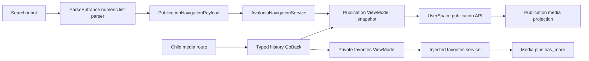

# List Search And Navigation State

Status: implemented on Gate 2 branch
Last updated: 2026-07-22

## Goal

Port the user-visible behavior requested by PR #79 and PR #80 into the current Microsoft DI, CommunityToolkit MVVM and typed-navigation architecture without merging their Prism-era implementation.

## Stable Contracts

- A bare `https://www.bilibili.com/list/<positive MID>` input navigates to all publications for that uploader.
- A list URL with a non-empty `sid` is not treated as all publications. Its series contract remains pending the Bilibili API audit.
- Publication navigation carries `PublicationNavigationPayload`; no dictionary parameters, string view names or Prism navigation objects are permitted.
- Publication search uses the WBI response `page.count` as the filtered total.
- Private-favorite search does not use `media_count` as a filtered total because the endpoint reports the folder total. The pager expands from `has_more` one page at a time.
- Returning through main-region history restores the same View and ViewModel instances. Query, page number and media object identity remain unchanged.
- Leaving a page cancels in-flight work. A canceled incomplete page reloads when restored; a completed snapshot does not issue a duplicate request.
- These changes do not modify settings, SQLite schemas, download records, unfinished task state or resume files.

## Flow

## Failure Behavior

- Malformed, foreign-host, non-numeric, zero and series list inputs are rejected instead of being guessed.
- Cancellation preserves cancellation semantics and is not logged as an operational failure.
- HTTP, JSON and contract failures are logged with operation context; no empty DTO is manufactured as success.
- Search state is changed only by explicit query or folder/type selection. Programmatic initial tab selection cannot trigger a duplicate API request.

## Verification

- Parser and routing tests cover valid and rejected list inputs.
- Fixed JSON fixtures protect publication search totals and media mapping.
- Coordinator tests protect keyword forwarding, `has_more`, exact totals and media identity.
- Headless Avalonia tests navigate to a child route and back, then assert the original ViewModel, query, page and media object.
- Architecture tests prevent Prism, legacy routes and source-file size debt from returning.

Final Gate 2 local result: strict Release build `0 warning / 0 error`; `536/536` tests passed; format changed `0/738` files; NuGet reported no vulnerable or deprecated packages.

## Rollback

Revert the Gate 2 integration PR. No persistent user-data migration is required because this feature changes only input parsing, API projections and in-memory navigation state.
