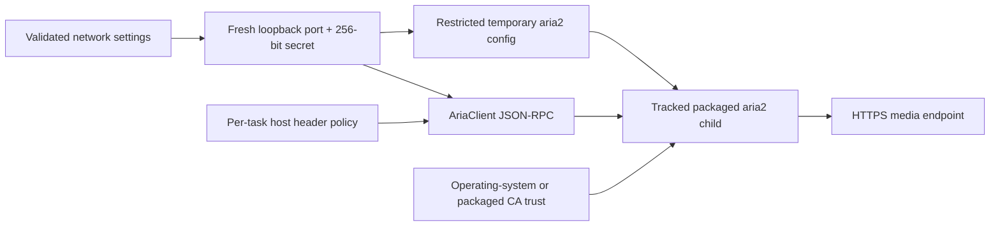

# aria2 Transport And Control Security

Status: required runtime contract
Last updated: 2026-08-03

## Security Boundary

DownKyi owns the packaged aria2 child process and its loopback JSON-RPC control
channel. A custom aria2 server is external: DownKyi sends RPC requests but does
not start, kill or configure that process.



## Required Behavior

- aria2 certificate and hostname validation stays enabled. Production source,
  workflows and scripts must not contain `--check-certificate=false`, insecure
  TLS callbacks, `curl -k` or equivalent bypasses.
- Packaged RPC binds loopback only and disallows wildcard origins. Its port and
  secret are regenerated for every runtime. Startup succeeds only while the
  supervised child is alive; shutdown addresses only that tracked child.
- The RPC secret is written to a unique temporary config with mode `0600` on
  Unix. Startup failure and shutdown first wait for the supervised child to
  exit, including a bounded kill-and-wait fallback, and only then remove the
  config. Neither the secret nor Cookie is present in
  `ProcessStartInfo.ArgumentList`.
- `AriaClient` permits `http` only for loopback. Non-loopback endpoints require
  `https`; URI user information and redirects are rejected.
- Every transfer receives an isolated header option. Cookie is eligible only
  for exact HTTPS `bilibili.com` or its subdomains. The resolver performs a
  defense-in-depth HTTPS preflight, but it is not the final redirect boundary.
  The DownKyi aria2 fork rejects HTTPS-to-non-HTTPS redirects while processing
  the actual `Location`, before another request is emitted. It also rejects an
  actual cross-origin HTTPS redirect after Cookie, Authorization,
  Proxy-Authorization, token or API-key material was emitted. A credentialed
  same-origin HTTPS redirect remains valid. Header values containing CR, LF,
  NUL or other control characters are rejected.
- Packaged aria2 starts only after its SHA-256 sidecar matches the executable.
  Both packaged and custom endpoints must report
  `downkyi-secure-redirect-v2` through `aria2.getVersion().enabledFeatures`;
  missing integrity or capability evidence fails closed.
- RPC error code `33` identifies HTTPS downgrade rejection and `34` identifies
  sensitive-header cross-origin rejection. These machine codes remain stable
  when aria2 exhausts a URI and replaces the human-readable status message.
- TLS failures receive a distinct typed classification and visible localized
  status. They are not converted to generic empty data and never trigger HTTP
  downgrade.

## Legacy `UseSsl` Migration

`UseSsl` is not a current setting and has no production getter, UI control or
runtime branch. `NetworkSettings` retains a private, setter-only JSON migration
member so old files still deserialize. Loading the marker schedules a normal
settings rewrite; the new serializer cannot emit the field.

```text
old settings contain UseSsl=No
  -> compatibility setter records presence only
  -> runtime still requires HTTPS and certificate validation
  -> next atomic settings write omits UseSsl
```

SQLite tasks, GIDs, aria2 session files, partial-file maps and download resume
state are outside this migration and remain byte/contract compatible.

## Real TLS Matrix

The `aria2-tls-security` quality job runs the actual manifest-pinned binary for
all six RIDs against a local deterministic certificate authority. It verifies:

- trusted download, split/hash, task headers, redirects and resume;
- RPC add, status and force-remove;
- unknown and self-signed CA;
- expired and not-yet-valid certificates;
- hostname mismatch and missing SAN/wrong CN;
- incomplete chain;
- trusted redirect to an untrusted endpoint;
- an explicit later application attempt retaining the partial file after TLS
  failure, without an automatic TLS retry or downgrade.
- preflight-safe/actual-GET downgrade, HEAD-safe/GET-downgrade, Range-only
  downgrade and second-attempt downgrade, each with zero HTTP target requests;
- same-origin and cross-origin HTTPS redirects, plus zero cross-origin
  connections for Cookie, Authorization, Proxy-Authorization, token and API-key
  cases.

Linux installs the fixture root temporarily into the system CA store and starts
aria2 without `--ca-certificate`, so the trusted case exercises the same default
trust discovery path used by production. An elevated Windows runner uses
LocalMachine Root; a non-elevated runner selects CurrentUser Root before any
store write. Both are Windows system trust stores used by WinTLS. macOS uses
the System keychain. Each registration is removed during test teardown.

The report contains only environment metadata, backend, aria2 version, case
names and pass/fail diagnostics. Header names may identify the tested policy;
header values, request URLs, filesystem paths, Cookie values, RPC tokens and
account identifiers are forbidden.

For a local packaged binary:

```powershell
$env:DOWNKYI_ARIA2_BINARY = '<absolute aria2c path>'
$env:DOWNKYI_ARIA2_RID = 'win-x64'
$env:DOWNKYI_ARIA2_TLS_REPORT = './artifacts/aria2-tls/win-x64.json'
dotnet test ./tests/DownKyi.Tests/DownKyi.Tests.csproj -c Release `
  --filter Category=Aria2TlsIntegration
```

## External Binary Evidence

The independent source repository is
`https://github.com/crazysmile-PhD/downkyi-aria2`. The security branch is based
on official aria2 `release-1.37.0` commit
`02f2d0d8472b3c38c29b4dba8c75ebd5fdd2899a`; its reviewed source commit is
`9938788f7e62af0530a1b28ece752e1de1fd0d46`. The normal-context canonical
patch SHA-256 is
`1234523d1dadedf2342142b656e64b4c67cbca6545afebc584d50f39a229d094`.
`source-lock.json` in the build repository pins those commits, the patch, zlib
1.3.2 and OpenSSL 3.5.7 with SHA-256 digests. Builds never follow the source
branch head.

The six immutable assets were published from build commit
`94299bd9bde28a83bcb31346ec1d5f8131d2ec0d` under tag
`1.37.0-downkyi.2`. Their archive and executable SHA-256 values are pinned in
`script/assets/external-assets.json` and independently match the release
sidecars and build evidence. This is source and artifact identity evidence,
not reproducible-build or signed-provenance proof; no SBOM or signed provenance
is currently available. The original aria2 fork and local mirror bundle remain
preserved until the full integration gate is green.

## Incident Checks

1. Preserve the sanitized TLS report and CI run URL.
2. Confirm no `aria2c` child remains after the test or application exits.
3. Run `pwsh ./script/scan-secrets.ps1` and inspect process arguments without
   recording their contents.
4. Classify certificate errors separately from DNS, timeout, HTTP status,
   storage and cancellation failures.
5. Do not ask users to disable TLS. Fix trust-store packaging or the upstream
   endpoint and rerun the affected RID.
